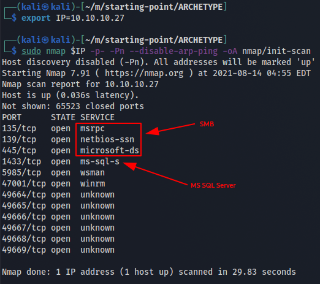

*2021-08-14*

*kimm3*
# Walkthrough: Archetype
Platform: HackTheBox, Starting Point

Difficulty: Very easy

This is the first box in the 'Starting Point'-series.

The boxes build on each other so make sure to save credentials and other interesting information that you find.

## Enumeration
A simple nmap scan reveals at least to interesting services, SMB and a MS SQL Server.

### SMB
Let's see what shares are available with 'smbclient'. Paramater '-N' is for anonymous and '-L' to list.

At first glance, the 'backups' share stick out. Let's try to access the shares as an anon user.

The 'backups'-share contains a config file. If we retrieve it and view the contents, it's ms sql server config file and it contains credentials in clear text:

This will at least give us access to the sql server.

## Exploitation
**Resources and notes for this section**
- I use Impackets mssqlclient.py and psexec.py, install with:
`pip install impacket` *(python3, I always make a new venv for a new machine/lab)*

- The original PS Reverse shell from payloadsallthethings reverse shell cheatsheet [on github.](https://github.com/swisskyrepo/PayloadsAllTheThings/blob/master/Methodology%20and%20Resources/Reverse%20Shell%20Cheatsheet.md#powershell), later modified.

- A common mistake is to try to send stuff to the wrong IP(your machine), get your tunnel ip quickly with: `ip add | grep tun`

### Detour
If you have credentials to a Windows machine, it's always nice to try if psexec(impacket) works to land a PS Shell.

Unfortunatly it fails due to the user not having write permission on the share.

### MS SQL Server
**Accessing with 'mssqlclient.py'**

The credentials worked. Make sure you use the '-windows-auth' parameter.

**xp_cmdshell**

*'Spawns a Windows command shell and passes in a string for execution. Any output is returned as rows of text.'*([MS Docs](https://docs.microsoft.com/en-us/sql/relational-databases/system-stored-procedures/xp-cmdshell-transact-sql?view=sql-server-ver15))

The client we used has a built-in shell command to configure the xp_cmdshell paramater if possible.

Let's see what we can do with this.

From here we have two main options, use cmd commands to enumerate and try to find the flags as the user, or elevate to a proper shell, like powershell for more functions.

**Alt 1: Enum with xp_cmdshell**

*As it happens, this also ends with a reverse shell(cmd)*
The user flag is easy from here:

We can see in the users folder that there's two users, sql_svc and Administrator.

We don't have access to the Administrator folder, so we need to privesc to get the root flag.

In the users AppData folder, we found a exe-version of netcat, endless possibilities. We can use it to start a cmd shell:

And to send files:

**Alt 2: PS reverse shell from sql server**

This is a more convenient method than using xp_cmdshell to enumerate the machine, and a good technique to learn. The steps are:

1. Get a reverse shell and host it on a http server.
2. Get powershell to retrieve it(through xp_cmdshell) from the server and execute it.

See [resources](#exploitation) for link. I used to second one and made the following edits:

1. Removed the powershell command and parameter, file starts with '$client'.
2. Changed IP/Port to my machine.

Use built-in python http.server to host the file.

On the server, download and execute the ps-script:

Powershell warns for malicious content and won't run the file, after som googling and messing around, removing the '.path' worked.

We now have a PS shell for easier enum.

### Privilege Escalation
You can find this with whatever method you use, since the password for the Administrator is available in clear text, in a file that's readable by the 'sql_svc' user.

After poking around for some time, I found this:

The user mounts the share with admin priviligies and the console history is saved.

The administrator should have write permission so we can try psexec again.

It works and we're in as administrator. The root flag is as usual at the admin desktop.

