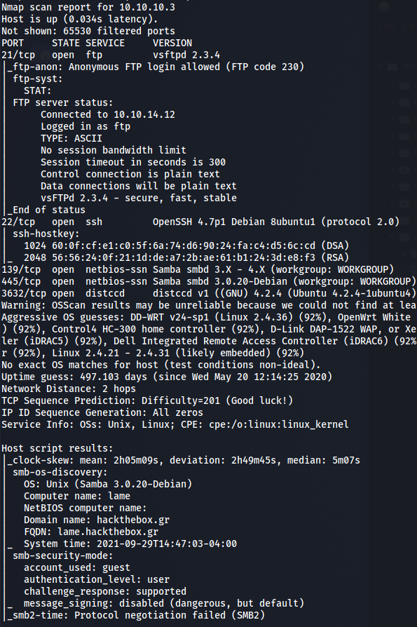
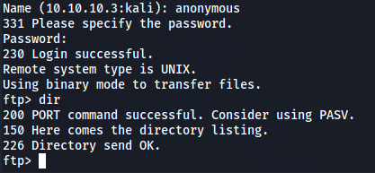
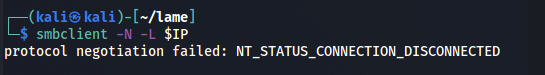
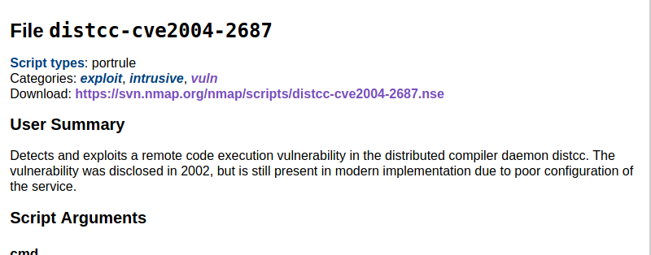
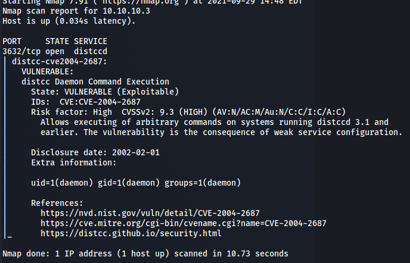
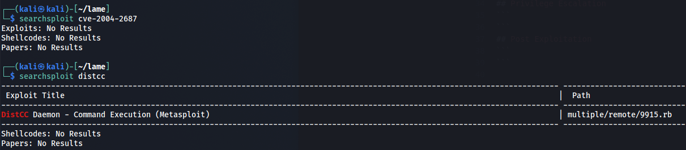
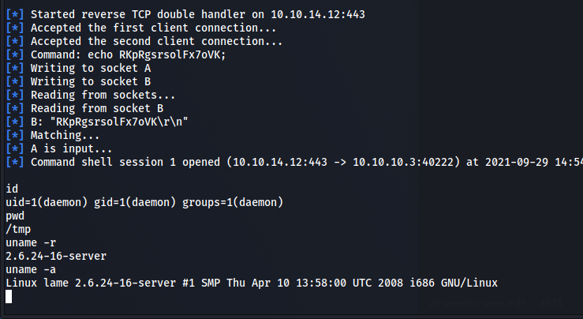
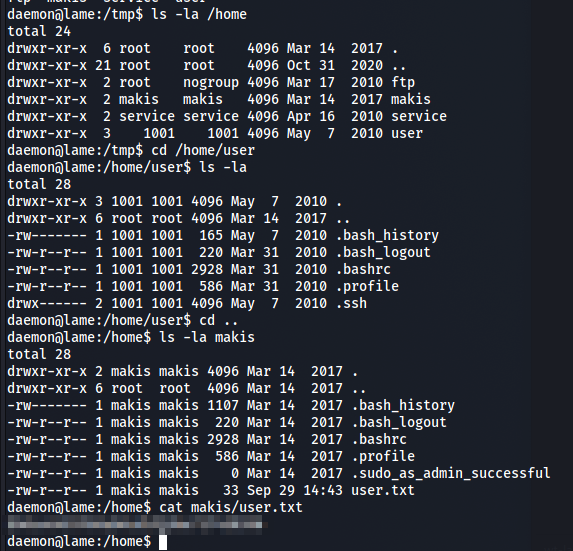
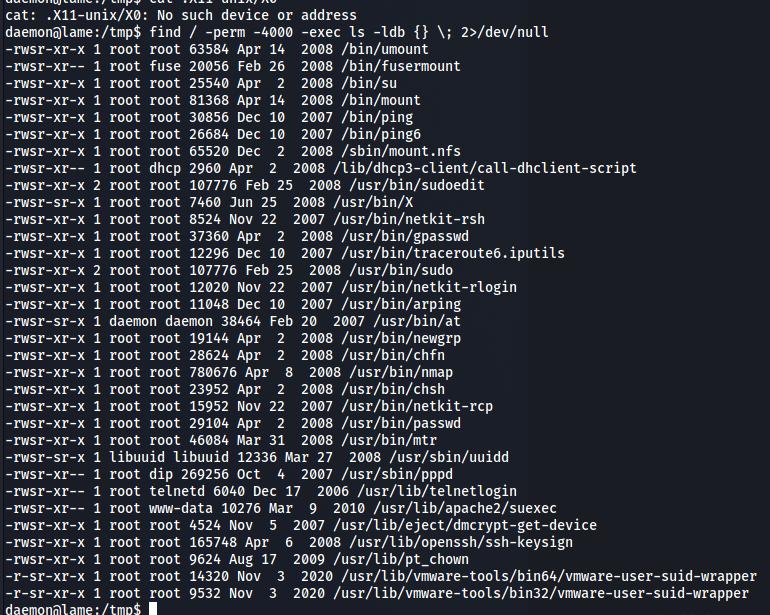
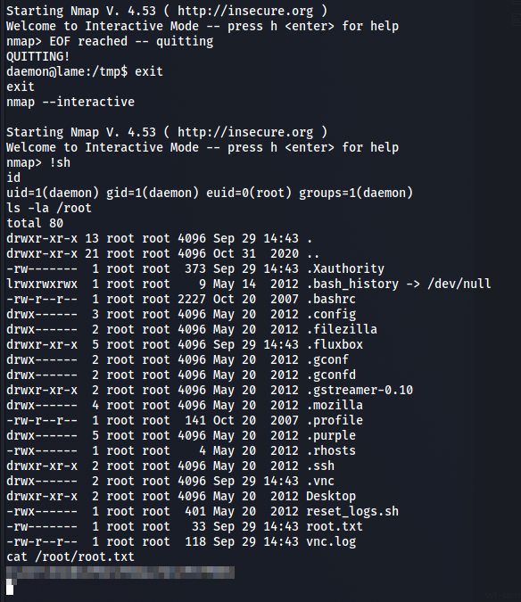

*2021-09-29*

*kimm3*

# Walkthrough: Lame
Platform: HackTheBox

Difficulty: Easy

## Setup


```
script history/enum1
export IP=10.10.10.3; ping $IP
```
## Scans and enumeration
`sudo nmap $IP -p- -Pn -A -v -oA scans/nmap-init`







Nothing on ftp or smb. Researching for distcc.



`sudo nmap $IP -p 3632 --script vuln -oA scans/nmap-distcc-vuln`





It's vulnerable and we have a msf module for it.
## Foothold/Exploit


Running it gives us a shell and user.txt.




## Privilege Escalation
Doing basic enumeration.

Searched for setUIDs, nmap had it set and we can run shell commands from inside the interactive mode.




