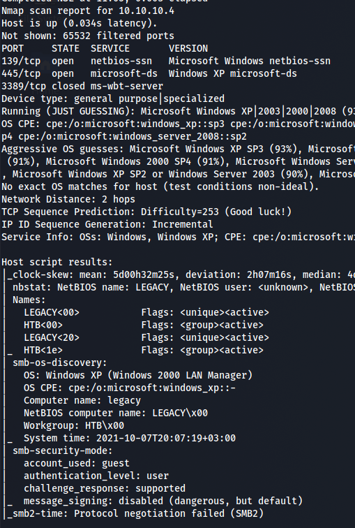
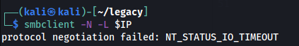
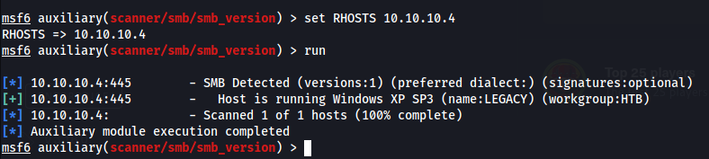
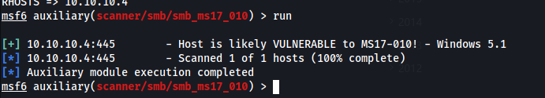
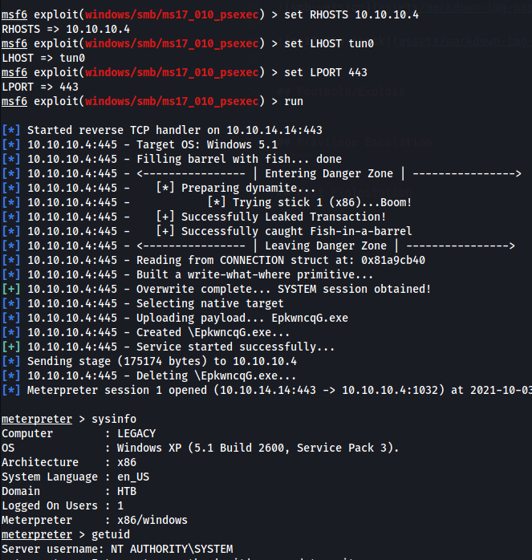
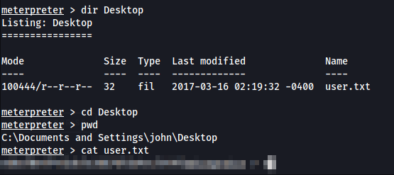
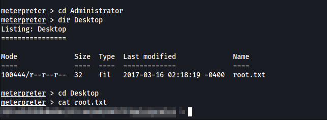
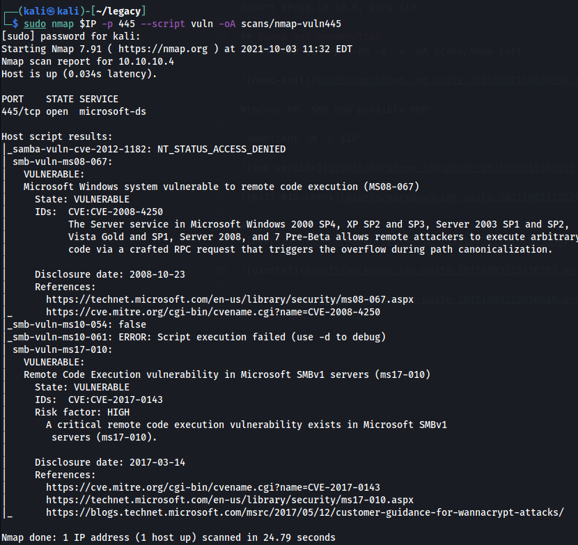

*2021-10-02*

*kimm3*

# Walkthrough: Legacy
Platform: HackTheBox

Difficulty: Easy

- [Link](https://app.hackthebox.eu/machines/2)

This box is on TJ Null/NetSec Focus list for OSCP-like machines.
## Setup


```
script history/enum1
export IP=10.10.10.4; ping $IP
```
## Scans and enumeration
`sudo nmap $IP -p- -Pn -A -v -oA scans/nmap-init`



Windows XP, SMB and possible RDP:

`smbclient -N -L $IP`



Checking SMB version with msf:



If it's SMBv1, it might be vulnerable to ms17-010(eternalblue).



Let's try.
## Exploit
I used another exploit than on the 'blue' machine because it had payloads available that was not 64-bit, and this is Windows XP - so most likely 32-bit.



Works and we got the System account, so we can retrieve both flags.





## Alternative
Nmap is pretty quick and easy to enumerate vulnerabilities, there's one more possible exploit to explore if you like.


