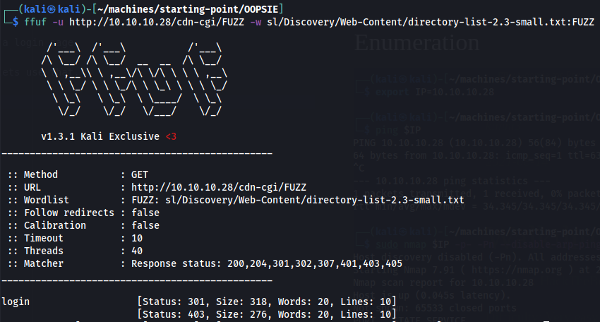
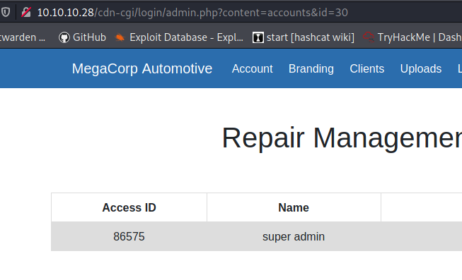

*kimm3*

*2021-08-14*
# Walkthrough: Oopsie
Platform: HackTheBox, Starting Point

Difficulty: Very easy

This is the second box in the 'Starting point' series.

The boxes build on each other so make sure to save credentials and other intersting information that you find.

For an easier, more automated time, you could use burpsuite for this box, however I think this method is good practice to understand things. See the official htb writeup for the burpsuite method.

## Enumeration

Two services are found, SSH and HTTP. Let's browse the web-server.

The web page belongs to Megacorp, the same corp as in the previous box. There's indication that it's not static, that you can log in and access records. No visible links to a login page though, so we'll have to fuzz it.

The overall search returns som common folders, but nothing that looks like a login page.

In the index page source, a script points to the relative path /cdn-cgi/, lets use that.

Looks promising, lets visit this page.

Score.

## Exploitation
**Getting in to the web page**

We have two valid passwords since the last box(archetype) that is somewhat connected to megacorp. Let's try them with some of the most common usernames.

First manually, and if no success - we'll go to hydra.

The combination admin and the second password from archetype worked.

There's an upload page, and we previously found an uploads folder. From the pages sources, we know it runs PHP. A PHP reverse shell should be our next mission.

The 'Uploads' page is restricted for our user. A look in the devtools(`CTRL+SHIFT+E`) for firefox reveals two cookie values for the session(role and user), let's try to manipulate that to get in to the uploads page. First we need to find another id.

**Getting access to the uploads page**

Use `echo {0..1000} | tr " " "\n" > numbers.txt` to create a long list of numbers for ffuf.

There's two ways to do this, one the ugly one is creating a long list of id's and brute force the cookie value. That works as shown in the picture:

Two valid responses.

So we probably have two valid IDs, 34322 and 86575.

Another way to use ffuf is available on the account page. It uses a GET parameter for user ids, and displays the users. The admin user is id 1, let's see what other users we have from 1-100.

It seems that the size for no user is 3595, lets filter that out.

We now have 5 valid ids. Starting to browse them from the top, the user id is named 'super admin', seems promising.

I activated the proxy and started mitmproxy(preinstalled in kali) and set it to intercept requests. See the [mitmproxy docs](https://docs.mitmproxy.org/stable/) for intercepting and modifying requests.

It works.

I copy the php reverse shell under `/usr/share/webshells/php/` and edit my IP accordingly.

Then I upload it, change the cookie value with mitmproxy.

Now we just have to set up a listener and trigger the shell via a request.

The first shell failed, changing the port worked(443 instead of 1234).

Since it's a linux machine, elevate to a proper shell with: `SHELL=/bin/bash script -q /dev/null`

**The user flag**

The user flag is readable from the www-data user, we also find a new username, 'robert'.

## Privilige escalation
The www-data user usually only have permissions in the `/var/www/` folders. You can use `grep -r` to search through text files for strings. Useful strings is normally password, pass, Password etc. I tried 'robert' and this came up, another password in cleartext.

We're now in as the user robert. robert has a group membership that stands out: bugtracker.

If we search for files owned by the group, a binary comes up. The binary have the setuid bit set, we run it with strings to see if we have any relative paths we can use to elevate ourselves.

Theres one line of cat with relative path, let's use this.

1. Create a file with /bin/sh, name it cat.
2. Add the path to our cat-file before the usual cat.
3. When cat executes, it will execute a shell as the root user.

The root.txt is as usual, in the '/root' folder.

## Post Exploitation

There's a cleartext credentials to an ftp server under the ''/root/.config' folder
