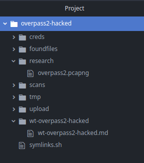

*2021-09-02*

*kimm3*

# Walkthrough: Overpass 2 - Hacked
Platform: TryHackMe

Difficulty: Easy

- [Link](https://tryhackme.com/room/overpass2hacked)

Recommended for this box:
- Hackthebox Academy, Introduction to network analysis

## Setup


## Analysis


- We have a 5 minute dump and almost 4000 packages captured.
- Most conersations are between '170.45' and '170.59'.
- Port 80, 2222 and 4242(<-My favourite).
- '170.45 is probably our machine being hacked.'

I'll start with the honeypot port 4242, because reasons.

Wireshark filter: `tcp.port == 4242`

There's one stream, right click any package and choose follow -> TCP stream.

(Filter: `tcp.stream eq 3`)


This shows the attacker gaining acceess as 'www-data', which means we should check out the http data next to find the foothold he used, there's a 'payload.php' file so we can search for that string later.

He then continues to check sudo privileges for user 'james', which he has a password for. 'james' unfortunately has full sudo privs.

He checks the shadow file, probably copying the hashes for offline cracking, and then clones a git repository of a ssh-backdoor.


He generates RSA keys with no passphrase and starts the server, might be the conversation at port 2222 that we saw?

So far we have these credentials:


Let's try to crack the other hashes in the shadow file.

```
curl "https://raw.githubusercontent.com/drtychai/wordlists/master/fasttrack.txt" > tmp/fasttrack.txt
cat creds/pass.txt tmp/fasttrack.txt > tmp/wl.txt
tail -n 5 creds/shadow | cut -d ":" -f 2 > creds/hash-shadow
hashcat -a 0 -m 1800 creds/hash-shadow tmp/wl.txt
```


Well that's nice, all of them cracked in one sec.

So the obvious way of getting back in is exploiting the ssh backdoor, but first let's find out how they delivered the 'payload.php'.
### Going back to http
There is not that much http traffic, if it were I would filter it out with `http.request.method == POST` to see all POST requests. There's only one in the pcap-file.

We can easily export any captured http files under "File -> Export objects -> HTTP".


A one-liner named pipe/sh/nc revshell, in php.


They uploaded it through the development page that has a upload form.


And then probably triggered with http(curl or browser), to '[address]/uploads/payload.php'.


Let's get back in.
## Geting access
Looking at the ssh-backdoor code, it has a defualt hash:


And a hardcoded salt:


To verify the password, it gets hashed(SHA512) with the salt. Let's try to crack that.


```
echo -n "1c362db832f3f864c8c2fe05f2002a05" >> creds/hashbackdoor
tr "\n" ":" < creds/hashbackdoor > creds/hashsaltbackdoor
hashcat -a 0 -m 1710 creds/hashsaltbackdoor tmp/rockyou.txt
```


Looking at port 2222 and following a stream in the capfile, we can confirm that port 2222 was used for SSH.


Seems that they changed all the passwords, so we can't sudo as they did.

Interesting file in james home folder, '.suid-bash', which has setuid set.


Seems to be a bash binary.


If we run it we get a bash prompt, but still with user james.


Had to google for this and the awnser is in the man page for bash.


Basically if the the user(james in this case) and effective user(root) does not match, root becomes effective user with the p option.


